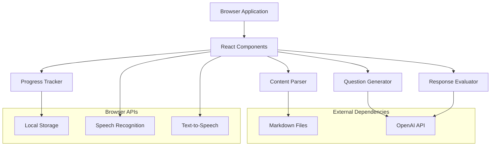

# Design Document

## Overview

The AI Assessment Trainer is a React-based web application that provides interactive educational assessment using OpenAI's API for intelligent evaluation. The system operates entirely in the browser, parsing educational markdown content to generate questions and evaluate user responses against expected answers with both semantic and phrasing accuracy.

The application follows the same architectural patterns as the Arabic language learning app, using React components, Webpack for bundling, and direct API integration without backend dependencies.

## Architecture

### High-Level Architecture



### Component Architecture

The application will use a modular React component structure:

- **App Component**: Main application container managing global state and routing
- **ModeSelector**: Allows switching between training and assessment modes
- **QuestionDisplay**: Renders questions with voice synthesis capability
- **AnswerInput**: Handles text and voice input from users
- **EvaluationDisplay**: Shows AI feedback and scoring
- **ProgressDashboard**: Displays performance metrics and trends
- **ConfigurationPanel**: Manages OpenAI API key and settings

## Components and Interfaces

### Core Components

#### ContentParser
**Purpose**: Parse markdown files and extract educational content
**Interface**:
```javascript
class ContentParser {
  parseMarkdownFiles(files)
  extractDefinitions(content)
  extractConcepts(content)
  generateQuestionBank(parsedContent)
}
```

#### QuestionGenerator
**Purpose**: Create questions from parsed content and generate new ones via OpenAI
**Interface**:
```javascript
class QuestionGenerator {
  generateFromContent(concepts, difficulty)
  generateWithAI(topic, questionType)
  getNextQuestion(userProgress)
  validateQuestion(question, expectedAnswer)
}
```

#### ResponseEvaluator
**Purpose**: Evaluate user responses using OpenAI API
**Interface**:
```javascript
class ResponseEvaluator {
  evaluateSemanticCorrectness(userAnswer, expectedAnswer)
  evaluatePhrasingSimilarity(userAnswer, expectedAnswer)
  generateFeedback(evaluation, mode)
  calculateScore(evaluation)
}
```

#### ProgressTracker
**Purpose**: Track and store user progress locally
**Interface**:
```javascript
class ProgressTracker {
  recordAttempt(question, answer, evaluation)
  getProgressSummary()
  getTopicPerformance()
  exportProgress()
}
```

### Speech Integration Components

#### SpeechRecognition
**Purpose**: Convert user speech to text
**Interface**:
```javascript
class SpeechRecognition {
  startListening()
  stopListening()
  onResult(callback)
  onError(callback)
}
```

#### TextToSpeech
**Purpose**: Convert text to speech for questions and feedback
**Interface**:
```javascript
class TextToSpeech {
  speak(text, options)
  stop()
  setVoice(voice)
  setRate(rate)
}
```

## Data Models

### Question Model
```javascript
{
  id: string,
  text: string,
  expectedAnswer: string,
  topic: string,
  difficulty: 'easy' | 'medium' | 'hard',
  questionType: 'definition' | 'explanation' | 'comparison',
  sourceFile: string,
  sourceSection: string
}
```

### Evaluation Model
```javascript
{
  semanticScore: number, // 0-100
  phrasingScore: number, // 0-100
  overallScore: number,  // 0-100
  feedback: string,
  suggestions: string[],
  correctConcepts: string[],
  missedConcepts: string[]
}
```

### Progress Model
```javascript
{
  sessionId: string,
  timestamp: Date,
  mode: 'training' | 'assessment',
  questionsAttempted: number,
  questionsCorrect: number,
  averageSemanticScore: number,
  averagePhrasingScore: number,
  topicPerformance: Map<string, number>,
  timeSpent: number
}
```

### Configuration Model
```javascript
{
  openaiApiKey: string,
  voiceEnabled: boolean,
  selectedVoice: string,
  speechRate: number,
  difficultyLevel: 'easy' | 'medium' | 'hard',
  evaluationStrictness: 'lenient' | 'moderate' | 'strict'
}
```

## Error Handling

### API Error Handling
- **Network Errors**: Retry mechanism with exponential backoff
- **Authentication Errors**: Clear messaging and API key reconfiguration prompt
- **Rate Limiting**: Queue requests and implement delays
- **Invalid Responses**: Fallback to basic text matching evaluation

### Speech API Error Handling
- **Microphone Access Denied**: Fallback to text input with clear messaging
- **Speech Recognition Failures**: Allow manual correction and retry
- **Browser Compatibility**: Feature detection and graceful degradation

### Content Loading Errors
- **Missing Markdown Files**: Display error message and disable affected features
- **Parsing Errors**: Log errors and skip malformed content sections
- **Empty Content**: Generate default questions or show appropriate messaging

## Testing Strategy

### Unit Testing
- **Component Testing**: Test individual React components with React Testing Library
- **Service Testing**: Test ContentParser, QuestionGenerator, and ResponseEvaluator
- **Utility Testing**: Test speech recognition, text-to-speech, and local storage utilities

### Integration Testing
- **API Integration**: Test OpenAI API integration with mock responses
- **Speech Integration**: Test speech recognition and synthesis workflows
- **End-to-End Flows**: Test complete question-answer-evaluation cycles

### Performance Testing
- **Content Loading**: Measure markdown parsing and question generation performance
- **API Response Times**: Monitor OpenAI API response times and implement timeouts
- **Memory Usage**: Test for memory leaks during extended sessions

### Accessibility Testing
- **Screen Reader Compatibility**: Ensure all content is accessible via screen readers
- **Keyboard Navigation**: Test complete functionality without mouse interaction
- **Voice Interface**: Test speech recognition accuracy across different accents and speech patterns

## Security Considerations

### API Key Management
- Store OpenAI API key in browser localStorage with encryption
- Implement key validation before storing
- Provide clear warnings about API key security
- Allow easy key rotation and deletion

### Data Privacy
- All user data stored locally in browser
- No transmission of personal data to external servers except OpenAI API
- Clear data deletion options for users
- Transparent privacy policy regarding OpenAI API usage

### Content Security
- Validate and sanitize all markdown content before parsing
- Implement Content Security Policy headers
- Prevent XSS attacks through proper React practices
- Validate all user inputs before processing

## Performance Optimization

### Content Loading
- Lazy load markdown files as needed
- Cache parsed content in memory
- Implement efficient question indexing
- Use Web Workers for heavy parsing operations

### API Optimization
- Batch API requests where possible
- Implement request caching for repeated evaluations
- Use streaming responses for real-time feedback
- Implement request queuing to avoid rate limits

### UI Performance
- Use React.memo for expensive components
- Implement virtual scrolling for large question lists
- Optimize re-renders with proper state management
- Use CSS animations instead of JavaScript where possible

## Deployment Strategy

### Build Process
- Use Webpack for bundling and optimization
- Implement code splitting for better loading performance
- Optimize assets (images, fonts, etc.)
- Generate service worker for offline functionality

### Distribution
- Deploy as static files to CDN or static hosting
- Implement proper caching headers
- Use compression (gzip/brotli) for assets
- Provide fallback for older browsers

### Environment Configuration
- Support multiple environments (development, staging, production)
- Environment-specific configuration files
- Feature flags for experimental functionality
- Analytics integration for usage tracking