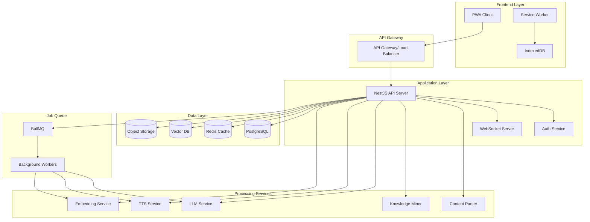
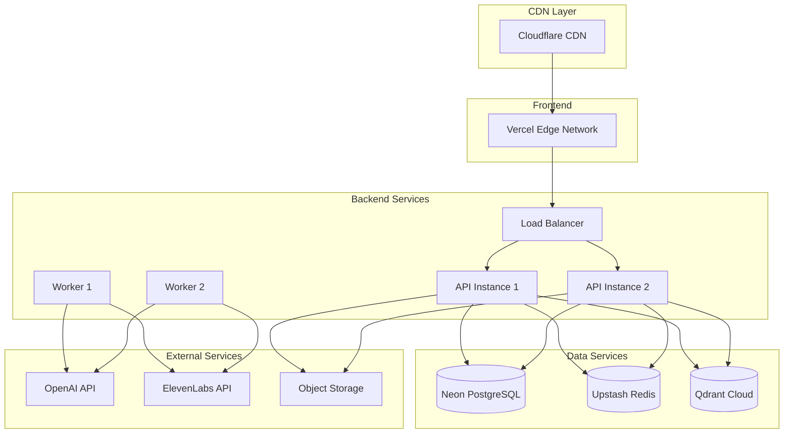

# Design Document

## Overview

The AWS AI Practitioner Trainer is a comprehensive, mobile-first Progressive Web Application (PWA) that transforms the existing AWS AI Practitioner course content into an interactive, gamified learning experience. The platform leverages modern web technologies, AI-powered content generation, and advanced learning science principles to create an engaging certification preparation tool.

The system processes structured Markdown content with embedded images, automatically extracts AWS-specific terminology and concepts, and generates personalized learning experiences including adaptive quizzes, spaced repetition flashcards, AI tutoring, audio summaries, and social learning features.

## Architecture

### High-Level Architecture



### Technology Stack

**Frontend:**
- Next.js 14 with App Router (React 18, TypeScript)
- Tailwind CSS + shadcn/ui components
- PWA with Workbox for offline functionality
- Framer Motion for animations
- React Query for state management
- Web Speech API for voice interactions

**Backend:**
- NestJS with TypeScript
- Prisma ORM with PostgreSQL
- Redis for caching and sessions
- BullMQ for job processing
- Socket.io for real-time features

**AI/ML Services:**
- OpenAI GPT-4 for content generation and tutoring
- Anthropic Claude for alternative LLM responses
- ElevenLabs for high-quality TTS
- OpenAI Embeddings for vector search
- Qdrant or pgvector for vector storage

**Infrastructure:**
- Vercel for frontend deployment
- Railway/Fly.io for backend services
- Neon for managed PostgreSQL
- Upstash for managed Redis
- Cloudflare for CDN and security

## Components and Interfaces

### Core Components

#### 1. Content Processing Pipeline

**ContentParser Service**
```typescript
interface ContentParser {
  parseMarkdownCourse(source: CourseSource): Promise<ParsedCourse>
  extractMetadata(content: string): CourseMetadata
  resolveAssets(basePath: string, assets: Asset[]): Promise<ResolvedAsset[]>
  generateSlugs(structure: CourseStructure): SlugMap
}

interface ParsedCourse {
  id: string
  title: string
  modules: Module[]
  assets: Asset[]
  crossReferences: CrossReference[]
}
```

**KnowledgeMiner Service**
```typescript
interface KnowledgeMiner {
  extractTerms(content: string, context: AWSContext): Promise<Term[]>
  identifyLearningObjectives(content: string): Promise<LearningObjective[]>
  generateQuestionCandidates(content: string): Promise<QuestionCandidate[]>
  createConceptMap(terms: Term[]): Promise<ConceptMap>
}

interface Term {
  id: string
  term: string
  definition: string
  category: 'aws-service' | 'ai-concept' | 'technical-term'
  sourceAnchor: string
  relatedTerms: string[]
}
```

#### 2. Learning Experience Engine

**QuizGenerator Service**
```typescript
interface QuizGenerator {
  generateMCQ(content: string, difficulty: Difficulty): Promise<MCQuestion[]>
  generateCloze(content: string): Promise<ClozeQuestion[]>
  generateScenario(awsContext: AWSContext): Promise<ScenarioQuestion[]>
  adaptDifficulty(userPerformance: Performance): DifficultyAdjustment
}

interface MCQuestion {
  id: string
  stem: string
  choices: Choice[]
  correctIndex: number
  rationale: string
  difficulty: Difficulty
  awsServices: string[]
  sourceAnchors: string[]
}
```

**SRSScheduler Service**
```typescript
interface SRSScheduler {
  scheduleCard(cardId: string, ease: number): Promise<ScheduleResult>
  getDailyReview(userId: string): Promise<Card[]>
  updateAlgorithm(algorithm: SRSAlgorithm): void
  calculateRetention(userId: string): Promise<RetentionMetrics>
}

interface Card {
  id: string
  front: string
  back: string
  type: 'basic' | 'cloze' | 'image-occlusion'
  interval: number
  easeFactor: number
  nextReview: Date
}
```

#### 3. AI Tutoring System

**TutorService**
```typescript
interface TutorService {
  chat(message: string, context: TutorContext): Promise<TutorResponse>
  generateSocraticQuestion(topic: string): Promise<string>
  evaluateAnswer(question: string, answer: string): Promise<Evaluation>
  provideFeedback(performance: Performance): Promise<Feedback>
}

interface TutorContext {
  userId: string
  courseId: string
  currentLesson: string
  learningHistory: LearningEvent[]
  mode: 'socratic' | 'answer' | 'drill'
}

interface TutorResponse {
  message: string
  citations: Citation[]
  followUpQuestions: string[]
  confidence: number
}
```

#### 4. Gamification Engine

**GamificationService**
```typescript
interface GamificationService {
  awardXP(userId: string, action: LearningAction): Promise<XPResult>
  checkAchievements(userId: string): Promise<Achievement[]>
  updateStreak(userId: string): Promise<StreakResult>
  generateChallenge(userId: string): Promise<DailyChallenge>
}

interface Achievement {
  id: string
  title: string
  description: string
  icon: string
  unlockedAt: Date
  category: 'learning' | 'consistency' | 'mastery' | 'social'
}
```

### User Interface Components

#### 1. Mobile-First Navigation
- Bottom tab navigation for core features
- Swipe gestures for lesson navigation
- Pull-to-refresh for content updates
- Floating action button for quick actions

#### 2. Adaptive Learning Dashboard
- Progress visualization with AWS service mastery
- Personalized study recommendations
- Daily challenge and streak display
- Quick access to review queue

#### 3. Interactive Content Viewer
- Responsive markdown rendering
- Image lightbox with zoom and pan
- Interactive AWS architecture diagrams
- Inline term definitions and cross-references

#### 4. Quiz Interface
- One question per screen for mobile optimization
- Large touch targets for answer selection
- Progress indicator and timer
- Immediate feedback with explanations

#### 5. Flashcard Review Interface
- Swipe-based ease rating (Again/Hard/Good/Easy)
- Voice input for hands-free review
- Image occlusion for diagram practice
- Confidence rating integration

## Data Models

### Core Entities

```typescript
// Course Structure
interface Course {
  id: string
  title: string
  description: string
  version: string
  modules: Module[]
  settings: CourseSettings
  createdAt: Date
  updatedAt: Date
}

interface Module {
  id: string
  courseId: string
  title: string
  slug: string
  order: number
  lessons: Lesson[]
  estimatedDuration: number
}

interface Lesson {
  id: string
  moduleId: string
  title: string
  slug: string
  content: string
  htmlContent: string
  frontmatter: Record<string, any>
  assets: Asset[]
  terms: Term[]
  objectives: LearningObjective[]
  order: number
  estimatedReadTime: number
}

// Learning Progress
interface UserProgress {
  id: string
  userId: string
  lessonId: string
  status: 'not-started' | 'in-progress' | 'completed'
  timeSpent: number
  completedAt?: Date
  confidence: number
}

interface QuizAttempt {
  id: string
  userId: string
  quizId: string
  answers: Answer[]
  score: number
  timeSpent: number
  completedAt: Date
}

interface CardReview {
  id: string
  userId: string
  cardId: string
  ease: number
  timeSpent: number
  reviewedAt: Date
  algorithm: string
}

// Gamification
interface UserProfile {
  id: string
  email: string
  name: string
  totalXP: number
  level: number
  currentStreak: number
  longestStreak: number
  achievements: Achievement[]
  preferences: UserPreferences
}

interface LearningSession {
  id: string
  userId: string
  startTime: Date
  endTime: Date
  activities: LearningActivity[]
  xpEarned: number
}
```

### AWS-Specific Extensions

```typescript
interface AWSService {
  id: string
  name: string
  category: string
  description: string
  useCases: string[]
  pricingModel: string
  relatedServices: string[]
}

interface AWSScenario {
  id: string
  title: string
  description: string
  services: string[]
  difficulty: Difficulty
  businessContext: string
}
```

## Error Handling

### Client-Side Error Handling
- Offline-first architecture with graceful degradation
- Retry mechanisms for failed API calls
- User-friendly error messages with recovery suggestions
- Automatic error reporting with user consent

### Server-Side Error Handling
- Structured error responses with error codes
- Rate limiting and abuse prevention
- Graceful LLM service failures with fallbacks
- Comprehensive logging and monitoring

### Content Processing Errors
- Fallback to basic markdown rendering
- Partial content loading for corrupted files
- Asset loading failures with placeholder images
- Term extraction failures with manual override options

## Testing Strategy

### Unit Testing
- Component testing with React Testing Library
- Service layer testing with Jest
- Database operations testing with test containers
- LLM service mocking for consistent testing

### Integration Testing
- API endpoint testing with Supertest
- Database integration testing
- External service integration testing
- PWA functionality testing

### End-to-End Testing
- Critical user journeys with Playwright
- Mobile device testing with BrowserStack
- Offline functionality testing
- Performance testing under load

### Content Quality Assurance
- Automated fact-checking against AWS documentation
- Question quality validation with expert review
- Audio quality assessment for TTS output
- Accessibility compliance testing

### Performance Testing
- Load testing for concurrent users
- Memory usage optimization
- Bundle size optimization
- Database query performance optimization

## Security Considerations

### Authentication & Authorization
- JWT-based authentication with refresh tokens
- Role-based access control (learner, admin)
- OAuth integration for social login
- Session management with secure cookies

### Data Protection
- Encryption at rest and in transit
- PII data minimization and anonymization
- GDPR compliance with data export/deletion
- Secure API key management

### Content Security
- Input sanitization for user-generated content
- XSS protection with Content Security Policy
- Rate limiting for API endpoints
- Secure file upload validation

### AI Safety
- Content filtering for inappropriate responses
- Prompt injection prevention
- Response validation against course content
- Audit logging for AI interactions

## Deployment Architecture

### Production Environment


### Monitoring & Observability
- Application performance monitoring with Sentry
- Infrastructure monitoring with Uptime Robot
- User analytics with privacy-focused tools
- Cost monitoring for AI service usage
- Real-time alerting for critical issues

### Backup & Recovery
- Automated database backups with point-in-time recovery
- Asset backup to multiple storage providers
- Configuration backup and version control
- Disaster recovery procedures and testing

This design provides a comprehensive foundation for building a sophisticated, scalable, and engaging AWS AI Practitioner training platform that leverages modern web technologies and AI capabilities while maintaining high performance and user experience standards.