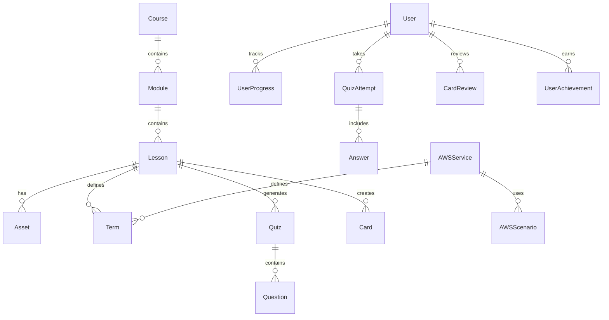

# Database Setup Documentation

## Overview

This document describes the database schema and setup for the AWS AI Practitioner Trainer application. The database is built using PostgreSQL with Prisma ORM for type-safe database operations.

## Database Schema

### Core Entities

#### User Management & Authentication
- **User**: Core user entity with profile, gamification data, and preferences
- **Session**: JWT session management for authentication

#### Course Structure & Content
- **Course**: Top-level course container (e.g., AWS AI Practitioner)
- **Module**: Course sections (e.g., Fundamentals, Use Cases, etc.)
- **Lesson**: Individual learning units within modules
- **Asset**: Images, videos, and other media files
- **CrossReference**: Links between lessons and content

#### AWS-Specific Entities
- **AWSService**: AWS service definitions with features, use cases, and pricing
- **AWSScenario**: Real-world scenarios for practical learning
- **Term**: Extracted terminology and definitions with categories

#### Quiz & Assessment System
- **Quiz**: Quiz containers with settings and metadata
- **Question**: Individual questions with multiple types (MCQ, cloze, scenario)
- **QuizAttempt**: User quiz attempts with scores and timing
- **Answer**: Individual question responses with confidence ratings

#### Spaced Repetition System
- **Card**: Flashcards with SRS algorithm data
- **CardReview**: Individual card review sessions with ease ratings

#### Progress Tracking & Analytics
- **UserProgress**: Lesson completion and confidence tracking
- **LearningSession**: Study session tracking with XP and activities

#### Gamification & Achievements
- **Achievement**: Achievement definitions with criteria and rewards
- **UserAchievement**: User-earned achievements with timestamps

#### AI Tutoring System
- **TutorSession**: AI tutoring conversation sessions
- **TutorMessage**: Individual messages in tutor conversations

## Database Commands

### Setup and Migration
```bash
# Generate Prisma client
npm run db:generate

# Push schema to database (development)
npm run db:push

# Create and apply migration
npm run db:migrate

# Reset database and run migrations
npm run db:reset

# Seed database with initial data
npm run db:seed

# Open Prisma Studio (database GUI)
npm run db:studio
```

### Testing
```bash
# Run database-specific tests
npm run test:db

# Run all tests
npm test
```

## Environment Variables

Required environment variables in `.env`:

```env
# Database
DATABASE_URL="your-postgresql-connection-string"

# Authentication
JWT_SECRET="your-super-secret-jwt-key"
JWT_EXPIRES_IN="7d"
BCRYPT_ROUNDS=12

# Application
NODE_ENV="development"
APP_URL="http://localhost:3000"
```

## Database Services

### UserService
- User creation and authentication
- Profile management
- XP and streak tracking
- Learning analytics

### CourseService
- Course and lesson retrieval
- Progress tracking
- Navigation helpers
- Content search

## Seeded Data

The database is automatically seeded with:

1. **AWS AI Practitioner Course Structure**
   - 8 modules covering fundamentals through advanced topics
   - 40 sample lessons (5 per module)
   - Proper course hierarchy and navigation

2. **AWS Services**
   - Amazon Bedrock, SageMaker, Rekognition, Comprehend, Textract
   - Service descriptions, use cases, and relationships

3. **Terms and Definitions**
   - Key AI/ML terminology
   - AWS-specific concepts
   - Technical definitions with difficulty levels

4. **Achievements**
   - Learning milestones
   - Consistency rewards
   - Mastery badges

5. **Sample Scenarios**
   - Real-world AWS implementation challenges
   - Business context and solution approaches

## API Endpoints

### Courses
- `GET /api/courses` - List all courses
- `GET /api/courses/[courseSlug]` - Get specific course with modules and lessons

### Future Endpoints (to be implemented)
- `POST /api/auth/login` - User authentication
- `POST /api/auth/register` - User registration
- `GET /api/progress/[courseSlug]` - User progress for course
- `POST /api/progress/lesson` - Update lesson progress
- `GET /api/quiz/[lessonId]` - Generate quiz for lesson
- `POST /api/quiz/attempt` - Submit quiz attempt
- `GET /api/cards/review` - Get cards for review
- `POST /api/cards/review` - Submit card review

## Database Relationships



## Performance Considerations

1. **Indexes**: Proper indexes on frequently queried fields (email, slugs, foreign keys)
2. **Pagination**: Large result sets should be paginated
3. **Eager Loading**: Use Prisma's `include` for related data to avoid N+1 queries
4. **Connection Pooling**: Configured for production environments

## Security Features

1. **Password Hashing**: bcrypt with configurable rounds
2. **JWT Authentication**: Secure token-based authentication
3. **Session Management**: Automatic cleanup of expired sessions
4. **Input Validation**: Prisma schema validation and custom validators
5. **SQL Injection Protection**: Prisma's type-safe queries prevent SQL injection

## Backup and Recovery

1. **Automated Backups**: Configure regular database backups
2. **Migration History**: All schema changes tracked in migration files
3. **Seed Data**: Reproducible initial data setup
4. **Environment Separation**: Separate databases for development, staging, and production

## Monitoring and Maintenance

1. **Query Performance**: Monitor slow queries and optimize as needed
2. **Connection Monitoring**: Track database connection usage
3. **Storage Growth**: Monitor database size and plan for scaling
4. **Regular Maintenance**: Periodic cleanup of old sessions and temporary data