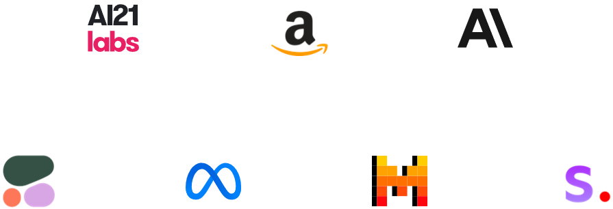

# Course Overview

In this course, you will explore the generative artificial intelligence (generative AI) application lifecycle, which includes the following:

- Defining a business use case
- Selecting a foundation model (FM)
- Improving the performance of an FM
- Evaluating the performance of an FM
- Deployment and its impact on business objectives
This course is a primer to generative AI courses, which dive deeper into concepts related to customizing an FM using prompt engineering, Retrieval Augmented Generation (RAG), and fine-tuning. 

## Developing generative AI solutions. 

Imagine being able to create stunning visuals, captivating stories, and even functional code with just a few prompts. Through the generative AI application lifecycle, we can train powerful models to generate human-like content across various domains. From generating personalized marketing campaigns to accelerating drug discovery, the possibilities are endless. Companies are already using this technology to automate content creation, reduce costs, and deliver truly unique experiences. With knowledge on developing generative AI solutions, you can unlock the full potential of generative AI to transform businesses and shape the future of content creation.

## Learning objectives:

- Identify selection criteria to choose pre-trained models.
- Define Retrieval Augmented Generation (RAG) and describe its business application.
- Explain the cost trade-offs of various approaches to foundation model customization.
- Understand the role of agents in multistep tasks.
- Understand approaches to evaluate foundation model performance.
- Identify relevant metrics to assess foundation model performance.

# Generative AI Application Lifecycle

## Capabilities and challenges of using generative AI

Before exploring the generative AI application lifecycle, it's important to understand some of the capabilities and challenges of using generative AI.

#### Capabilities of generative AI
- Adaptability
- Responsiveness
- Simplicity
- Creativity and exploration
- Data efficiency
- Personalization
- Scalability

#### Challenges of generative AI
- Regulatory violations
- Social risks
- Data security and privacy concerns
- Toxicity
- Hallucinations
- Interpretability
- Nondeterminism

Keep the capabilities and challenges in mind while navigating through the generative AI application lifecycle phases.

## Generative AI application lifecycle

The generative AI application lifecycle refers to the process of using generative AI models within applications or systems.

This lifecycle encompasses several stages. 

>#### Define a use case
>In the first stage, requirements for incorporating generative AI capabilities into an application are identified. This might involve analyzing the application's functionalities, user needs, and business goals to determine where generative AI can add value.

>#### Select a foundation model
>Based on the identified requirements, an appropriate generative AI model is either selected from existing pre-trained models or developed from scratch. This decision depends on factors such as the availability of suitable pre-trained models, the complexity of the use case, and the availability of domain-specific data for training.

>#### Improve performance
>The selected or developed generative AI model is integrated into the application's codebase or infrastructure. This might involve adapting the model's input and output formats, fine-tuning the model with application-specific data, and implementing any necessary customizations or optimizations.

>#### Evaluate results
>Thorough testing and evaluation of the integrated generative AI capabilities are conducted to ensure that they meet the specified requirements and perform as expected. This might involve testing with various inputs, edge cases, and real-world scenarios, as well as evaluating the quality, coherence, and relevance of the generated content.

>#### Deployment
>After successful testing, the application with integrated generative AI capabilities is deployed to the production environment. Monitoring mechanisms are established to track the performance, usage, and potential issues or biases associated with the generative AI model's outputs.

After deployment, user feedback, usage data, and performance metrics are continuously collected and analyzed to identify areas for improvement or new requirements. Based on this feedback, the generative AI model might be retrained, fine-tuned, or updated to enhance its performance and address any identified issues.

It's important to note that the generative AI application lifecycle is an iterative process, and different stages might have to be revisited or repeated as the application evolves, user needs change, or new advancements in generative AI technologies emerge

# Defining a Use Case

The first stage in the generative AI application lifecycle is defining a use case. This phase is the foundation that sets the path for the entire project by doing the following:

- Defining the problem to be solved

- Gathering relevant requirements

- Aligning stakeholder expectations

Getting this stage right is imperative, because it informs all subsequent steps and ultimately determines the success or failure of the generative AI application. During this crucial phase, teams must carefully analyze the problem space, consult with subject matter experts, and translate business needs into technical specifications that can guide the development process.

Knowing which information to include in your business use case is important to identify early on.

## Business use cases

A business use case is a structured narrative that describes how a system or process should behave from the perspective of an actor or stakeholder. It helps to communicate the functional requirements of a system or process.

### Parts of a use case

A well-defined business use case typically consists of the following parts:

>#### Use case name
>A short and descriptive name that identifies the use case

>#### Brief description
>A high-level summary of the use case's purpose and objective

>#### Actors
>The entities or stakeholders that interact with the system or process
>
>These can be human actors (for example, customers or employees) or external systems. 

>#### Preconditions
>The conditions that must be true before the use case can be initiated

>#### Basic flow (main success scenario)
>A step-by-step description of the actions and interactions that occur when the use case is completed successfully, from start to finish
>
>This is the primary path or happy path—for example, a list of each step necessary to achieve success.

>#### Alternative flows (extensions)
>Additional scenarios or paths that might occur due to exceptional conditions, errors, or alternative user choices
>
>These describe how the system should handle these situations—for example, contingency plans.

>#### Postconditions
>The state or conditions that must be true after the successful completion of the use case

>#### Business rules
>Any business policies, constraints, or regulations that govern the behavior of the system or process within the context of the use case 

>#### Nonfunctional requirements
>Any nonfunctional requirements, such as performance, security, or usability considerations, that are relevant to the use case

>#### Assumptions
>Any assumptions made about the system, environment, or context that are necessary for the use case to be valid or applicable

>#### Notes or additional information
>Any additional notes, explanations, or supplementary information that might be helpful for understanding or implementing the use case

## Addressing business use cases with generative AI

When it comes to resolving business problems using generative AI, there are various metrics and approaches that can be employed.

### Key metrics:

#### Cost savings

One of the primary metrics is the potential cost savings that can be achieved by using generative AI. This includes reductions in labor costs, process optimization, and efficiency gains.

#### Time savings

Generative AI can automate and streamline various tasks, leading to significant time savings. Measuring the reduction in time required for specific processes or activities can be a valuable metric.

#### Quality improvement

Generative AI can enhance the quality of outputs, such as written content, creative designs, or analytical insights. Metrics like accuracy, coherence, and creativity can be used to measure quality improvements.

#### Customer satisfaction

If generative AI is used to improve customer interactions or experiences, metrics like customer satisfaction scores, net promoter score (NPS), or sentiment analysis can be valuable indicators.

#### Productivity gains

Generative AI can augment human capabilities, leading to increased productivity. Metrics like output volume, error rates, or task completion times can measure productivity improvements.

### Approaches:

>#### Process automation
>Generative AI can be used to automate repetitive or time-consuming tasks, such as content generation, data analysis, or customer service interactions. This approach can lead to significant efficiency gains and cost savings.

>#### Augmented decision-making
>Generative AI can be used to enhance decision-making processes by providing insights, recommendations, and decision support. By analyzing large and complex datasets, generative AI models can uncover patterns, trends, and actionable insights that can inform and improve business decisions, ultimately leading to better outcomes.

>#### Personalization and customization
>Generative AI can be used to create personalized and customized content, products, or experiences for customers or stakeholders. This approach can improve customer satisfaction, engagement, and loyalty.

>#### Creative content generation
>Generative AI can be employed to generate creative content, such as written text, images, videos, or audio. This approach can be valuable for marketing, advertising, entertainment, or educational purposes.

>#### Exploratory analysis and innovation
>Generative AI can be used to explore new ideas, concepts, or solutions by generating novel combinations or variations. This approach can foster innovation and help businesses stay at the forefront of technology.

# Selecting an FM

After the use case has been defined, the next phase is the selection of an appropriate foundation model. This choice sets the foundation for the iterative training process and has profound implications for the performance, efficiency, and robustness of the final application. One key consideration is whether to use pre-trained models or develop a model from scratch.

## Pre-trained model selection criteria

Pre-trained models offer a valuable head start by encapsulating knowledge distilled from vast amounts of data. These models can be fine-tuned on task-specific data, potentially leading to faster convergence and better generalization. However, pre-trained models might carry undesirable biases or fail to fully capture the nuances of the target domain.

The selection criteria for choosing a pre-trained model depend on the requirements of the business use case.

Some criteria to consider include the following:

### Cost

Pre-trained models can be expensive, especially for larger and more complex models. The cost might include licensing fees, computational resources for inference, and potential customization or fine-tuning costs. It's essential to evaluate the budget constraints and weigh the cost against the expected benefits.

### Modality

Generative AI models can be designed for different modalities, such as text generation, image generation, audio generation, or multimodal generation (combining multiple modalities). The choice of modality depends on the desired output format and the target application.

### Latency

Some applications require real-time or low-latency generation, and others can tolerate longer processing times. The model's inference speed and the available computational resources should be evaluated to ensure acceptable latency for the target use case.

### Multi-lingual support

If the application requires generating content in multiple languages, selecting a model that supports the desired languages or can be adapted to new languages through techniques like transfer learning is crucial.

### Model size

Larger models generally have higher computational requirements and can be more resource intensive during inference. However, they often perform better on complex tasks. The model size should be balanced against the available computational resources and performance requirements.

### Model complexity

More complex models, such as those based on transformer architectures or large language models, can handle more advanced tasks but might be more challenging to deploy and optimize. Simpler models might be preferred for resource-constrained environments or simpler use cases.

### Customization

Some pre-trained models offer the ability to fine-tune or adapt them to specific domains or tasks. This customization can improve performance but might require additional computational resources and labeled data.

### Input/output length

Generative models might have limitations on the maximum input or output sequence lengths that they can handle. Applications requiring long-form generation or processing of extensive input data should consider models capable of handling the desired input/output lengths.

### Responsibility considerations

It's important to evaluate the responsible implications of using pre-trained generative AI models, such as potential biases, misinformation risks, or misuse. Models should be vetted for their training data sources and potential societal impacts.

### Deployment and integration

The ease of deployment, compatibility with existing infrastructure, and availability of tools or libraries for integrating the model into the target application should be considered.

It's essential to carefully evaluate these criteria and prioritize the most critical factors based on the specific business use case, including the constraints, and trade-offs involved.

## Choosing a pre-trained model based on selection criteria

Comparing pre-trained generative AI models based on selection criteria can be a complex task. There are many factors to consider, and the relative importance of each factor can vary depending on the specific business use case.

>#### AI21 labs
>Jurassic-2 Series
>
>Jurassic-2 (J2) is AI21 Labs' state-of-the-art large language model (LLM). Businesses use the AI21 Jurassic family to build generative AI-driven applications and services using existing organizational data. Jurassic supports cross-industry use cases including long-form and short-form text generation, contextual question answering, summarization, and classification.

>#### Amazon
>Titan
>
>Amazon Titan foundation models are a family of models built by Amazon Web Services (AWS) that are >pre-trained on large datasets, which makes them powerful, general-purpose models. Use them as is, or >customize them by fine tuning the models with your own data for a particular task without annotating large >volumes of data.
>
>There are three types of Amazon Titan models: embeddings, text generation, and image generation.

>#### ANTHROP\C
>Claude
>
>Claude 3 is Anthropic's family of state-of-the-art vision and text AI models. The three models in the family—Haiku, Sonnet, and Opus—allow customers to choose the exact combination of intelligence, speed, and cost that suits their business needs.

>#### Cohere
>Command XL
>
>Cohere provides a generative LLM, Command, that can generate text-based responses based on prompts. Cohere models are trained on data that supports reliable business applications, like text generation, summarization, copywriting, dialogue, extraction, and question answering.

>#### Meta
>Llama 3
>
>Llama is a family of large language models that uses publicly available data for training. These models are based on the transformer architecture, which allows it to process input sequences of arbitrary length and generate output sequences of variable length. One of the key features of Llama models is its ability to generate coherent and contextually relevant text.

>#### Mistral AI
>Mistral Large
>
>Mistral AI is a small creative team with high scientific standards. They make efficient, helpful, and trustworthy AI models through ground-breaking innovations. Mistral Large is ideal for complex tasks that require large reasoning capabilities or are highly specialized, like synthetic text generation, code generation, RAG, or agents.

>#### Stability AI
>Stable Diffusion
>
>Stable Diffusion is an industry-leading image generation model. Stable Diffusion can generate images of from text input.

Each of these models could be analyzed for compatibility based on the selection criteria and the business use case. Regularly reviewing and updating the selection criteria as new models and techniques emerge is recommended, because the generative AI landscape is rapidly evolving.

# Knowledge Check
Test your skills

A developer is creating a real-time translation application for mobile devices. 
**Which criterion would be most important when selecting a pre-trained model for this task?**

- Model size
- Model complexity
- Latency
- Customization

For a real-time translation application on mobile devices, latency is a critical factor because the model has to provide translations with minimal delay to ensure a smooth user experience.