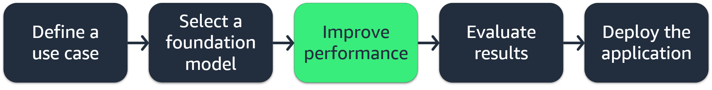
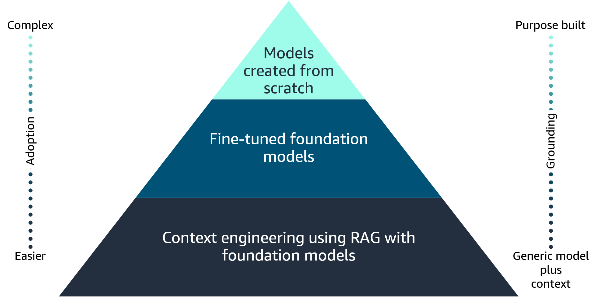
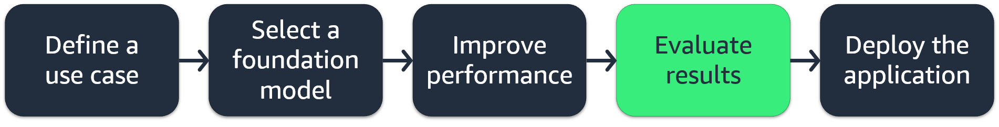
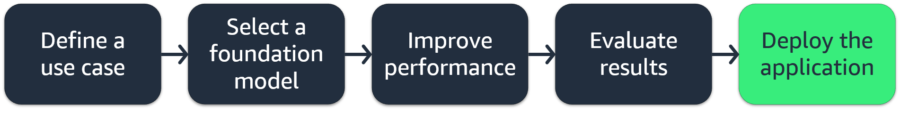

# Course Overview

In this course, you will explore the generative artificial intelligence (generative AI) application lifecycle, which includes the following:

- Defining a business use case
- Selecting a foundation model (FM)
- Improving the performance of an FM
- Evaluating the performance of an FM
- Deployment and its impact on business objectives
This course is a primer to generative AI courses, which dive deeper into concepts related to customizing an FM using prompt engineering, Retrieval Augmented Generation (RAG), and fine-tuning. 

## Developing generative AI solutions. 

Imagine being able to create stunning visuals, captivating stories, and even functional code with just a few prompts. Through the generative AI application lifecycle, we can train powerful models to generate human-like content across various domains. From generating personalized marketing campaigns to accelerating drug discovery, the possibilities are endless. Companies are already using this technology to automate content creation, reduce costs, and deliver truly unique experiences. With knowledge on developing generative AI solutions, you can unlock the full potential of generative AI to transform businesses and shape the future of content creation.

## Learning objectives:

- Identify selection criteria to choose pre-trained models.
- Define Retrieval Augmented Generation (RAG) and describe its business application.
- Explain the cost trade-offs of various approaches to foundation model customization.
- Understand the role of agents in multistep tasks.
- Understand approaches to evaluate foundation model performance.
- Identify relevant metrics to assess foundation model performance.

# Generative AI Application Lifecycle

## Capabilities and challenges of using generative AI

Before exploring the generative AI application lifecycle, it's important to understand some of the capabilities and challenges of using generative AI.

#### Capabilities of generative AI
- Adaptability
- Responsiveness
- Simplicity
- Creativity and exploration
- Data efficiency
- Personalization
- Scalability

#### Challenges of generative AI
- Regulatory violations
- Social risks
- Data security and privacy concerns
- Toxicity
- Hallucinations
- Interpretability
- Nondeterminism

Keep the capabilities and challenges in mind while navigating through the generative AI application lifecycle phases.

## Generative AI application lifecycle

The generative AI application lifecycle refers to the process of using generative AI models within applications or systems.

This lifecycle encompasses several stages. 

>#### Define a use case
>In the first stage, requirements for incorporating generative AI capabilities into an application are identified. This might involve analyzing the application's functionalities, user needs, and business goals to determine where generative AI can add value.

>#### Select a foundation model
>Based on the identified requirements, an appropriate generative AI model is either selected from existing pre-trained models or developed from scratch. This decision depends on factors such as the availability of suitable pre-trained models, the complexity of the use case, and the availability of domain-specific data for training.

>#### Improve performance
>The selected or developed generative AI model is integrated into the application's codebase or infrastructure. This might involve adapting the model's input and output formats, fine-tuning the model with application-specific data, and implementing any necessary customizations or optimizations.

>#### Evaluate results
>Thorough testing and evaluation of the integrated generative AI capabilities are conducted to ensure that they meet the specified requirements and perform as expected. This might involve testing with various inputs, edge cases, and real-world scenarios, as well as evaluating the quality, coherence, and relevance of the generated content.

>#### Deployment
>After successful testing, the application with integrated generative AI capabilities is deployed to the production environment. Monitoring mechanisms are established to track the performance, usage, and potential issues or biases associated with the generative AI model's outputs.

After deployment, user feedback, usage data, and performance metrics are continuously collected and analyzed to identify areas for improvement or new requirements. Based on this feedback, the generative AI model might be retrained, fine-tuned, or updated to enhance its performance and address any identified issues.

It's important to note that the generative AI application lifecycle is an iterative process, and different stages might have to be revisited or repeated as the application evolves, user needs change, or new advancements in generative AI technologies emerge

# Defining a Use Case

The first stage in the generative AI application lifecycle is defining a use case. This phase is the foundation that sets the path for the entire project by doing the following:

- Defining the problem to be solved

- Gathering relevant requirements

- Aligning stakeholder expectations

Getting this stage right is imperative, because it informs all subsequent steps and ultimately determines the success or failure of the generative AI application. During this crucial phase, teams must carefully analyze the problem space, consult with subject matter experts, and translate business needs into technical specifications that can guide the development process.

Knowing which information to include in your business use case is important to identify early on.

## Business use cases

A business use case is a structured narrative that describes how a system or process should behave from the perspective of an actor or stakeholder. It helps to communicate the functional requirements of a system or process.

### Parts of a use case

A well-defined business use case typically consists of the following parts:

>#### Use case name
>A short and descriptive name that identifies the use case

>#### Brief description
>A high-level summary of the use case's purpose and objective

>#### Actors
>The entities or stakeholders that interact with the system or process
>
>These can be human actors (for example, customers or employees) or external systems. 

>#### Preconditions
>The conditions that must be true before the use case can be initiated

>#### Basic flow (main success scenario)
>A step-by-step description of the actions and interactions that occur when the use case is completed successfully, from start to finish
>
>This is the primary path or happy path—for example, a list of each step necessary to achieve success.

>#### Alternative flows (extensions)
>Additional scenarios or paths that might occur due to exceptional conditions, errors, or alternative user choices
>
>These describe how the system should handle these situations—for example, contingency plans.

>#### Postconditions
>The state or conditions that must be true after the successful completion of the use case

>#### Business rules
>Any business policies, constraints, or regulations that govern the behavior of the system or process within the context of the use case 

>#### Nonfunctional requirements
>Any nonfunctional requirements, such as performance, security, or usability considerations, that are relevant to the use case

>#### Assumptions
>Any assumptions made about the system, environment, or context that are necessary for the use case to be valid or applicable

>#### Notes or additional information
>Any additional notes, explanations, or supplementary information that might be helpful for understanding or implementing the use case

## Addressing business use cases with generative AI

When it comes to resolving business problems using generative AI, there are various metrics and approaches that can be employed.

### Key metrics:

#### Cost savings

One of the primary metrics is the potential cost savings that can be achieved by using generative AI. This includes reductions in labor costs, process optimization, and efficiency gains.

#### Time savings

Generative AI can automate and streamline various tasks, leading to significant time savings. Measuring the reduction in time required for specific processes or activities can be a valuable metric.

#### Quality improvement

Generative AI can enhance the quality of outputs, such as written content, creative designs, or analytical insights. Metrics like accuracy, coherence, and creativity can be used to measure quality improvements.

#### Customer satisfaction

If generative AI is used to improve customer interactions or experiences, metrics like customer satisfaction scores, net promoter score (NPS), or sentiment analysis can be valuable indicators.

#### Productivity gains

Generative AI can augment human capabilities, leading to increased productivity. Metrics like output volume, error rates, or task completion times can measure productivity improvements.

### Approaches:

>#### Process automation
>Generative AI can be used to automate repetitive or time-consuming tasks, such as content generation, data analysis, or customer service interactions. This approach can lead to significant efficiency gains and cost savings.

>#### Augmented decision-making
>Generative AI can be used to enhance decision-making processes by providing insights, recommendations, and decision support. By analyzing large and complex datasets, generative AI models can uncover patterns, trends, and actionable insights that can inform and improve business decisions, ultimately leading to better outcomes.

>#### Personalization and customization
>Generative AI can be used to create personalized and customized content, products, or experiences for customers or stakeholders. This approach can improve customer satisfaction, engagement, and loyalty.

>#### Creative content generation
>Generative AI can be employed to generate creative content, such as written text, images, videos, or audio. This approach can be valuable for marketing, advertising, entertainment, or educational purposes.

>#### Exploratory analysis and innovation
>Generative AI can be used to explore new ideas, concepts, or solutions by generating novel combinations or variations. This approach can foster innovation and help businesses stay at the forefront of technology.

# Selecting an FM

After the use case has been defined, the next phase is the selection of an appropriate foundation model. This choice sets the foundation for the iterative training process and has profound implications for the performance, efficiency, and robustness of the final application. One key consideration is whether to use pre-trained models or develop a model from scratch.

## Pre-trained model selection criteria

Pre-trained models offer a valuable head start by encapsulating knowledge distilled from vast amounts of data. These models can be fine-tuned on task-specific data, potentially leading to faster convergence and better generalization. However, pre-trained models might carry undesirable biases or fail to fully capture the nuances of the target domain.

The selection criteria for choosing a pre-trained model depend on the requirements of the business use case.

Some criteria to consider include the following:

### Cost

Pre-trained models can be expensive, especially for larger and more complex models. The cost might include licensing fees, computational resources for inference, and potential customization or fine-tuning costs. It's essential to evaluate the budget constraints and weigh the cost against the expected benefits.

### Modality

Generative AI models can be designed for different modalities, such as text generation, image generation, audio generation, or multimodal generation (combining multiple modalities). The choice of modality depends on the desired output format and the target application.

### Latency

Some applications require real-time or low-latency generation, and others can tolerate longer processing times. The model's inference speed and the available computational resources should be evaluated to ensure acceptable latency for the target use case.

### Multi-lingual support

If the application requires generating content in multiple languages, selecting a model that supports the desired languages or can be adapted to new languages through techniques like transfer learning is crucial.

### Model size

Larger models generally have higher computational requirements and can be more resource intensive during inference. However, they often perform better on complex tasks. The model size should be balanced against the available computational resources and performance requirements.

### Model complexity

More complex models, such as those based on transformer architectures or large language models, can handle more advanced tasks but might be more challenging to deploy and optimize. Simpler models might be preferred for resource-constrained environments or simpler use cases.

### Customization

Some pre-trained models offer the ability to fine-tune or adapt them to specific domains or tasks. This customization can improve performance but might require additional computational resources and labeled data.

### Input/output length

Generative models might have limitations on the maximum input or output sequence lengths that they can handle. Applications requiring long-form generation or processing of extensive input data should consider models capable of handling the desired input/output lengths.

### Responsibility considerations

It's important to evaluate the responsible implications of using pre-trained generative AI models, such as potential biases, misinformation risks, or misuse. Models should be vetted for their training data sources and potential societal impacts.

### Deployment and integration

The ease of deployment, compatibility with existing infrastructure, and availability of tools or libraries for integrating the model into the target application should be considered.

It's essential to carefully evaluate these criteria and prioritize the most critical factors based on the specific business use case, including the constraints, and trade-offs involved.

## Choosing a pre-trained model based on selection criteria

Comparing pre-trained generative AI models based on selection criteria can be a complex task. There are many factors to consider, and the relative importance of each factor can vary depending on the specific business use case.

>#### AI21 labs
>Jurassic-2 Series
>
>Jurassic-2 (J2) is AI21 Labs' state-of-the-art large language model (LLM). Businesses use the AI21 Jurassic family to build generative AI-driven applications and services using existing organizational data. Jurassic supports cross-industry use cases including long-form and short-form text generation, contextual question answering, summarization, and classification.

>#### Amazon
>Titan
>
>Amazon Titan foundation models are a family of models built by Amazon Web Services (AWS) that are >pre-trained on large datasets, which makes them powerful, general-purpose models. Use them as is, or >customize them by fine tuning the models with your own data for a particular task without annotating large >volumes of data.
>
>There are three types of Amazon Titan models: embeddings, text generation, and image generation.

>#### ANTHROP\C
>Claude
>
>Claude 3 is Anthropic's family of state-of-the-art vision and text AI models. The three models in the family—Haiku, Sonnet, and Opus—allow customers to choose the exact combination of intelligence, speed, and cost that suits their business needs.

>#### Cohere
>Command XL
>
>Cohere provides a generative LLM, Command, that can generate text-based responses based on prompts. Cohere models are trained on data that supports reliable business applications, like text generation, summarization, copywriting, dialogue, extraction, and question answering.

>#### Meta
>Llama 3
>
>Llama is a family of large language models that uses publicly available data for training. These models are based on the transformer architecture, which allows it to process input sequences of arbitrary length and generate output sequences of variable length. One of the key features of Llama models is its ability to generate coherent and contextually relevant text.

>#### Mistral AI
>Mistral Large
>
>Mistral AI is a small creative team with high scientific standards. They make efficient, helpful, and trustworthy AI models through ground-breaking innovations. Mistral Large is ideal for complex tasks that require large reasoning capabilities or are highly specialized, like synthetic text generation, code generation, RAG, or agents.

>#### Stability AI
>Stable Diffusion
>
>Stable Diffusion is an industry-leading image generation model. Stable Diffusion can generate images of from text input.

Each of these models could be analyzed for compatibility based on the selection criteria and the business use case. Regularly reviewing and updating the selection criteria as new models and techniques emerge is recommended, because the generative AI landscape is rapidly evolving.

# Knowledge Check
Test your skills

A developer is creating a real-time translation application for mobile devices. 
**Which criterion would be most important when selecting a pre-trained model for this task?**

- Model size
- Model complexity
- Latency
- Customization

For a real-time translation application on mobile devices, latency is a critical factor because the model has to provide translations with minimal delay to ensure a smooth user experience.

# Improving the Performance of an FM

After selecting an appropriate pre-trained foundation model that aligns with the business use case, the next step is to focus on improving the performance of the model. This can be achieved through various techniques such as prompt engineering, RAG, fine-tuning, or automation agents.

## Prompt engineering

Prompt engineering is the fastest way to harness the power of large language models (LLMs). By interacting with an LLM through prompts (a series of questions, statements, or instructions), you can adjust LLM output behavior based on the specific context of the output that you want to achieve.

Prompt engineering refers to the process of carefully crafting the input prompts or instructions given to the model to generate desired outputs or behaviors. The phrasing, structure, and content of the prompt can significantly influence the quality, relevance, and characteristics of the generated outputs. Prompt engineering aims to optimize the prompts to steer the model's generation in the desired direction, using the model's capabilities while mitigating potential biases or undesirable outputs.

Some key aspects of prompt engineering include the following:

- **Design**: Crafting clear, unambiguous, and context-rich prompts that effectively communicate the desired task or output to the model

- **Augmentation**: Incorporating additional information or constraints into the prompts, such as examples, demonstrations, or task-specific instructions, to guide the model's generation process

- **Tuning**: Iteratively refining and adjusting the prompts based on the model's outputs and performance, often through human evaluation or automated metrics

- **Ensembling**: Combining multiple prompts or generation strategies to improve the overall quality and robustness of the outputs

- **Mining**: Exploring and identifying effective prompts through techniques like prompt searching, prompt generation, or prompt retrieval from large prompt libraries

Prompt engineering is particularly important for generative AI models. These models are trained on vast amounts of data and can exhibit undesirable behaviors or generate outputs that are inconsistent with the intended task or context. By carefully engineering the prompts, developers can better control and steer the model's generation process, improving the quality, safety, and reliability of the outputs.

## Prompt techniques

Prompt engineering techniques are strategies used to guide generative AI models. Some common prompt engineering techniques include the following:

- Zero-shot prompting
- Few-shot prompting
- Chain-of-thought (CoT) prompting
- Self-consistency
- Tree of thoughts (ToT)
- Retrieval Augmented Generation (RAG)
- Automatic Reasoning and Tool-use (ART)
- ReAct prompting
 
For the purpose of this course, let's focus on Retrieval Augmented Generation (RAG).

## RAG

RAG is a natural language processing (NLP) technique that combines the capabilities of retrieval systems and generative language models to produce high-quality and informative text outputs.

RAG incorporates two main components. To learn more, choose each of the following flashcards.

> #### A retrieval system
> This component retrieves relevant information from a large corpus of text data, such as a knowledge base, web pages, or other textual sources. The retrieval system uses techniques like information retrieval, sparse indexing, or dense retrieval to identify the most relevant passages or documents for a given input query or context.

> #### A generative language model
> This component is a large pre-trained language model, such as GPT-3, BART, or T5, that can generate natural language text. The language model takes the input query or context, along with the retrieved relevant information. And from this, it generates a coherent and fluent text output that combines the retrieved knowledge with its own understanding and language generation capabilities.

The RAG prompt techniques approach uses retrieval systems and generative language models. The retrieval system provides access to a vast amount of factual knowledge and information. And the generative language model can synthesize and present this information in a natural and coherent manner, tailored to the specific input or context.

### RAG business applications

RAG has several business applications, including the following:
- Building intelligent question-answering systems 
- Expanding and enriching existing knowledge bases 
- Generating high-quality content

#### Building intelligent question-answering systems

RAG can be used to build intelligent question-answering systems that can retrieve relevant information from large knowledge bases and generate natural language responses. This can be useful in customer support, virtual assistants, or any domain where users need quick and accurate information.

#### Expanding and enriching existing knowledge bases

RAG can also expand and enrich existing knowledge bases by generating new knowledge or rephrasing existing information in a more natural and understandable way. This can improve the accessibility and usability of knowledge bases for various applications.

#### Generating high-quality content

RAG also generates high-quality content, such as articles, reports, or summaries, by combining retrieved information from various sources with the language generation capabilities of the model. This can be useful in domains like journalism, research, or content marketing.

### Amazon Bedrock knowledge base examples

Amazon Bedrock Knowledge Bases provide you the capability of amassing data sources into a repository of information. RAG can use knowledge bases across various domains to provide intelligent and contextual responses, recommendations, or analysis by combining information retrieval and natural language generation capabilities. Here are some examples of Amazon Bedrock knowledge bases that could be applicable to Retrieval Augmented Generation (RAG) business use cases:

>#### Customer Service Chatbot
>
>**Knowledge base**: A comprehensive product knowledge base containing information about products, features, >specifications, troubleshooting guides, and FAQs
>
>**RAG application**: A customer service chatbot that can answer customer queries by retrieving relevant >information from the product knowledge base and generating natural language responses
>
>

>#### Legal Research and Analysis
>
>**Knowledge base**: A vast legal knowledge base containing laws, regulations, case precedents, legal opinions, and expert analysis
>
>**RAG application**: A legal research assistant that can provide relevant information and analysis for specific legal queries by retrieving information from the legal knowledge base and generating summaries or insights
>
>

>#### Healthcare Question-Answering
>**Knowledge base**: A medical knowledge base containing information about diseases, treatments, clinical guidelines, research papers, and patient education materials
>
>**RAG application**: A virtual healthcare assistant that can answer complex medical queries by retrieving relevant information from the knowledge base and generating concise and accurate responses
>
>

Overall, RAG is a powerful technique that combines the strengths of retrieval systems and generative language models. It facilitates the creation of intelligent systems that can retrieve relevant information and present it in a natural and coherent manner. This makes it a valuable tool for various business applications involving knowledge management, content generation, and intelligent assistants.

## Fine-tuning

Fine-tuning is another way to improve the performance of a foundation model even further. Fine-tuning refers to the process of taking a pre-trained language model and further training it on a specific task or domain-specific dataset. Fine-tuning allows the model to adapt its knowledge and capabilities to better suit the requirements of the business use case. Although FMs are pre-trained through self-supervised learning and have inherent capability of understanding information, fine-tuning the FM base model can improve performance.

There are two ways to fine-tune a model:

1. Instruction fine-tuning uses examples of how the model should respond to a specific instruction. Prompt tuning is a type of instruction fine-tuning.

2. Reinforcement learning from human feedback (RLHF) provides human feedback data, resulting in a model that is better aligned with human preferences.

Let's consider a use case for fine-tuning. If you are working on a task that requires industry knowledge, you can take a pre-trained model and fine-tune the model with industry data. If the task involves medical research, for example, the pre-trained model can be fine-tuned with articles from medical journals to achieve more contextualized results. 

>#### How fine-tuning works

>#### 1. Start with a pre-trained language model.
>Large language models are trained on vast amounts of general-purpose text data. This helps them to develop a broad understanding of language and acquire general knowledge.

>#### 2. Prepare a task-specific dataset.
>Collect a dataset that is relevant to the task or domain that you want the model to specialize in. This dataset should contain examples of inputs and desired outputs for the specific task.

>#### 3. Add task-specific layers.
>The pre-trained model's architecture is often modified by adding additional layers or components specific to the target task. For example, a classification layer might be added for text classification tasks or a decoder component for text generation tasks.

>#### 4. Fine-tune the model.
>The pre-trained model, with the added task-specific layers, is then fine-tuned on the task-specific dataset. During fine-tuning, the model's parameters are updated to better capture the patterns and nuances present in the task-specific data.

>#### 5. Evaluate and iterate.
>After fine-tuning, the model's performance is evaluated on a test set for the target task. If the performance is not satisfactory, the fine-tuning process can be repeated with different hyperparameters, more data, or different task-specific architectures.

>#### Summary
>Fine-tuning lets the generative AI model use its pre-trained knowledge while adapting to the specific requirements of the target task or domain. This approach is particularly useful when the target task has a limited amount of training data. This is because the pre-trained model can provide a strong foundation of general knowledge, which is then specialized during fine-tuning.

## Creating a foundation model from scratch

In the context of the generative AI application lifecycle, creating a model from scratch involves training a completely new model architecture on a custom dataset, without using any pre-existing models or weights. This approach is typically undertaken when there are no suitable pre-trained models available for the specific task or domain, or when the requirements for accuracy, performance, or customization are exceptionally high.

The process of creating a model from scratch begins with defining the model architecture, which involves selecting the appropriate neural network architecture, layers, and hyperparameters based on the problem at hand. This step requires a deep understanding of machine learning concepts and techniques, as well as domain expertise to ensure that the model is designed to capture the relevant patterns and features in the data.

Next, a large and diverse dataset must be curated, cleaned, and preprocessed to serve as the training data for the model. This dataset should be representative of the real-world data that the model will encounter and should cover a wide range of scenarios and variations.

After the dataset is prepared, the model is initialized with random weights and trained using various optimization algorithms in an iterative process. During training, the model's weights are adjusted based on the input data and the corresponding target outputs, with the goal of minimizing the loss function and improving the model's performance on the training data.

Creating a model from scratch allows for complete customization and tailoring to the specific problem. But it comes at a significant cost in terms of computational resources, time, and expertise required. It is often a more suitable approach for research or highly specialized applications where existing pre-trained models are inadequate or unavailable.

## Cost trade-offs of various approaches to foundation model customization

When developing a generative AI application, there is often a trade-off between cost and accuracy when deciding whether to use a pre-trained foundation model or pursue a more customized approach.

Pre-trained models, such as large language models or computer vision models, offer a cost-effective solution. They have already undergone extensive training on vast amounts of data, so they require less computational resources and time for fine-tuning or transfer learning. However, these pre-trained models might not always achieve the desired level of accuracy or performance for specific tasks or domains.

Pursuing a more customized approach, such as training a model from scratch or heavily fine-tuning a pre-trained model, can potentially yield higher accuracy and better performance tailored to the specific use case. However, this customization comes at a higher cost in terms of computational resources, data acquisition, and specialized expertise required for training and optimization.

When deciding on the appropriate customization technique for their generative AI application, organizations must carefully evaluate the cost-accuracy trade-off. They must balance their budget constraints, performance requirements, and the availability of high-quality domain-specific data.

## Automated multi-step tasks with agents

Agents are another component in generative AI solutions that can enhance the performance and capabilities of the foundation model. As generative AI models become more advanced and capable, there is a growing need for agents and automation to streamline and optimize the various phases of the application lifecycle. Agents play a crucial role in breaking down complex processes into smaller, manageable steps and orchestrating their completion. Agents are software components or entities designed to perform specific actions or tasks autonomously or semi-autonomously, based on predefined rules or algorithms.

In the case of Amazon Bedrock, agents are used to manage and carry out various multi-step tasks  related to infrastructure provisioning, application deployment, and operational activities.

Here are some examples of tasks that agents can accomplish:

- **Task coordination**: Agents coordinate the completion of subtasks in the correct order, and ensure that dependencies and prerequisites are met before proceeding to the next step. They manage the flow of information and data between different subtasks and ensure that the overall task progresses smoothly.

- **Reporting and logging**: Agents can provide detailed logs and reports on the progress and status of multi-step tasks, including metrics, performance data, and diagnostic information. This aids in troubleshooting, auditing, and analyzing the overall process.

- **Scalability and concurrency**: Agents can be designed to handle multiple instances of multi-step tasks concurrently. This permits parallel implementation and improves overall throughput and scalability.

- **Integration and communication**: Agents often must integrate with other systems, services, or components to exchange data, initiate actions, or receive notifications. They might communicate through APIs, message queues, or other communication channels.

In the case of Amazon Bedrock, agents might be responsible for tasks such as provisioning and configuring cloud resources (for example, EC2 instances, load balancers, or databases). They can also deploy applications or services across multiple environments, automate operational tasks like backups or scaling, and monitor the overall health and performance of the infrastructure.

By using agents for multi-step tasks, organizations can achieve higher levels of automation, consistency, and efficiency in their cloud operations, while also improving visibility, control, and auditability of the processes involved.

# Knowledge Check
Test your skills

## Question 1

You are working on developing an intelligent question-answering system for a company's internal knowledge base. The system must provide accurate and relevant answers to employees' queries by using the extensive information available in the knowledge base.

**Which business application of Retrieval Augmented Generation (RAG) would be the most suitable in this scenario?**

- Generating high-quality content, such as articles, reports, or summaries
- Building intelligent question-answering systems
- Expanding and enriching existing knowledge bases
- Training a large language model on the knowledge base

RAG is an approach that combines retrieval from a knowledge base with natural language generation. This makes it well suited for building intelligent question-answering systems that can provide accurate and relevant answers by retrieving information from a large knowledge base.

## Question 2

You are working on a project that requires customizing a large language model for a specific domain, such as legal or medical. The model must be highly accurate and tailored to the domain-specific terminology and knowledge.

**Which approach would provide the best trade-off between cost and performance for this scenario?**

- In-context learning
- Retrieval Augmented Generation (RAG)
- Pre-training
- Fine-tuning

Fine-tuning a pre-trained language model on domain-specific data is generally the most cost-effective approach for customizing the model to a specific domain while maintaining high performance. It uses the knowledge and capabilities of the pre-trained model and fine-tunes it on the target domain data, which is less computationally expensive than pre-training from scratch.

## Question 3

You are developing a large-scale data processing pipeline that involves multiple steps, such as data ingestion, cleaning, transformation, and analysis. Each step requires different computational resources and dependencies.

**What would be the most important role of agents to ensure efficient and reliable completion of this multi-step task?**

- Reporting and logging 
- Task coordination 
- Scalability and concurrency
- Integration and communications 

In a multi-step task, agents play a crucial role in task coordination by ensuring that the different steps are carried out in the correct order, with proper handling of dependencies and resource allocation. Task coordination is essential for the efficient and reliable implementation of the data processing pipeline.

# Evaluating an FM

## Evaluating foundation model performance

To determine whether a foundation model effectively meets business objectives, it is essential to align the model's capabilities with the specific requirements and goals of the organization.

## Types of evaluation methods

### Human evaluation:

Human evaluation involves having humans interact with the foundation model and assess its performance based on specific criteria. This can involve tasks such as open-ended conversations, question-answering, text generation, or other specific use cases. Human evaluators can provide qualitative feedback on factors like coherence, relevance, factuality, and overall quality of the model's outputs. Although human evaluation is often considered the gold standard, it can be time consuming and expensive, especially for large-scale evaluations.

### Benchmark datasets:

Benchmark datasets are curated collections of data designed specifically for evaluating the performance of language models or other AI systems. These datasets often consist of carefully selected examples or tasks that cover a wide range of topics, complexities, and linguistic phenomena. Models are evaluated by running them on these benchmark datasets and measuring their performance using predefined metrics or tasks.

Some popular benchmark datasets for natural language processing tasks include the following:

- The General Language Understanding Evaluation (GLUE) benchmark is a collection of datasets for evaluating language understanding tasks like text classification, question answering, and natural language inference.
- SuperGLUE is an extension of GLUE with more challenging tasks and a focus on compositional language understanding.
- Stanford Question Answering Dataset (SQuAD) is a dataset for evaluating question-answering capabilities.
- Workshop on Machine Translation (WMT) is a series of datasets and tasks for evaluating machine translation systems.

These benchmark datasets provide a standardized way to compare the performance of different foundation models and track progress over time.

### Automated metrics:

Although human evaluation is considered the gold standard, automated metrics can provide a quick and scalable way to evaluate foundation model performance. These metrics typically measure specific aspects of the model's outputs, such as the following:

- Perplexity (a measure of how well the model predicts the next token)
- BLEU score (for evaluating machine translation)
- F1 score (for evaluating classification or entity recognition tasks)

Automated metrics can be useful for rapid iterations and fine-tuning during model development, but they often fail to capture the nuances and complexities of human language and might not align perfectly with human judgments.

## Relevant metrics

Metrics like ROUGE, BLEU, and BERTScore provide an initial assessment of the foundation model's capabilities.

>#### ROUGE
>Recall-Oriented Understudy for Gisting Evaluation (ROUGE) is a set of metrics used for evaluating automatic summarization and machine translation systems. It measures the quality of a generated summary or translation by comparing it to one or more reference summaries or translations.

>#### BLEU
>Bilingual Evaluation Understudy (BLEU) is a metric used to evaluate the quality of machine-generated text, particularly in the context of machine translation. It measures the similarity between a generated text and one or more reference translations, considering both precision and brevity.

>#### BERTScore
>BERTScore is a metric that evaluates the semantic similarity between a generated text and one or more reference texts. It uses pre-trained Bidirectional Encoder Representations from Transformers (BERT) models to compute contextualized embeddings for the input texts, and then calculates the cosine similarity between them.

These metrics are commonly used to assess the performance of foundation models in generative AI tasks, such as text summarization, machine translation, and open-ended text generation. However, it's important to note that although these metrics provide a quantitative measure of performance, they might not always align perfectly with human judgment. And it's often recommended to combine them with human evaluation for a more comprehensive assessment.

# Knowledge Check
Test your skills

## Question 1

You are developing a state-of-the-art natural language processing (NLP) model for text summarization.

**Which evaluation method would be most appropriate to ensure the model's performance and quality?**

- Automated testing
- Using benchmark datasets
- Code review
- Human evaluation

For complex NLP tasks like text summarization, human evaluation is the most appropriate method to assess the quality and performance of the model. Human evaluators can provide subjective judgments on the coherence, fluency, and overall quality of the generated summaries, which is difficult to capture through automated metrics alone.

## Question 2

You are developing a text summarization system, and you need to evaluate the quality of the generated summaries.

**Which metric would be most suitable for assessing the performance of your system?**

- Bilingual Evaluation Understudy (BLEU)
- BERTScore
- Recall-Oriented Understudy for Gisting Evaluation (ROUGE)
- Perplexity

ROUGE is a widely used metric for evaluating text summarization systems. It measures the overlap between the generated summaries and reference summaries, capturing the ability of the system to produce relevant and comprehensive summaries.

# Deploying the Application

The deployment phase of the generative AI lifecycle ensures that the trained model is successfully integrated into the target environment for practical use. During this phase, careful consideration is given to factors such as system architecture, scalability, security, and user experience to ensure a seamless and efficient deployment.

## Key considerations
There are factors that you should consider when deploying your model on premises or in the cloud. The following list is not exhaustive, but keep these factors in mind as you are deploying your model.

- Cost: Pay for the resources that you use with no minimum fees.
- Regions: Model deployment is limited to certain AWS Regions.
- Quotas: Ensure that you have the adequate service resources for your AWS account.
- Security:
    - If your model is deployed in AWS infrastructure, the security responsibility is shared between the company and AWS.
    - If accessing a model outside of AWS, security considerations must be evaluated for data leaving the AWS account.

By carefully navigating the deployment phase, organizations can unlock the full potential of generative AI models. This makes it possible for them to drive innovation, enhance operational efficiency, and deliver exceptional user experiences.

# Course Summary

Mastering the generative AI application lifecycle is essential for organizations or individuals seeking to unlock the potential of cutting-edge AI capabilities. By understanding the full generative AI application lifecycle, from defining a use case to deployment, teams can build robust and trustworthy generative AI systems. You have completed the following learning objectives and are now equipped with the understanding necessary to develop generative AI solutions.

## Learning objectives completed

- Identify selection criteria to choose pre-trained models.
- Define Retrieval Augmented Generation (RAG) and describe its business application.
- Explain the cost trade-offs of various approaches to foundation model customization.
- Understand the role of agents in multi-step tasks.
- Understand approaches to evaluate foundation model performance.
- Identify relevant metrics to assess foundation model performance.

