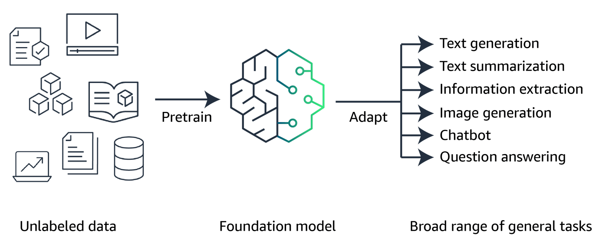
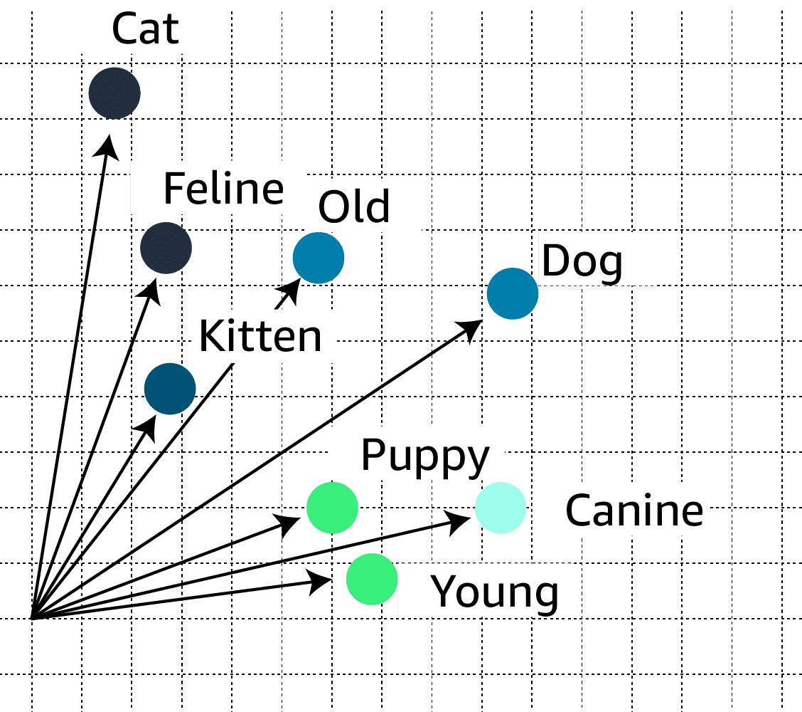

# Fundamentals of Machine Learning and Artificial Intelligence

# Introduction

In this course, you will learn about the foundations of machine learning (ML) and artificial intelligence (AI). You will explore the connections between AI, ML, deep learning, and the emerging field of generative artificial intelligence (generative AI), which has captured the attention of businesses and individuals alike. You will gain a solid understanding of foundational AI terms, laying the groundwork for a deeper dive into these concepts. Additionally, you will learn about a selection of Amazon Web Services (AWS) services that use AI and ML capabilities. You will gain practical insights into how these tools can be used to solve real-world problems and drive innovation across various industries.

## Welcome video

Welcome to Fundamentals of Machine Learning and Artificial Intelligence, where you will explore the world of generative AI and traditional machine learning. This technology is rapidly transforming industries and shaping the future of how we interact with machines.

Generative AI is a branch of artificial intelligence that focuses on creating new content, such as text, images, audio, or even computer code, from existing data. Unlike traditional AI or machine learning systems that analyze and interpret data, generative AI models learn patterns and relationships from vast amounts of training data and use that knowledge to generate entirely new content.

One of the most popular applications of generative AI is text generation, where models like Amazon Titan and Anthropic’s Claude can produce human-like writing on virtually any topic, from creative stories to technical reports. In the field of computer vision, generative AI models like Stable Diffusion can create stunning visual images from simple text prompts.

Generative AI is also revolutionizing the field of audio and speech synthesis. AI models can now generate realistic human-like voices for virtual assistants, audiobooks, and even podcasts. In the realm of coding, generative AI models can assist developers by auto-completing code snippets or even generating entire programs based on natural language descriptions.

As with any powerful technology, generative AI also raises important responsibility considerations. Issues like bias, privacy, and responsible use of these models must be carefully addressed to ensure they are deployed in a safe and trustworthy manner.

This course will provide you with the principles and concepts behind artificial intelligence, machine learning, deep learning, and generative AI. You will also discover how AWS services can play a role in your AI journey.

To fully appreciate the capabilities and potential of generative AI, it is crucial to understand its relationship with the broader fields of AI, machine learning, and deep learning. By examining the similarities and differences between these concepts, we can gain a more comprehensive understanding of the technological landscape and the synergies that drive innovation in this rapidly evolving domain.

## Artificial intelligence (AI)

AI is a broad field that encompasses the development of intelligent systems capable of performing tasks that typically require human intelligence, such as perception, reasoning, learning, problem-solving, and decision-making. AI serves as an umbrella term for various techniques and approaches, including machine learning, deep learning, and generative AI, among others.

## Machine learning (ML)

ML is a type of AI for understanding and building methods that make it possible for machines to learn. These methods use data to improve computer performance on a set of tasks.

## Deep learning (DL)

Deep learning uses the concept of neurons and synapses similar to how our brain is wired. An example of a deep learning application is Amazon Rekognition, which can analyze millions of images and streaming and stored videos within seconds.

## Generative AI

Generative AI is a subset of deep learning because it can adapt models built using deep learning, but without retraining or fine tuning.

Generative AI systems are capable of generating new data based on the patterns and structures learned from training data.

# Machine Learning Fundamentals

Building a machine learning model involves data collection and preparation, selecting an appropriate algorithm, training the model on the prepared data, and evaluating its performance through testing and iteration.

## Training data

The machine learning process starts with collecting and processing training data. Bad data is often called garbage in, garbage out, and therefore an ML model is only as good as the data used to train it. Although data preparation and processing are sometimes a routine process, it is arguably the most critical stage in making the whole model work as intended or ruining its performance.

There are a several different types of data used in training an ML model. First, it's important to know the difference between labeled and unlabeled data.

### Labeled data

Labeled data is a dataset where each instance or example is accompanied by a label or target variable that represents the desired output or classification. These labels are typically provided by human experts or obtained through a reliable process.

**Example:** In an image classification task, labeled data would consist of images along with their corresponding class labels (for example, cat, dog, car). 

### Unlabeled data

Unlabeled data is a dataset where the instances or examples do not have any associated labels or target variables. The data consists only of input features, without any corresponding output or classification.

**Example:** A collection of images without any labels or annotations

The main types of data used in training are structured and unstructured data. They come with various subtypes, which you can find by expanding the following categories.

### Structured data

Structured data refers to data that is organized and formatted in a predefined manner, typically in the form of tables or databases with rows and columns. This type of data is suitable for traditional machine learning algorithms that require well-defined features and labels. The following are types of structured data.

**Tabular data:** This includes data stored in spreadsheets, databases, or CSV files, with rows representing instances and columns representing features or attributes.

**Time-series data:** This type of data consists of sequences of values measured at successive points in time, such as stock prices, sensor readings, or weather data.

### Unstructured data

Unstructured data is data that lacks a predefined structure or format, such as text, images, audio, and video. This type of data requires more advanced machine learning techniques to extract meaningful patterns and insights.

Text data: This includes documents, articles, social media posts, and other textual data.

Image data: This includes digital images, photographs, and video frames.

## Machine learning process

The compiled training data is fed into machine learning algorithms. The ML learning process is traditionally divided into three broad categories: *supervised learning*, *unsupervised learning*, and *reinforcement learning*.

In *supervised learning*, the algorithms are trained on labeled data. The goal is to learn a mapping function that can predict the output for new, unseen input data.

*Unsupervised learning* refers to algorithms that learn from unlabeled data. The goal is to discover inherent patterns, structures, or relationships within the input data.

In *reinforcement learning*, the machine is given only a performance score as guidance and semi-supervised learning, where only a portion of training data is labeled. Feedback is provided in the form of rewards or penalties for its actions, and the machine learns from this feedback to improve its decision-making over time.

## Inferencing

After the model has been trained, it is time to begin the process of using the information that a model has learned to make predictions or decisions. This is called inferencing.

There are two main types of inferencing in machine learning: batch inferencing and real-time inferencing.

### Batch inferencing

Batch inferencing is when the computer takes a large amount of data, such as images or text, and analyzes it all at once to provide a set of results. This type of inferencing is often used for tasks like data analysis, where the speed of the decision-making process is not as crucial as the accuracy of the results.

### Real-time inferencing

Real-time inferencing is when the computer has to make decisions quickly, in response to new information as it comes in. This is important for applications where immediate decision-making is critical, such as in chatbots or self-driving cars. The computer has to process the incoming data and make a decision almost instantaneously, without taking the time to analyze a large dataset.

Both batch and real-time inferencing have their own unique advantages and use cases. Your use case will determine which inferencing type you use.

# Deep Learning Fundamentals

The field of deep learning is inspired by the structure and function of the brain. It involves the use of artificial neural networks, which are computational models that are designed to mimic the way the human brain processes information.

## Neural networks

At the core of deep learning are neural networks. Just like our brains have neurons that are connected to each other, neural networks have lots of tiny units called nodes that are connected together. These nodes are organized into layers. The layers include an input layer, one or more hidden layers, and an output layer.

When we show a neural network many examples, like data about customers who bought certain products or used certain services, it figures out how to identify patterns by adjusting the connections between its nodes. It's like the nodes are talking to each other and slowly figuring out the patterns that separate different types of customers.

When a neural network learns to recognize these patterns from the examples, it can then look at data for completely new customers that it has never seen before and still make predictions about what they might buy or how they might behave.

The following are a couple branches of AI where deep learning is used to enhance results.

### Computer vision

Computer vision is a field of artificial intelligence that makes it possible for computers to interpret and understand digital images and videos. Deep learning has revolutionized computer vision by providing powerful techniques for tasks such as image classification, object detection, and image segmentation.

### Natural language processing (NLP)

Natural language processing (NLP) is a branch of artificial intelligence that deals with the interaction between computers and human languages. Deep learning has made significant strides in NLP, making possible tasks such as text classification, sentiment analysis, machine translation, and language generation.

# Generative AI Fundamentals

Machine learning has been around for decades, which begs the question, what has led to the emergence of generative AI right now? The answer is as straightforward as huge investments in resources. Hiring a large team, spending on compute resources, and importantly, having the willingness to invest and develop big ideas, are all contributors to the rise of generative AI.

## Foundation models

Generative AI is powered by models that are pretrained on internet-scale data, and these models are called foundation models (FMs).  With FMs, instead of gathering labeled data for each model and training multiple models as in traditional ML, you can adapt a single FM to perform multiple tasks. These tasks include text generation, text summarization, information extraction, image generation, chatbot interactions, and question answering. FMs can also serve as the starting point for developing more specialized models.

### FM lifecycle

The foundation model lifecycle is a comprehensive process that involves several stages, each playing a crucial role in developing and deploying effective and reliable foundation models.

#### Data selection

Unlabeled data can be used at scale for pre-training because it is much easier to obtain compared to labeled data. Unlabeled data includes raw data, such as images, text files, or videos, with no meaningful informative labels to provide context. FMs require training on massive datasets from diverse sources.

#### Pre-training

Although traditional ML models rely on supervised, unsupervised, or reinforcement learning patterns, FMs are typically pre-trained through self-supervised learning. With self-supervised learning, labeled examples are not required. Self-supervised learning makes use of the structure within the data to autogenerate labels.

During the initial pre-training stage, the FM's algorithm can learn the meaning, context, and relationship of the words in the datasets. For example, the model might learn whether drink means beverage, the noun, or swallowing the liquid, the verb.

After the initial pre-training, the model can be further pre-trained on additional data. This is known as continuous pre-training. The goal is to expand the model's knowledge base and improve its ability to understand and generalize across different domains or tasks.

#### Optimization

Pre-trained language models can be optimized through techniques like prompt engineering, retrieval-augmented generation (RAG), and fine-tuning on task-specific data. These methods will vary in complexity and cost and will be discussed later in this lesson.

#### Evaluation

Whether or not you fine-tune a model or use a pre-trained model off the shelf, the next logical step is to evaluate the model. An FM's performance can be measured using appropriate metrics and benchmarks. Evaluation of model performance and its ability to meet business needs is important.

#### Deployment

When the FM meets the desired performance criteria, it can be deployed in the target production environment. Deployment can involve integrating the model into applications, APIs, or other software systems.

#### Feedback and continuous improvement

After deployment, the model's performance is continuously monitored, and feedback is collected from users, domain experts, or other stakeholders. This feedback, along with model monitoring data, is used to identify areas for improvement, detect potential biases or drift, and inform future iterations of the model. The feedback loop permits continuous enhancement of the foundation model through fine-tuning, continuous pre-training, or re-training, as needed.

#### Summary

It's important to note that the FM lifecycle is an iterative process, where lessons learned and insights gained from each stage can inform and improve subsequent iterations.

> ℹ️
> Amazon Bedrock provides access to a choice of high-performing FMs from leading AI companies like AI21 Labs, Anthropic, Cohere, Meta, Mistral AI, Stability AI, and Amazon.
> With these FMs as a foundation, you can further optimize their outputs with prompt engineering, fine-tuning, or RAG.

There are a few types of FMs that are essential to understanding generative AI's capabilities.

### Large language models
Large language models (LLMs) can be based on a variety of architectures, but the most common architecture in today's state-of-the-art models is the transformer architecture. Transformer-based LLMs are powerful models that can understand and generate human-like text. They are trained on vast amounts of text data from the internet, books, and other sources, and learn patterns and relationships between words and phrases.

To better understand how LLMs work, choose the following tabs to learn about tokens and embeddings and vectors.

#### TOKENS
Tokens are the basic units of text that the model processes. Tokens can be words, phrases, or individual characters like a period. Tokens also provide standardization of input data, which makes it easier for the model to process.

As an example, the sentence "A puppy is to dog as a kitten is to cat." might be broken up into the following tokens: “A” “puppy” “is” “to” “dog” “as” "a" “kitten” “is” “to” "cat." 

#### EMBEDDINGS AND VECTORS
Embeddings are numerical representations of tokens, where each token is assigned a vector (a list of numbers) that captures its meaning and relationships with other tokens. These vectors are learned during the training process and allow the model to understand the context and nuances of language.
 
For example, the embedding vector for the token "cat" might be close to the vectors for "feline" and "kitten" in the embedding space, indicating that they are semantically related. This way, the model can understand that "cat" is similar to "feline" and "kitten" without being explicitly programmed with those relationships.

LLMs use these tokens, embeddings, and vectors to understand and generate text. The models can capture complex relationships in language, so they can generate coherent and contextually appropriate text, answer questions, summarize information, and even engage in creative writing.

## Diffusion models
Diffusion is a deep learning architecture system that starts with pure noise or random data. The models gradually add more and more meaningful information to this noise until they end up with a clear and coherent output, like an image or a piece of text. Diffusion models learn through a two-step process of forward diffusion and reverse diffusion.

### Forward diffusion
Using forward diffusion, the system gradually introduces a small amount of noise to an input image until only the noise is left over.

### Reverse diffusion
In the subsequent reverse diffusion step, the noisy image is gradually introduced to denoising until a new image is generated.

Although some of the most well-known and impressive applications of diffusion models have been text-to-image models, diffusion models can be applied to a variety of tasks beyond just image generation.

## Multimodal models
Instead of just relying on a single type of input or output, like text or images, multimodal models can process and generate multiple modes of data simultaneously. For example, a multimodal model could take in an image and some text as input, and then generate a new image and a caption describing it as output.

These kinds of models learn how different modalities like images and text are connected and can influence each other. Multimodal models can be used for automating video captioning, creating graphics from text instructions, answering questions more intelligently by combining text and visual info, and even translating content while keeping relevant visuals.

## Other generative models
There are several types of generative models used in ML and AI. Expand the following tabs to learn more about two of these generative models not yet covered in this lesson.

### Generative adversarial networks (GANs)

GANs are a type of generative model that involves two neural networks competing against each other in a zero-sum game framework. The two networks are generator and discriminator.

**Generator**: This network generates new synthetic data (for example, images, text, or audio) by taking random noise as input and transforming it into data that resembles the training data distribution.

**Discriminator**: This network takes real data from the training set and synthetic data generated by the generator as input. Its goal is to distinguish between the real and generated data.

During training, the generator tries to generate data that can fool the discriminator into thinking it's real, while the discriminator tries to correctly classify the real and generated data. This adversarial process continues until the generator produces data that is indistinguishable from the real data.

### Variational autoencoders (VAEs)

VAEs are a type of generative model that combines ideas from autoencoders (a type of neural network) and variational inference (a technique from Bayesian statistics). In a VAE, the model consists of two parts:

**Encoder**: This neural network takes the input data (for example, an image) and maps it to a lower-dimensional latent space, which captures the essential features of the data.

**Decoder**: This neural network takes the latent representation from the encoder and generates a reconstruction of the original input data.

The key aspect of VAEs is that the latent space is encouraged to follow a specific probability distribution (usually a Gaussian distribution), which allows for generating new data by sampling from this latent space and passing the samples through the decoder.

## Optimizing model outputs
A key part of the foundation model lifecycle is the optimization phase. An FM can be further optimized in several different ways. These techniques vary in complexity and cost, with the fastest and lowest cost option being prompt engineering.

### Prompt engineering
Prompts act as instructions for foundation models. Prompt engineering focuses on developing, designing, and optimizing prompts to enhance the output of FMs for your needs. It gives you a way to guide the model's behavior to the outcomes that you want to achieve.
A prompt's form depends on the task that you are giving to a model. As you explore prompt engineering examples, you will review prompts containing some or all of the following elements:
- **Instructions:** This is a task for the FM to do. It provides a task description or instruction for how the model should perform.
- **Context:** This is external information to guide the model.
- **Input data:** This is the input for which you want a response.
- **Output indicator:** This is the output type or format.

The following is an example of a prompt that could be provided to a FM.
> **Example prompt**  
> You are an experienced journalist that excels at condensing long articles into concise summaries. Summarize the following text in 2–3 sentences.
> Text: [Long article text goes here]

### Fine-tuning
Although FMs are pre-trained through self-supervised learning and have inherent capability of understanding information, fine-tuning the FM base model can improve performance. Fine-tuning is a supervised learning process that involves taking a pre-trained model and adding specific, smaller datasets. Adding these narrower datasets modifies the weights of the data to better align with the task.

There are two ways to fine-tune a model:
- **Instruction fine-tuning** uses examples of how the model should respond to a specific instruction. Prompt tuning is a type of instruction fine-tuning.
- **Reinforcement learning** from human feedback (RLHF) provides human feedback data, resulting in a model that is better aligned with human preferences.

Consider this use case for fine-tuning. If you are working on a task that requires industry knowledge, you can take a pre-trained model and fine-tune the model with industry data. If the task involves medical research, for example, the pre-trained model can be fine-tuned with articles from medical journals to achieve more contextualized results.

### Retrieval-augmented generation

**Retrieval-augmented generation (RAG)** is a technique that supplies domain-relevant data as context to produce responses based on that data. This technique is similar to fine-tuning. However, rather than having to fine-tune an FM with a small set of labeled examples, RAG retrieves a small set of relevant documents and uses that to provide context to answer the user prompt. RAG will not change the weights of the foundation model, whereas fine-tuning will change model weights.

# Knowledge check

### Question 1
A company wants to develop a system that can accurately recognize and classify handwritten digits from images.

**Which of the following options best describes the use of neural networks for this task?**

- Neural networks are a type of decision tree algorithm that can be trained on image data to create a set of rules for classifying handwritten digits.
- Neural networks are a form of linear regression that can be used to map pixel values from images to corresponding digit labels.
- Neural networks are a type of deep learning model inspired by the structure and function of the human brain. They consist of interconnected nodes that can learn to recognize patterns in data, such as images of handwritten digits.
- Neural networks are a type of database system that can store and retrieve images of handwritten digits based on their pixel values and associated labels.

### Question 2
A company is developing an artificial intelligence (AI) system to control a self-driving car. The system learns through trial-and-error interactions with the driving environment, receiving rewards for safe and efficient actions.

**Which machine learning (ML) approach is being used in this scenario?**
- Supervised learning
- Reinforcement learning
- Unsupervised learning
- Self-supervised learning

### Question 3
A company is developing a large language model (LLM) for natural language processing tasks, such as text generation, summarization, and question answering.

**Which of the following best describes the role of embeddings, in the context of LLMs?**
- Embeddings are numerical representations of words or tokens, where semantically similar words have similar vector representations.
- Embeddings are the preprocessing techniques used to clean and tokenize the text data before feeding it into the LLM for training or inference.
- Embeddings are the ensemble methods used to combine multiple LLMs to improve the overall performance and robustness of the system.
- Embeddings are the linguistic rules and grammar patterns extracted from the text data to aid the LLM in understanding and generating language.

### Question 4
A company has pre-trained a large language model on a vast corpus of text data. They want to adapt this pre-trained model to perform specific tasks such as sentiment analysis and document summarization.

**Which of the following best describes the process of fine-tuning?**
- Fine-tuning involves training the pre-trained language model from scratch.
- Fine-tuning refers to the process of further training the pre-trained language model on labeled data for the specific tasks.
- Fine-tuning is a technique used to preprocess and clean the task-specific data before feeding it into the pre-trained language model.
- Fine-tuning is an ensemble method that combines the pre-trained language model with task-specific models to improve the overall performance.

### Question 5
A team is tasked with choosing a generative artificial intelligence (AI) model that can recognize and interpret different forms of input data, such as text, images, and audio.

**Which of the following model architectures is best suited for this task?**
- Large language model
- Diffusion model
- Multimodal model
- Foundation model

# AWS Infrastructure and Technologies
AWS offers a comprehensive suite of ML and generative AI services that can help you unlock the full potential of these transformative technologies.

In this lesson, you will learn about the various AI and ML services available on AWS, from text comprehension with Amazon Comprehend to code generation with Amazon Q Developer. You will gain a broad understanding of the capabilities of each service and how they can be used to build innovative, intelligent applications.

You will also explore the advantages of using AWS generative AI services, and the benefits of the AWS infrastructure when developing generative AI applications. Finally, you will be introduced to the cost trade-offs and considerations that you should keep in mind when using these powerful tools.

## AWS AI/ML services stack
The stack starts at the ML frameworks layer. At the core of this layer is Amazon SageMaker. SageMaker is a fully managed machine learning service that you can use to build, train, and deploy your own custom models. SageMaker provides tools and infrastructure to accelerate your ML development and deployment lifecycle.
 
Next is the AI/ML services layer, where you find a wide array of specialized services tailored for different use cases. In the text and documents domain, there is Amazon Comprehend for natural language processing, Amazon Translate for language translation, and Amazon Textract for extracting data from scanned documents.
 
For chatbots, AWS offers Amazon Lex, which you can use to build conversational interfaces powered by the same deep learning technologies that drive Amazon Alexa. In the speech domain, you can find Amazon Polly for text-to-speech and Amazon Transcribe for automatic speech recognition.
 
In the vision domain, you have Amazon Rekognition, a deep learning-based computer vision service that can analyze images and videos for a wide range of applications. For search, Amazon Kendra reimagines enterprise search for websites and applications so that individuals can readily find the content they are looking for.
 
In the recommendations domain, we have Amazon Personalize for real-time personalization and recommendations. Finally, in the miscellaneous category, there is AWS DeepRacer, a fully autonomous 1/18th scale race car that lets you get hands-on experience with reinforcement learning.
 
AWS offers even more in the generative AI layer. You will find a set of services and tools that unlock the power of foundation models. This includes Amazon SageMaker JumpStart, which provides a set of solutions for the most common use cases.

Amazon Bedrock is a fully managed service that makes FMs from Amazon and leading AI startups available through an API. With Amazon Bedrock, you can quickly get started, experiment with FMs, privately customize them with your own data, and seamlessly integrate and deploy FMs into AWS applications. If you'd prefer to experiment with building AI applications, you can get hands-on experience by using PartyRock, an Amazon Bedrock Playground.

Finally, you have applications like Amazon Q, a generative AI–powered assistant designed for work that can be tailored for a business's data. And there is Amazon Q Developer, providing ML–powered code recommendations to accelerate development in a variety of programming languages and applications.
 
Each of these services is designed to empower you to harness the potential of AI and ML, driving innovation, efficiency, and growth.

AWS rapidly innovates across the AI and ML stack, offering comprehensive capabilities from infrastructure and tools to groundbreaking applications like AI-based coding. Customers value the AWS data-first approach, security, and breadth of enterprise-grade offerings spanning all layers.

### ML frameworks
The ML frameworks layer plays a crucial role in the development and deployment of machine learning models. At the core of the frameworks layer is Amazon SageMaker. SageMaker offers the right tools to effectively build, train, and run LLMs and other FMs efficiently and cost effectively. Choose the following tab to learn more about this service.

#### Amazon SageMaker
With SageMaker, you can build, train, and deploy ML models for any use case with fully managed infrastructure, tools, and workflows. SageMaker removes the heavy lifting from each step of the ML process to make it easier to develop high-quality models. SageMaker provides all the components used for ML in a single toolset, so models get to production faster with much less effort and at lower cost.

### AI/ML services
AWS provides a robust AI/ML services layer, offering ready-to-use solutions like Amazon Comprehend for natural language processing tasks and Amazon Kendra for intelligent search across organizational data. This layer includes a wide range of services that provide developers with AI/ML capabilities without requiring extensive infrastructure management or specialized expertise. 

#### Amazon Comprehend

Amazon Comprehend uses ML and natural language processing (NLP) to help you uncover the insights and relationships in your unstructured data. This service performs the following functions:
Identifies the language of the text
Extracts key phrases, places, people, brands, or events
Understands how positive or negative the text is
Analyzes text using tokenization and parts of speech
And automatically organizes a collection of text files by topic

#### Amazon Translate

Amazon Translate is a neural machine translation service that delivers fast, high-quality, and affordable language translation. Neural machine translation is a form of language translation automation that uses deep learning models to deliver more accurate and more natural-sounding translation than traditional statistical and rule-based translation algorithms. With Amazon Translate, you can localize content such as websites and applications for your diverse users, translate large volumes of text for analysis, and efficiently implement cross-lingual communication between users.

#### Amazon Textract

Amazon Textract is a service that automatically extracts text and data from scanned documents. Amazon Textract goes beyond optical character recognition (OCR) to also identify the contents of fields in forms and information stored in tables.

#### Amazon Lex

Amazon Lex is a fully managed AI service to design, build, test, and deploy conversational interfaces into any application using voice and text. Amazon Lex provides the advanced deep learning functionalities of automatic speech recognition (ASR) for converting speech to text, and natural language understanding (NLU) to recognize the intent of the text. This permits you to build applications with highly engaging user experiences and lifelike conversational interactions, and create new categories of products. With Amazon Lex, the same deep learning technologies that power Amazon Alexa are now available to any developer. You can efficiently build sophisticated, natural-language conversational bots and voice-enabled interactive voice response (IVR) systems.

#### Amazon Polly

Amazon Polly is a service that turns text into lifelike speech. Amazon Polly lets you create applications that talk, so you can build entirely new categories of speech-enabled products. Amazon Polly is an AI service that uses advanced deep learning technologies to synthesize speech that sounds like a human voice. Amazon Polly includes a wide selection of lifelike voices spread across dozens of languages, so you can select the ideal voice and build speech-enabled applications that work in many different countries.

#### Amazon Transcribe

Amazon Transcribe is an automatic speech recognition (ASR) service for automatically converting speech to text. The service can transcribe audio files stored in common formats, like WAV and MP3, with time stamps for every word so that you can quickly locate the audio in the original source by searching for the text. You can also send a live audio stream to Amazon Transcribe and receive a stream of transcripts in real time. Amazon Transcribe is designed to handle a wide range of speech and acoustic characteristics, including variations in volume, pitch, and speaking rate. Customers can use Amazon Transcribe for a variety of business applications, including the following:
Transcription of voice-based customer service calls
Generation of subtitles on audio and video content
Conducting (text based) content analysis on audio and video content

#### Amazon Rekognition

Amazon Rekognition facilitates adding image and video analysis to your applications. It uses proven, highly scalable, deep learning technology that requires no ML expertise to use. With Amazon Rekognition, you can identify objects, people, text, scenes, and activities in images and videos, and even detect inappropriate content. Amazon Rekognition also provides highly accurate facial analysis and facial search capabilities. You can use it to detect, analyze, and compare faces for a wide variety of user verification, people counting, and public safety use cases.

#### Amazon Kendra

Amazon Kendra is an intelligent search service powered by ML. Amazon Kendra reimagines enterprise search for your websites and applications. Your employees and customers can conveniently find the content that they are looking for, even when it’s scattered across multiple locations and content repositories within your organization.

#### Amazon Personalize

Amazon Personalize is an ML service that developers can use to create individualized recommendations for customers who use their applications.

With Amazon Personalize, you provide an activity stream from your application (page views, signups, purchases, and so forth). You also provide an inventory of the items that you want to recommend, such as articles, products, videos, or music. You can choose to provide Amazon Personalize with additional demographic information from your users, such as age or geographic location. Amazon Personalize processes and examines the data, identifies what is meaningful, selects the right algorithms, and trains and optimizes a personalization model that is customized for your data.

#### AWS DeepRacer

AWS DeepRacer is a 1/18th scale race car that gives you an interesting and fun way to get started with reinforcement learning (RL). RL is an advanced ML technique that takes a very different approach to training models than other ML methods. Its superpower is that it learns very complex behaviors without requiring any labeled training data, and it can make short-term decisions while optimizing for a longer-term goal.

### Generative AI
Services included in the generative AI layer.
The generative AI services layer in the AI and ML stack offers a suite of powerful tools and services specifically designed for generative AI tasks. This layer includes services like SageMaker JumpStart for accelerating model development and deployment. Amazon Bedrock offers a choice of high-performing FMs from leading AI companies through a single API. With these services, developers and organizations can harness the capabilities of generative AI models, unlocking new possibilities for content creation, data synthesis, and interactive AI experiences. Choose the following tabs to learn more about these services

#### Amazon SageMaker JumpStart
SageMaker JumpStart helps you quickly get started with ML. To facilitate getting started, SageMaker JumpStart provides a set of solutions for the most common use cases, which can be readily deployed. The solutions are fully customizable and showcase the use of AWS CloudFormation templates and reference architectures so that you can accelerate your ML journey. SageMaker JumpStart also supports one-click deployment and fine-tuning of more than 150 popular open-source models such as natural language processing, object detection, and image classification models.

#### Amazon Bedrock
Amazon Bedrock is a fully managed service that makes FMs from Amazon and leading AI startups available through an API. With the Amazon Bedrock serverless experience, you can quickly get started, experiment with FMs, privately customize them with your own data, and seamlessly integrate and deploy FMs into your AWS applications.

#### Amazon Q
Amazon Q can help you get fast, relevant answers to pressing questions, solve problems, generate content, and take actions using the data and expertise found in your company's information repositories, code, and enterprise systems. When you chat with Amazon Q, it provides immediate, relevant information and advice to help streamline tasks, speed decision-making, and help spark creativity and innovation.

#### Amazon Q Developer
Designed to improve developer productivity, Amazon Q Developer provides ML–powered code recommendations to accelerate development of C#, Java, JavaScript, Python, and TypeScript applications. The service integrates with multiple integrated development environments (IDEs) and helps developers write code faster by generating entire functions and logical blocks of code—often consisting of more than 10–15 lines of code.

## Advantages and benefits of AWS AI solutions
From small startups to massive companies, organizations rely on AWS to innovate with powerful AI tools. AWS offers top-notch security and privacy features to keep your data safe, and it gives you access to the most advanced AI models available.

With AWS, you can build and grow your own custom AI applications that use generative AI. These applications can be tailored to your specific needs. AWS helps you take advantage of generative AI technology and create something truly unique and personalized.

### Accelerated development and deployment
Amazon Q Developer (previously Amazon CodeWhisperer) can generate code in real time. Amazon ran a productivity challenge during the preview of CodeWhisperer. Participants who used the service were 27 percent more likely to complete tasks successfully and did so an average of 57 percent faster than those who did not use CodeWhisperer.
SageMaker handles tasks such as data preprocessing, model training, and deployment. So developers can focus on the application logic and user experience.
Amazon Bedrock provides access to pre-trained models and APIs. So developers can quickly integrate AI capabilities into their applications without the need for extensive training or specialized hardware. This accelerates the development process and permits faster iteration cycles, reducing the time to market for AI-powered applications.

### Scalability and cost optimization
With pay-as-you-go pricing models, businesses only pay for the resources that they consume. This reduces upfront costs and facilitates efficient resource utilization.
AWS global infrastructure and distributed computing capabilities permit applications to scale seamlessly across regions and handle large datasets or high-volume traffic.

### Flexibility and access to models
AWS continuously updates and expands its AI services, providing access to the latest advancements in machine learning models, techniques, and algorithms.
Amazon Bedrock offers a choice of high-performing FMs from leading AI companies like AI21 Labs, Anthropic, Cohere, Meta, Mistral AI, Stability AI, and AWS, through a single API.

### Integration with AWS tools and services
Services like Amazon Comprehend and Amazon Rekognition offer ready-to-use AI capabilities that can be readily incorporated into applications.
AWS AI services seamlessly integrate with other AWS services, so developers can build end-to-end solutions that use multiple cloud services.
The AWS ecosystem provides a wide range of tools, SDKs, and APIs, so developers can incorporate AI capabilities into their existing applications or build entirely new AI-driven applications.

## Cost considerations
When working with AI and ML services on AWS, it's essential to understand the various cost considerations involved. These trade-offs can impact factors such as responsiveness, availability, redundancy, performance, regional coverage, pricing models, throughput, and the ability to use custom models.

### Responsiveness and availability
AWS generative AI services are designed to be highly responsive and available. However, higher levels of responsiveness and availability often come at an increased cost. For example, services with lower latency and higher availability (for example, multi-Region deployment) will typically have higher pricing compared to alternatives with lower performance and availability guarantees.

### Redundancy and Regional coverage
To ensure redundancy and high availability, AWS generative AI services can be deployed across multiple Availability Zones or even across multiple AWS Regions. This redundancy comes with an additional cost, because resources have to be provisioned and data replicated across multiple locations.

### Performance
AWS offers different compute options (for example, CPU, GPU, and custom hardware accelerators) for generative AI services. Higher-performance options, such as GPU instances, generally come at a higher cost but can provide significant performance improvements for certain workloads.

### Token-based pricing
Many AWS generative AI services, such as Amazon Q Developer and Amazon Bedrock, use a token-based pricing model. This means that you pay for the number of tokens (a unit of text or code) generated or processed by the service. The more tokens you generate or process, the higher the cost.

### Provisioned throughput
Some AWS generative AI services, like Amazon Polly and Amazon Transcribe, let you provision a specific amount of throughput (for example, audio or text processing capacity) in advance. Higher provisioned throughput levels typically come at a higher cost but can ensure predictable performance for time-sensitive workloads.

### Custom models
AWS provides pre-trained models for various generative AI tasks, but you can also bring your own custom models or fine-tune existing models. Training and deploying custom models can incur additional costs, depending on the complexity of the model, the training data, and the compute resources required.

It's important to carefully evaluate your specific requirements and workloads when choosing AWS services. Factors like those listed previously, can significantly impact the overall cost and performance.

By understanding these cost considerations, you can make informed decisions and optimize your AWS AI deployments to balance cost, performance, and other requirements effectively.

# Knowledge Check
### Question 1
A company has a large collection of customer support emails and chat transcripts. They want to analyze the sentiment expressed in these messages and identify common issues or topics discussed by their customers.

**Which AWS service would be most appropriate for this task? **
- Amazon Transcribe
- Amazon Kendra
- Amazon Polly
- Amazon Comprehend

### Question 2
A retail company has accumulated a large volume of customer transaction data, including purchase history, product preferences, and demographic information. The company wants to use this data to build machine learning models that can provide personalized product recommendations to customers and improve their overall shopping experience.

**Which AWS service would be most suitable for the retail company to build, train, and deploy machine learning models for personalized product recommendations?**
- Amazon SageMaker
- Amazon Bedrock
- Amazon Lex
- Amazon Q Developer