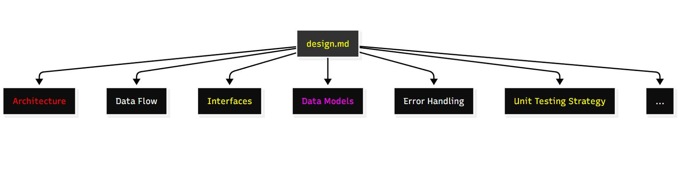

# Spec-Driven Development with Kiro


# Understanding Spec-driven Development

## What is Spec-driven Development
Spec-driven development (SDD) represents a software engineering methodology, prioritizing comprehensive planning and documentation before code implementation. This approach transforms how teams conceptualize and execute software projects by creating detailed specifications that serve as the project's foundation.

In today's rapidly evolving development landscape, the availability of powerful AI coding tools often encourages teams to bypass systematic planning and jump directly into implementation. While AI tools offer impressive code generation capabilities, spec-driven development takes a more structured approach by establishing clear alignment among stakeholders on project goals, requirements, and expected behaviors before development begins. This methodology is especially valuable for enterprise applications where system reliability, maintainable documentation, and effective cross-team collaboration directly impact business success.

The process involves creating detailed documentation covering requirements, expected behaviors, interfaces, and test criteria. This documentation becomes a living blueprint that guides the entire development lifecycle, from initial conception through to final implementation, ensuring code quality and reducing the likelihood of defects. This approach enables teams to create comprehensive test suites based on specifications, ensuring that the final implementation meets all documented requirements and behaviors while significantly reducing technical debt and improving long-term maintainability.

## Power of Spec-driven Development

### Early problem detection

Identifies and resolves ambiguities before coding begins.

Rather than discovering requirements issues mid-development, Kiro identifies and resolves ambiguities upfront. This prevents costly rewrites and provides alignment before coding begins

### Enhanced control

Creates natural pause points for review and modification.
The specification phase creates natural pause points where humans can review, modify, and approve the direction before resources are invested in implementation.

### Iterative refinement

Allows specification updates without losing progress.
If you make a mistake in defining your requirements, no problem. You can modify the specification files and regenerate the implementation plan without losing your entire conversation history.

### Team collaboration

Enables seamless sharing of knowledge and requirements.

Specification files serve as living documentation that team members can review, comment on, and contribute to using standard development workflows.

### Institutional knowledge

Preserves context and decision rationale for future reference.
Every decision and requirement is documented, creating a clear audit trail of why certain technical choices were made and preserving context for future team members

> Spec-driven development fundamentally improve how teams design, build, and maintain the software. Rather > than treating planning as overhead, it becomes your competitive advantage.

## Example of Specs for Soccer Voting Application
To understand spec-driven development in practice, let's examine a Soccer Voting Application - a web-based platform that enables secure, transparent voting for soccer-related events and polls. This example showcases how spec-driven development effectively manages complex features including user authentication, vote management, real-time result visualization, and administrative controls, while ensuring data integrity and user privacy through comprehensive specifications.

By examining this application through each specification phase, we'll see how detailed documentation guides development from initial concept through final deployment, ensuring that each component meets both functional requirements and security standards while maintaining code quality and system integrity.

#### REQUIREMENT SPECS
Requirements spec sample for a Soccer Voting application


#### DESIGN SPECS
Design spec sample for a Soccer Voting application


#### IMPLEMENTATION SPECS
Implementation spec sample for a Soccer Voting application


#### TECHNICAL SPECS
Technical spec sample for a Soccer Voting application


# Current State and Challenges
## Challenges with traditional development practice and AI tools

#### Context fragmentation and incomplete understanding

*Traditional development practices, even when augmented by AI tools, often struggle with fragmented context. AI assistants, while powerful, have limited ability to grasp the full scope of complex projects. This results in code generation that may be syntactically correct but misaligned with broader architectural goals or business requirements. Developers find themselves constantly bridging the gap between AI-generated snippets and the overarching system design.*

#### Quality and security trade-offs

*The rapid code generation capabilities of AI tools can lead to a false sense of productivity. The output often requires substantial refactoring to meet quality standards and security requirements. Traditional practices need to rigorously validate and secure AI-generated code, leading to potential vulnerabilities and increased technical debt.*

#### Workflow disruption and integration hurdles

*The constant context-switching between human-driven design and AI-assisted coding can disrupt developer focus and team dynamics. Many teams struggle to find the right balance between leveraging AI capabilities and maintaining the structured approach necessary for complex software projects. This integration challenge often results in fragmented codebases and inconsistent development practices across teams.*

#### Scalability and long-term maintenance issues

*As projects grow in scale and complexity, the limitations of AI-assisted traditional practices become more apparent. Without a comprehensive understanding of system architecture and long-term maintainability, AI tools may generate code that becomes increasingly difficult to manage over time.*


The current AI coding assistants often struggle with limited context windows and inefficient back-and-forth iterations. This results in cluttered conversations and compromised code quality as the AI lacks complete understanding of project requirements.

This is where the **Kiro**, fundamentally changes how we approach AI-assisted development through *Spec-Driven Development* approach.

What is the primary difference between spec-driven development and other traditional development approaches?

- Spec-driven development focuses on immediate coding while traditional approaches prioritize planning
- Spec-driven development requires more developers than traditional approaches
- Spec-driven development prioritizes comprehensive planning and documentation before coding begins
- Spec-driven development eliminates the need for testing

Spec-driven development prioritizes comprehensive planning and documentation before code implementation. This allows teams to identify and resolve ambiguities and potential issues early in the process, before coding begins. This early problem detection is a significant advantage over traditional approaches that often discover requirements issues mid-development.

# Kiro's Development Approach

## What is Kiro
Kiro is an innovative AI-powered IDE that revolutionizes software development through intelligent assistance and structured workflows. Built on a familiar VS Code-like interface, it combines traditional development tools with advanced AI capabilities to support the entire software development lifecycle.

Kiro differentiates itself through its spec-first approach, moving beyond simple code generation to provide comprehensive project planning, design, and implementation support. It uses cutting edge and frontier models to understand developer intent, and create structured specifications before generating any code.
Core concepts

## Core concepts

Autonomous - Autonomous and supervised code generation and modification

Specs - Specs for breaking down complex features into manageable implementation plans

Hooks - Hooks that automate repetitive tasks based on IDE events

Steering - Steering capabilities for fine-tuning AI behavior to match team standards

Model Context Protocol (MCP) - MCP for extending functionality with specialized tools

Comprehensive - Comprehensive codebase understanding and contextual assistance

## Development Approach
If you're working on a challenging feature, Kiro serves as your intelligent sounding board to help you understand your codebase, define your problem clearly, and reach a quality solution efficiently. You can collaborate with Kiro on creating concise specifications that include clear requirements, system architecture, tech stack considerations, and implementation approach. Kiro helps make all requirements and constraints explicit, then uses these specifications as context to complete tasks with fewer iterations and higher accuracy.

Let's review the Kiro's approach in spec-driven development

#### Understand your existing codebase

Before starting new development, Kiro analyzes your existing code and generates three foundational documents: 
- **structure.md** (codebase architecture), 
- **tech.md** (technical stack and patterns),
- **product.md** (business context and requirements).
This gives you and your team a clear baseline understanding that informs all subsequent specification work. Existing codebases can now take advantage of this new paradigm.

#### Analyze and plan your project

When you provide a project prompt in spec mode, Kiro's AI doesn't immediately start coding. Instead, it performs deep analysis to understand your requirements, identifies potential challenges, and creates comprehensive planning documents.

#### Generate comprehensive planning documentation

From a simple prompt, Kiro creates detailed specification files including:
- **Requirements Analysis** - Breaking down your prompt into specific, actionable requirements
- **Technical Design** - Architecture decisions, technology choices, and implementation approach
- **Task Breakdown** - Granular development tasks with clear acceptance criteria

#### Collaborate with AI effectively

Kiro saves specification files in your project directory as readable markdown files. You can review, edit, and refine them before any code is written. This creates natural checkpoints for collaboration with team members or stakeholders.

#### Maximize coding context and efficiency

When it's finally time to write code, Kiro references these specification files rather than cluttering your context window with exploratory conversation. This means maximum context space is available for the actual coding task.

> From a single prompt, you can collaborate with Kiro on creating concise specifications that include clear requirements, system architecture, tech stack considerations, and implementation approach

Which of the following is **NOT** a core concept of Kiro?

- Autonomous and supervised code generation
- Specs for breaking down complex features
- Manual code review processes
- Hooks that automate repetitive tasks

While Kiro incorporates many advanced features to assist with development, being an Agentic IDE, the manual code review processes are not listed as one of its core concepts. Below are the core concepts for your review:
- Autonomous and supervised code generation and modification
- Specs for breaking down complex features into manageable implementation plans
- Hooks that automate repetitive tasks based on IDE events
- Steering capabilities for fine-tuning AI behavior to match team standards
- MCP (Model Context Protocol) for extending functionality with specialized tools
- Comprehensive codebase understanding and contextual assistance 

# Kiro - Specs

## Specification Structure
Specs are a structured approach to building and documenting features with Kiro. They formalize the design and implementation process, allowing you to iterate with the agent on requirements, design, and implementation tasks.

## Key Components
1. Requirements definition
2. Design considerations
3. Implementation tasks
4. References to supporting documentation

Specs bridge the gap between conceptual product requirements and technical implementation details, ensuring alignment and reducing development iterations. Kiro generates three key files that form the foundation of each specification:

  
Kiro's approach in creating specs

**requirements.md** - captures user stories and acceptance criteria in structured notation.

**design.md** - documents technical architecture, sequence diagrams, and implementation considerations.

**tasks.md** - provides a detailed implementation plan with discrete, and trackable tasks.

> Specs act as living documents that evolve with your project, maintaining synchronization between documentation and code. This approach ensures that teams can collaborate effectively while preserving institutional knowledge and design decisions.

# Kiro - Project Workflow

## Workflow Overview
The Kiro workflow follows a logical progression through four distinct phases, each building upon the previous to create a comprehensive development process. At each stage, Kiro's AI capabilities assist in generating and refining specifications while maintaining focus on project goals.

  
Kiro's flexible workflow in creating project specs


## Workflow Phases
The workflow follows a logical progression with decision points between phases, ensuring each step is properly completed before moving to the next.


#### Requirements Phase

Define user stories and acceptance criteria in structured notation

#### Design Phase

Document the technical architecture, sequence diagrams, and implementation considerations

#### Implementation Phase

Break down the work into discrete, trackable tasks with clear descriptions and outcomes

#### Execution Phase

Track progress as tasks are completed, with the ability to update and refine the spec as needed

> The workflow remains highly adaptable, allowing for iterative refinement at any stage, while Kiro handles the complexity of automatically adjusting any dependencies when modifications are made, making the entire development process both flexible and efficiently managed.

# Kiro - Workflow Components

## Requirements Phase
Requirements in Kiro are captured using the Easy Approach to Requirements Syntax (EARS) notation, providing clear, testable criteria for development. Each requirement follows a structured format that specifies conditions and expected behaviors, making it easier to translate requirements into actual features.

EARS notation provides a structured format for writing clear, testable requirements. In a spec's requirements.md file, each requirement follows this pattern:

```
WHEN [condition/event]
THE SYSTEM SHALL [expected behavior]
```

The following example demonstrates this pattern:

>*Condition or event*  
>**WHEN**  
>a user submits a form with invalid data

>*Expected behavior*  
>**THE SYSTEM SHALL**  
>display validation errors next to the relevant fields

This structured approach offers several benefits:

>#### Clarity
>
>Requirements are unambiguous and easy to understand ·

>#### Testability
>
>Each requirement can be directly translated into test cases

>#### Traceability
>
>Individual requirements can be tracked through implementation

>#### Completeness
>
>The format encourages thinking through all conditions and behaviors

Kiro helps you transform vague feature requests into these well-structured requirements, making the development process more efficient and reducing misunderstandings between product and engineering teams.

Here is a sample of requirement.md created by Kiro based on the specs of Soccer Voting Application.

  
Sample requirements.md

## Design Phase
The design phase in Kiro focuses on translating requirements into technical specifications and architecture decisions. Through the design.md file, teams can document system components, interactions, and implementation considerations in a format that's both human-readable and AI-processable.

Kiro's specs offer a structured approach to design documentation, making it easier to understand and collaborate on complex systems. The design.md file is where you document technical architecture, sequence diagrams, and implementation considerations. It's a great place to capture the big picture of how the system will work, including the components and their interactions.

Sample of components can be included in Design.md

Here is a sample of design.md created by Kiro based on the specs of Soccer Voting Application.
  
Sample design.md

## Implementation Phase
The implementation phase in Kiro breaks down high-level requirements into discrete, manageable tasks. The tasks.md file serves as a dynamic roadmap, tracking progress and maintaining alignment between specifications and actual development work.

The tasks.md file is where you provide a detailed implementation plan with discrete, trackable tasks and sub-tasks. Each task is clearly defined, with a clear description, expected outcome, and any necessary resources or dependencies. Kiro's specs offer a structured approach to implementation plans, making it easier to understand and collaborate on complex systems.

Kiro provides a task execution interface for tasks.md files that displays real-time status updates. Tasks are updated as in-progress or completed, allowing you to efficiently track implementation progress and maintain an up-to-date view of your development status.

Here is a sample of tasks.md created by Kiro based on the specs of Soccer Voting Application.

Implementation of tasks in Kiro

What notation does Kiro use for capturing requirements in a structured format?

- UML
- EARS
- JSON
- XML

Kiro uses EARS (Easy Approach to Requirements Syntax) notation for capturing requirements. This structured format provides clear, testable criteria for development, specifying conditions and expected behaviors

# Best Practices - Spec-driven Development in Kiro

Successful implementation of Kiro's spec-driven development relies on following established best practices that maximize efficiency and collaboration. These practices ensure that teams can fully leverage Kiro's capabilities while maintaining code quality and project organization.

The following practices have been proven effective across various project sizes and team structures, helping organizations maintain consistency and quality in their development processes.

## Managing shared specs within a team
Teams can share artifacts (steering, hooks, and specs) by leveraging Git submodules or package references. Here are some options to consider:

>#### Create a central specs repository
>
>Establish a dedicated repository for shared artifacts that multiple projects can reference

>#### Use Git submodules or package references
>
>Link your central artifacts to individual projects using Git submodules, package references, or symbolic links depending on your development environment

>#### Implement cross-repository workflows
>
>Develop processes for proposing, reviewing, and updating shared artifacts that affect multiple projects

## Handling multiple specs
Create separate specs for different features within your project rather than maintaining a single spec for your entire codebase.

For example, in an e-commerce application, organize your specs like this:
  
Sample for multi specs usage in the same project

This approach helps you to:
- Work on features independently without conflicts
- Maintain focused, manageable spec documents
- Iterate on specific functionality without affecting other areas
- Collaborate with team members on different features simultaneously

## Importing existing requirements
When importing requirements or designs from another system (such as JIRA, Confluence, or Word documents), you have two options:

>#### Using MCP integration
>
>Connect directly through an MCP server that supports STDIO to import requirements into your spec session

>#### Manual import
>
>Copy existing requirements (e.g., foo-prfaq.md) into a new file in your repository, open a spec chat >session, and use the command "#foo-prfaq.md Generate a spec from it"

## Task execution

>#### Perform task-wise execution
>
>While you can execute all tasks in your tasks.md file at once, it is recommended executing tasks >individually for better control and results


>#### Managing task execution in a collaborative environment
>
>##### Option 1: Update tasks via tasks.md
>Open your tasks.md file  
>Choose "Update tasks"  
>Kiro will automatically mark completed tasks  
>##### Option 2: Use Kiro's scanning capability
>In a spec session, ask Kiro: "Check which tasks are already complete"  
>Kiro will analyze your codebase and identify implemented functionality  
>Tasks will be automatically marked as completed  