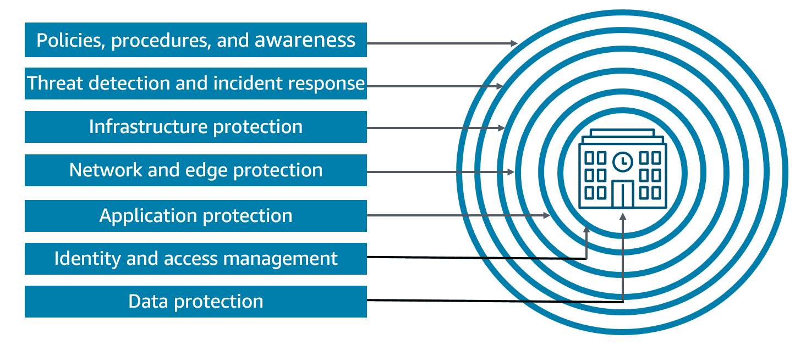
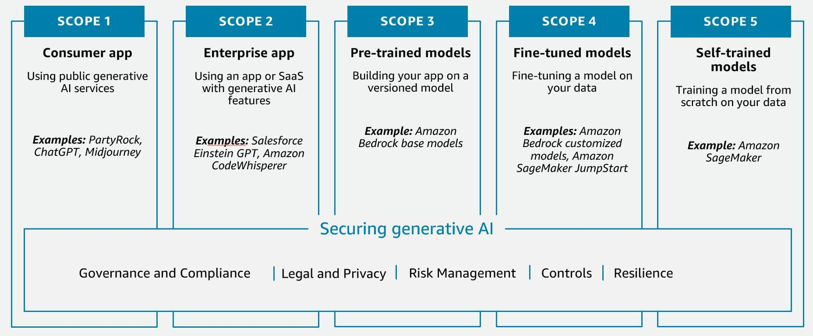

# Course Overview

## Security, compliance, and governance for AI solutions

Amazon Web Services (AWS) provides a comprehensive set of tools, services, and partner solutions to build and secure artificial intelligence (AI) systems. These resources help achieve compliance objectives, such as protecting data, and apply governance to manage risk and accelerate business outcomes. 

This course helps you understand some common issues of around security, compliance, and governance associated with artificial intelligence (AI) solutions. You will learn how to recognize governance and compliance requirements for AI systems. You will also learn about various Amazon Web Services (AWS) services and features that will help you apply governance controls and achieve your compliance objectives. Finally, you will be introduced to AWS services that can help you secure your AI systems.

## Learning objectives

**In this course, you will learn to do the following:**

- **Recognize governance and compliance requirements for AI systems**
    - Identify and describe common governance and compliance considerations for AI systems.
    - Describe the AWS services that assist with applying governance controls and achieving compliance objectives.
    - Describe common data governance strategies.
    - Describe common approaches for implementing governance strategies.
- **Explain methods for securing AI systems**
    - List and describe security and privacy considerations for AI systems.
    - Describe AWS services and features for securing AI systems.
    - Describe tasks like source citation and documenting data origins.
    - Describe best practices for secure data engineering.

# Strategic Guidance for Security, Governance, and Compliance

## Concepts of security, governance, and compliance in organizations 

Security, governance, and compliance might seem like the same function. The following are examples of the primary goals of each:
- **Security**: Ensure that confidentiality, integrity, and availability are maintained for organizational data and information assets and infrastructure. This function is often called information security or cybersecurity in an organization.
- **Governance**: Ensure that an organization can add value and manage risk in the operation of business.
- **Compliance**: Ensure normative adherence to requirements across the functions of an organization.

Organizations implement security, governance, and compliance functions to assure that they can deliver on their primary business. Sometimes the requirements for these functions are referred to as the most important requirements, or the things that must not be sacrificed in product development or delivery.

## Defense in depth 
This course focuses on one of the most common paradigms, known as defense in depth, that organizations follow to integrate their security, governance, and compliance functions while building on AWS. Here are some features of a defense in depth security strategy:

- A defense in depth security strategy uses multiple redundant defenses to protect your AWS accounts, workloads, data, and assets. It helps make sure that if any one security control is compromised or fails, additional layers exist to help isolate threats and prevent, detect, respond, and recover from security events.
- Applying a defense in depth security strategy to generative AI workloads, data, and information can help create the best conditions to achieve business objectives. Defense-in-depth security mitigates many of the common risks that any workload faces by layering controls, helping teams govern generative AI workloads using familiar tools. 
- You can use a combination of strategies, including AWS and AWS Partner services and solutions, at each layer to improve the security and resiliency of your generative AI workloads.

>#### 1. Data protection
>
>Data at rest: Ensure that all data at rest is encrypted with AWS Key Management Service (AWS KMS) or >customer managed key. Make sure all data and models are versioned and backed up using Amazon Simple Storage >Service (Amazon S3) versioning.
>
>Data in transit: Protect all data in transit between services using AWS Certificate Manager (ACM) and AWS Private Certificate Authority (AWS Private CA). Keep data within virtual private clouds (VPCs) using AWS PrivateLink.

>#### 2. Identity and access management
>
>Identity and access management ensures that only authorized users, applications, or services can access and interact with the cloud infrastructure and its services.
>
>AWS offers several services that can be used for identity and access management. The fundamental service is AWS Identity and Access Management (IAM).

>#### 3. Application protection
>
>This includes measures to protect against various threats, such as unauthorized access, data breaches, denial-of-service (DoS) attacks, and other security vulnerabilities.
>
>AWS offers several services to protect applications. These include the following:
>
>- AWS Shield
>- Amazon Cognito
>- Others

>#### 4. Network and edge protection
>
>Security services are used to protect the network infrastructure and the boundaries of a cloud environment. Services are designed to prevent unauthorized access, detect and mitigate threats, and ensure the security of the cloud-based resources.
>
>AWS services that provide network and edge protection include the following:
>
>- Amazon Virtual Private Cloud (Amazon VPC)
>- AWS WAF

>#### 5. Infrastructure protection
>
>Protect against various threats, such as unauthorized access, data breaches, system failures, and natural disasters. Ensure the availability, confidentiality, and integrity of the cloud-based resources and data. Some AWS services and features include the following:
>
>- AWS Identity and Access Management (IAM)
>- IAM user groups and network access control lists (network ACLs)

>#### 6. Threat detection and incident response
>
>Identify and address potential security threats or incidents.
>
>AWS services that help with threat detection include:
>- AWS Security Hub
>- Amazon GuardDuty
>AWS services for incident response include the following:
>- AWS Lambda
>- Amazon EventBridge

>#### 7. Policies, procedures, and awareness
>
>Implement a policy of least privilege using AWS Identity and Access Management Access Analyzer to look for overly permissive accounts, roles, and resources. Then, restrict access using short-termed credentials.

You will learn more about security later in the course.

## Developing a high-level strategy for governance and compliance

### High-level strategy for governance and compliance

Developing a high-level governance and compliance strategy for an organization producing AI solutions is important for ensuring the responsible deployment of these technologies. To begin, you might consider the following:

- Establish an AI governance framework
- Address AI compliance considerations

>#### Governance framework
>The following is an example approach for establishing a governance framework.
>
>- **Establish an AI governance board or committee**: This cross-functional team should include representatives from various departments, such as legal, compliance, data privacy, and subject matter experts in AI development.
>- **Define roles and responsibilities**: Clearly outline the roles and responsibilities of the governance board, including oversight, policy-making, risk assessment, and decision-making processes.
>- **Implement policies and procedures**: Develop comprehensive policies and procedures that address the entire AI lifecycle, from data management to model deployment and monitoring.

You will learn more about governance and compliance later in the course.

# Compliance Standards for AI Systems

## The importance of governance and compliance for AI systems

Following are points that explain the advantages of governance and compliance:

- Managing, optimizing, and scaling the organizational AI initiative is at the core of the governance perspective. Incorporating AI governance into an organization’s AI strategy is instrumental in building trust. Governance also helps in enabling the deployment of AI technologies at scale, and overcoming challenges to drive business transformation and growth.

- Governance and compliance are important for AI systems used in business to ensure responsible and trustworthy AI practices. As AI systems become more prevalent in decision-making processes, it is essential to have robust governance frameworks and compliance measures in place to mitigate risks. These risks include bias, privacy violations, and unintended consequences.

- Governance helps organizations establish clear policies, guidelines, and oversight mechanisms to ensure AI systems align with legal and regulatory requirements, in addition to ethical principles and societal values. Therefore, governance protects the organization from potential legal and reputational risks. It also fosters public trust and confidence in the responsible deployment of AI technologies within the business context.

## AWS compliance

AWS compliance empowers customers to understand the robust controls in place at AWS to maintain security and data protection in the AWS Cloud. AWS supports 143 security standards and compliance certifications.

Typically, customers decide their own tolerance for risk. The following are some specific security standards that might apply to AI systems.

>#### National Institute of Standards and Technology (NIST)
>The NIST 800-53 security controls are commonly used for U.S. federal information systems. Federal information systems typically need to undergo a formal evaluation and approval process to verify they have adequate safeguards in place to protect the confidentiality, integrity, and availability of the information and information systems.

>#### European Union Agency for Cybersecurity (ENISA)
>European Union Agency for Cybersecurity (ENISA) contributes to the EU’s cyber policy. It boosts trust in digital products, services, and processes by drafting cybersecurity certification schemes. It cooperates with EU countries and bodies and helps prepare for future cyber challenges. 

>#### International Organization for Standardization (ISO)
>ISO is a security standard that outlines recommended security management practices and comprehensive security controls, based on the guidance provided in the ISO/IEC 27002 best practice document.

>#### AWS System and Organization Controls (SOC)
>The AWS System and Organization Controls (SOC) Reports are independent assessments conducted by third parties that show how AWS has implemented and maintained key compliance controls and objectives.

>#### Health Insurance Portability and Accountability Act (HIPAA)
>AWS empowers covered entities and their business associates under the U.S. HIPAA regulations to use the secure AWS environment for processing, maintaining, and storing protected health information.

>#### General Data Protection Regulation (GDPR)
>The European Union's GDPR safeguards the fundamental right of EU citizens to privacy and the protection of their personal information. The GDPR establishes stringent requirements that raise and unify the standards for data protection, security, and compliance across the EU.

>#### Payment Card Industry Data Security Standard (PCI DSS)
>The PCI DSS is a private information security standard that is managed by the PCI Security Standards Council. This council was established by a group of major credit card companies, including American Express, Discover Financial Services, JCB International, Mastercard, and Visa.

## AI standards compliance

AI standards compliance influences how organizations follow established guidelines, rules, and legal requirements that govern the development, deployment, and use of AI technologies.

There are several key ways in which AI standards compliance differs from traditional software and technology requirements. The following are some issues to consider.

>#### Complexity and opacity
>AI systems, especially large language models (LLMs) and generative AI, can be highly complex with opaque decision-making processes. This makes it challenging to audit and understand how they arrive at outputs, which is crucial for compliance.

>#### Dynamism and adaptability
>AI systems are often dynamic and can adapt and change over time, even after deployment. This makes it difficult to apply static standards, frameworks, and mandates.

>#### Emergent capabilities
>Emergent capabilities in AI systems refer to unexpected or unintended capabilities that arise as a result of complex interactions within the AI system. In contrast to capabilities that are explicitly programmed or designed.
>
>As AI systems become more advanced, they might exhibit unexpected or emergent capabilities that were not anticipated during the regulatory process. This requires ongoing monitoring and adaptability.

>#### Unique risks
>AI poses novel risks, such as algorithmic bias, privacy violations, misinformation, and AI-powered automation displacing human workers. Traditional requirements might not adequately address these.
>
>Algorithmic bias refers to the systematic errors or unfair prejudices that can be introduced into the outputs of AI and machine learning (ML) algorithms. The following are some examples:
>
>- **Biased training data**: If the data used to train the AI model is not representative or contains historical biases, the model can learn and perpetuate those biases in its outputs.
>- **Human bias**: The biases and assumptions of the human developers and researchers who create the AI systems can also get reflected in the final outputs.

>#### Algorithm accountability
>Algorithm accountability refers to the idea that algorithms, especially those used in AI systems, should be transparent, explainable, and subject to oversight and accountability measures. These safeguards are important because algorithms can have significant impacts on individuals and society. They can potentially perpetuate biases or make decisions that violate human rights or the principles of responsible AI.
>
>Examples of algorithm accountability laws include the European Union's proposed Artificial Intelligence Act, which includes provisions for transparency, risk assessment, and human oversight of AI systems. In the >United States, several states and cities have also passed laws related to algorithm accountability, such as >New York City's Automated Decision Systems Law.
>
>The goal of these laws is to ensure that AI systems are designed and used in a way that respects human rights, promotes fairness and non-discrimination, and upholds the principles of responsible AI. 

## Regulated workloads

### What is a regulated workload? 

Regulated is a common term used to indicate that a workload might need special consideration, because of some form of compliance that must be achieved.

This term often refers to customers who work in industries with high degrees of regulatory compliance requirements or high industrial demands. 

Some example industries are as follows:

- Financial services
- Healthcare
- Aerospace

> #### Data regulation and governance
> You can be sure that you’re operating in a regulated context when you must comply with regulatory frameworks such as HIPAA, GDPR, PCI DSS, and others.

>#### Expected impacts and usage
>An example of a *regulated process* would be reporting to a US federal agency, such as the Food and Drug Administration (FDA).
>
>An example of *regulated outcomes or decisions* would be mortgage and credit applications.
>
>An example of *regulated usage* would be a safety-critical system. If a workload fails, then there could be safety implications.
>
>*Regulated liabilities* are related to AI models. If the model fails, there are significant liabilities.

>#### Industry standarts and guidelines
>Industry standards and guidelines require you to meet the bar for their industrial practice, which might not be specifically a legal compliance framework. HIPAA is and example of this, but it still could have detailed governance and policy implications. 

### Example regulated workloads

Example workloads that are regulated or that need to be handled as though they are regulated include the following: 

- HR workloads
- Safety workloads
- Inspection and regulatory compliance workloads

### Which indicators tell you that your workload might be regulated?
You are operating in a regulated context when you must comply with regulatory frameworks such as HIPAA, GDPR, PCI DSS, and others.

You can realize your data needs by determining if such standards exist or apply. Ask the following questions.

>#### Questions to ask
>- Do you need to audit this workload?
>- Do you need to archive this data for a period of time?
>- Will the predictions created by my model constitute a record or other special data item?
>- Do any of the systems you get the data from contain data classifications that are restricted by your organization’s governance, but not a regulatory framework? For example, customer addresses.

# AWS Services for Governance and Compliance

## AWS Governance and Compliance

AWS takes a proactive and collaborative approach to governance and compliance when it comes to AI and generative AI workflows. AWS works closely with regulators, customers, and other stakeholders to ensure these technologies are used responsibly and in alignment with relevant laws and regulations.

AWS has many services and features to assist with governance and regulation compliance. The following is a brief description of some of the key services.

#### AWS Config

AWS Config provides a detailed view of the configuration of AWS resources in your AWS account. This includes how the resources are related to one another and how they were configured in the past so that you can see how the configurations and relationships change over time.

When you run your applications on AWS, you usually use AWS resources, which you must create and manage collectively. As the demand for your application keeps growing, so does your need to keep track of your AWS resources. The following are some scenarios where AWS Config can help you oversee your application resources:

- **Resource administration**: Exercise governance over your resource configurations and detect resource misconfigurations.
- **Auditing and compliance**: You might work with data that requires frequent audits to ensure compliance with internal policies and best practices. AWS Config helps you demonstrate compliance by providing access to the historical configurations of your resources.
- **Managing and troubleshooting configuration changes**: You can view how any resource you intend to modify is related to other resources and assess the impact of your change. 

#### Amazon Inspector
Amazon Inspector is a vulnerability management service that continuously scans your AWS workloads for software vulnerabilities and unintended network exposure.  

Amazon Inspector automatically discovers and scans running AWS resources for known software vulnerabilities and unintended network exposure. Some of these resources include Amazon Elastic Compute Cloud (Amazon EC2) instances, container images, and Lambda functions. Amazon Inspector creates a finding when it discovers a software vulnerability or network configuration issue. 

Some examples of these vulnerabilities include the following:

- **Package vulnerability**: There are software packages in your AWS environment that are exposed to common vulnerabilities and exposures (CVEs). 
- **Code vulnerability**: There are lines in your code that attackers could exploit. Other vulnerabilities include data leaks, weak cryptography, and missing encryption.
- **Network reachability**: There are open network paths to Amazon EC2 instances in your environment.

Some features of Amazon Inspector include the following:

- Continuously scan your environment for vulnerabilities and network exposure. 
- Assess vulnerabilities accurately and provide a risk score.
- Identify high-impact findings.
- Monitor and process findings with other services and systems.
**Note**: The risk score is based on security metrics from the National Vulnerability Database(opens in a new tab) (NVD) and is adjusted according to your compute environment.

#### AWS Audit Manager
AWS Audit Manager helps you continually audit your AWS usage to streamline how you manage risk and compliance with regulations and industry standards. 

Audit Manager automates evidence collection so you can conveniently assess whether your policies, procedures, and activities (also known as controls) are operating effectively. When it's time for an audit, Audit Manager helps you manage stakeholder reviews of your controls. 

Some tasks you can perform with Audit Manager include the following:

- Upload and manage evidence from hybrid or multi-cloud environments.
- Support common compliance standards and regulations.
- Monitor your active assessments.
- Search for evidence.
- Ensure evidence integrity.

#### AWS Artifact
AWS Artifact provides on-demand downloads of AWS security and compliance documents, such as AWS ISO certifications, PCI reports, and SOC Reports. 

You can submit the security and compliance documents to your auditors or regulators to demonstrate the security and compliance of your AWS infrastructure.

AWS customers are responsible for developing or obtaining documents that demonstrate the security and compliance of their companies. You will learn more about the responsibilities of customers in a later lesson about the Shared Responsibility Model.

#### AWS CloudTrail
AWS CloudTrail helps you perform operational and risk auditing, governance, and compliance of your AWS account. Actions taken by a user, role, or an AWS service are recorded as events in CloudTrail. Events include actions taken in the AWS Management Console, AWS Command Line Interface (AWS CLI), and AWS SDKs and APIs. 

Visibility into your AWS account activity is a key aspect of security and operational best practices. You can use CloudTrail to view, search, download, archive, analyze, and respond to account activity across your AWS infrastructure. You can identify who took which action, which resources were acted upon, and when the event occurred. These and other details can help you analyze and respond to activity in your AWS account.

#### AWS Trusted Advisor
AWS Trusted Advisor helps you optimize costs, increase performance, improve security and resilience, and operate at scale in the cloud. 

Trusted Advisor continuously evaluates your AWS environment using best practice checks across the categories of cost optimization, performance, resilience, security, operational excellence, and service limits. It then recommends actions to remediate any deviations from best practices.

Use cases for Trusted Advisor include:
- Optimizing cost and efficiency
- Assessing your AWS environment against security standards and best practices
- Improving performance
- Improving resilience

## Resources for further learning 

You can learn more about the AWS services that are used for governance and compliance by visiting the AWS webpage for each of these services. 

- AWS Config 

- Amazon Inspector

- AWS Audit Manager

- AWS Artifact

- AWS CloudTrail

- AWS Trusted Advisor

# Data Governance Strategies

## Which data governance strategies are associated with AI?

### Data governance strategies

Data governance strategies for AI and generative AI workloads involve an approach to managing the data lifecycle, from data collection and storage, to data usage and security. The following are some key data governance strategies that organizations can consider.

#### Data quality and integrity
To ensure the quality and integrity of your data, follow these steps:

- Establish data quality standards and processes to ensure the accuracy, completeness, and consistency of data used for AI and generative AI models.
- Implement data validation and cleansing techniques to identify and address data anomalies and inconsistencies.
- Maintain data lineage and provenance to understand the origin, transformation, and usage of data.
    - Data lineage and provenance are concepts that describe the origins, history, and transformations of data as it flows through an organization.

#### Data protection and privacy
To ensure data protection and privacy, implement the following steps:

- Develop and enforce data privacy policies that protect sensitive or personal information.
- Implement access controls, encryption, and other security measures to safeguard data from unauthorized access or misuse.
- Establish data breach response and incident management procedures to mitigate the impact of any data security incidents.

#### Data lifecycle management
Some steps for data lifecycle management include the following:

- Classify and catalog data assets based on their sensitivity, value, and criticality to the organization.
- Implement data retention and disposition policies to ensure the appropriate storage, archiving, and deletion of data.
- Develop data backup and recovery strategies to ensure business continuity and data resilience.

#### Responsible AI
Some steps to ensure responsible AI include the following:

- Establish responsible frameworks and guidelines for the development and deployment of AI and generative AI models, addressing issues like bias, fairness, transparency, and accountability.
- Implement processes to monitor and audit AI and generative AI models for potential biases, fairness issues, and unintended consequences.
- Educate and train AI development teams on responsible AI practices.

#### Governance structures and roles
Follow these steps to establish governance structures and roles:

- Establish a data governance council or committee to oversee the development and implementation of data governance policies and practices.
- Define clear roles and responsibilities for data stewards, data owners, and data custodians to ensure accountable data management.
- Provide training and support to artificial intelligence and machine learning (AI/ML) practitioners and data users on data governance best practices.

#### Data sharing and collaboration
You can manage data sharing and collaboration as follows:

- Develop data sharing agreements and protocols to facilitate the secure and controlled exchange of data across organizational boundaries.
- Implement data virtualization or federation techniques to enable access to distributed data sources without compromising data ownership or control.
- Foster a culture of data-driven decision-making and collaborative data governance across the organization.

## Concepts in data governance 

### Data management concepts

The following concepts are all important considerations for the successful management and deployment of AI workloads. They help ensure the quality, integrity, and governance of the data that underpins the development, training, and deployment of AI models.

#### Data lifecycles
Data lifecycles refer to the management of data throughout its entire lifespan, from creation to eventual disposal or archiving. In the context of AI workloads, the data lifecycle encompasses the following stages in the lifecycle of data used to train and deploy AI models:

- Collection
- Processing
- Storage
- Consumption
- Disposal or archiving

#### Data logging
Data logging involves the systematic recording of data related to the processing of an AI workload. This can include the following: 

- Tracking inputs
- Tracking outputs
- Model performance metrics
- System events

Effective data logging is necessary for debugging, monitoring, and understanding the behavior of AI systems.

#### Data residency
Data residency refers to the physical location where data is stored and processed. In the context of AI workloads, data residency considerations might include the following:

- Compliance with data privacy regulations
- Data sovereignty requirements
- Proximity of data to the compute resources used for training and inference

#### Data monitoring
Data monitoring involves the ongoing observation and analysis of data used in AI workloads. This can include the following: 

- Monitoring data quality
- Identifying anomalies (An anomaly is an unexpected data point that significantly deviates from the norm.)
- Tracking data drift (Data drift is observed when the distribution of the input data changes over time.)

Monitoring also helps to ensure that the data being used for training and inference remains relevant and representative.

#### Data analysis
Data analysis methods are used to understand the characteristics, patterns, and relationships within the data used for AI workloads.

These methods help to gain insights into the data. They include the following: 

- Statistical analysis
- Data visualization
- Exploratory data analysis (EDA): EDA is a task to discover patterns, understand relationships, validate assumptions, and identify anomalies in data.

#### Data retention
Data retention policies define how long data should be kept for AI workloads. This can be influenced by factors such as the following: 
- Regulatory requirements
- Maintaining historical data for model retraining
- Cost of data storage  
Effective data retention strategies can help organizations manage the lifecycle of data used in their AI systems.

# Approaches for Implementing Governance Strategies

## Governance strategies 

### Approaches to governance strategies

When working with generative AI solutions, it's important to establish and follow governance strategies to ensure responsible development and deployment. The following are some key approaches to consider.

#### Policies
Develop clear and comprehensive policies that outline the organization's approach to generative AI, including principles, guidelines, and responsible AI considerations. Here are some common characteristics of policies:
- Policies should address areas such as data management, model training, output validation, safety, and human oversight.
- Policies should also cover aspects like intellectual property, bias mitigation, and privacy protection.
- Ensure these policies are regularly reviewed and updated to keep pace with evolving technology and regulatory requirements.

#### Review cadence
Implement a regular review process to assess the performance, safety, and responsible AI implications of the generative AI solutions. Here are some common tasks to include in the review process:

- The review process could involve a combination of technical, legal, and responsible AI reviews at different stages of the development and deployment lifecycle.
- Establish a clear timeline for these reviews, such as monthly, quarterly, or bi-annually, depending on the complexity and risk profile of the solutions.
- Ensure that the review process includes diverse perspectives from stakeholders, including subject matter experts, legal and compliance teams, and end-users.

#### Review strategies
Develop comprehensive review strategies that cover both technical and non-technical aspects of the generative AI solutions. Here is some suggested guidance for a review strategy:

- Technical reviews should focus on model performance, data quality, and the robustness of the underlying algorithms.
- Non-technical reviews should assess the solutions' alignment with organizational policies, responsible AI principles, and regulatory requirements.
- Incorporate testing and validation procedures to validate the outputs of the generative AI solutions before deployment.
- Establish clear decision-making frameworks to determine when and how to intervene or modify the solutions based on the review findings.

#### Transparency standards
Commit to maintaining high standards of transparency in the development and deployment of generative AI solutions by ensuring the following:

- Include publishing information about the AI models, their training data, and the key decisions made during the development process.
- Provide clear and accessible documentation on the capabilities, limitations, and intended use cases of the generative AI solutions.
- Establish channels for stakeholders, including end-users, to provide feedback and raise concerns about the solutions.

#### Team training requirements
Ensure that all team members involved in the development and deployment of generative AI solutions are adequately trained on relevant policies, guidelines, and best practices. Some suggestions for team training include the following:

- Provide comprehensive training on bias mitigation, and responsible AI practices.
- Encourage cross-functional collaboration and knowledge-sharing to foster a culture of responsible AI development.
- Consider implementing ongoing training and certification programs to keep team members up to date with the latest advancements and regulatory changes.

## Monitoring an AI system

### Monitoring

Monitoring an AI system is necessary to ensure its performance, reliability, and compliance with the intended use case. Effective monitoring can help identify issues, optimize system performance, and maintain overall system health. 

The following are some key aspects to consider when monitoring an AI system.

#### Performance metrics
Monitor the performance of the AI system by tracking metrics, such as the following:

- **Model accuracy**: The proportion of correct predictions made by the model
- **Precision**: The ratio of true positive predictions to the total number of positive predictions made by the model
- **Recall**: The ratio of true positive predictions to the total number of actual positive instances in the data
- **F1-score**: The harmonic mean of precision and recall, which provides a balanced measure of model performance
- **Latency**: The time taken by the model to make a prediction, which is an important measure of a model's practical performance

These metrics can help you assess the effectiveness of the AI model and identify areas for improvement.

#### Infrastructure monitoring
Monitor the underlying infrastructure that supports the AI system, including the following: 

- Compute resources (for example, CPU, memory, GPU)
- Network performance
- Storage
- System logs
This can help you identify resource bottlenecks, capacity planning issues, and potential system failures.

#### Monitoring for bias and fairness
Regularly assess the AI system for potential biases and unfair outcomes, especially in sensitive domains such as healthcare, finance, and HR. This can help ensure the AI system is making fair and unbiased decisions.

#### Monitoring for compliance and responsible AI
Ensure the AI system's operations and outputs adhere to relevant regulations, industry standards, and responsible guidelines. Monitor for any potential violations or issues that could raise compliance or responsible AI concerns.

## Generative AI Security Scoping Matrix 

You can use the Generative AI Security Scoping Matrix to assist you with application security scoping efforts. This matrix summarizes the key security disciplines that you should consider based on your generative AI solution. Use the matrix to guide you in classifying your applications among the five defined generative AI scopes.

#### Scope 1: Consumer app

Your business consumes a public third-party generative AI service, either at no-cost or paid. At this scope, you don’t own or see the training data or the model, and you cannot modify or augment it. You invoke APIs or directly use the application according to the terms of service of the provider.

**Example**: An employee interacts with a generative AI chat application to generate ideas for an upcoming marketing campaign.

#### Scope 2: Enterprise app

Your business uses a third-party enterprise application that has generative AI features embedded within, and a business relationship is established between your organization and the vendor.

**Example**: You use a third-party enterprise scheduling application that has a generative AI capability embedded within to help draft meeting agendas.

#### Scope 3: Pre-trained models

Your business builds its own application using an existing third-party generative AI foundation model. You directly integrate it with your workload through an API.

Example: You build an application to create a customer support chatbot that uses the Anthropic Claude foundation model through Amazon Bedrock APIs. 

#### Scope 4: Fine-tuned models

Your business refines an existing third-party generative AI foundation model by fine-tuning it with data specific to your business. This generates a new, enhanced model that is specialized to your workload.

Example: You build an application for your marketing teams that helps them build materials that are specific to your products and services. For this application you use an API to access a foundation model.

#### Scope 5: Self-trained models

Your business builds and trains a generative AI model from scratch using data that you own or acquire. You own every aspect of the model.

Example: Your business wants to create a model trained exclusively on deep, industry-specific data to license to companies in that industry, creating a completely novel LLM.

### Security disciplines

The matrix provides guidance on how to apply the following security disciplines to each scope.

>#### Governance and Compliance
>Governance and compliance deals with the policies, procedures, and reporting needed to empower the business while minimizing risk. 
>
>The following are some examples:
>- Governance framework for developing AI services
>- Compliance monitoring and reporting processes

>#### Legal and Privacy
>These are the specific regulatory, legal, and privacy requirements for using or creating generative AI solutions. 
>
>The following are some examples:
>- Is your data shared with other parties?
>- What is the source of the training data for the model?

>#### Risk Management
>Risk management involves the identification of potential threats to generative AI solutions and recommended mitigations. 
>
>The following are some examples:
>
>- Insecure output handling
>- Sensitive information disclosure

>#### Controls and Resilience
>Controls: The implementation of security controls that are used to mitigate risk
>
>The following are some examples:
>
>- Control who can use specific foundation models.
>- Control access to inference endpoints.
>Resilience: How to architect generative AI solutions to maintain availability and meet business Service Level Agreements (SLAs)
>
>The following is an example:
>
>- Ensure each AWS service is available in your chosen AWS Region.

## Additional resources

**Securing Generative AI: An Introduction to the Generative AI Security Scoping Matrix **

[To learn more about the Generative AI Security Scoping Matrix and how to use it, choose the following button.](https://aws.amazon.com/ru/blogs/security/securing-generative-ai-applying-relevant-security-controls/)

**Securing Generative AI: Applying Relevant Security Controls **

[This post discusses the considerations when implementing security controls to protect a generative AI application. To learn more, choose the following button.](https://aws.amazon.com/ru/blogs/security/securing-generative-ai-an-introduction-to-the-generative-ai-security-scoping-matrix/)

# Knowledge Check
You have completed the section Applying Governance and Compliance for AI Systems. The following questions will help you check what you’ve learned. Select the correct answer and choose SUBMIT. 

## Question 1

A company has implemented a generative AI solution that a US federal information system will use. The developers need to ensure sufficient protection of confidentiality, integrity, and availability of the information that their solution accesses. 

Which of the following standards should they comply with for the US government?

- National Institute of Standards and Technology (NIST)
- General Data Protection Regulation (GDPR)
- Payment card industry data security standard (PCI-DSS)
- AWS System and Organization Controls (SOC)

The National Institute of Standards and Technology (NIST) 800-53 security controls are generally applicable to US Federal Information Systems. Federal Information Systems typically must go through a formal assessment and authorization process to ensure sufficient protection of confidentiality, integrity, and availability of information and information systems.

## Question 2

A financial institute is exploring artificial intelligence (AI)-based solutions for a customer-facing web application. They are considering some products that are available through the AWS Marketplace. The financial institute needs to perform due diligence of independent software vendors (ISVs) that sell products on AWS Marketplace, and access security and compliance reports.

Which AWS service can this company use to help with this task?

- AWS CloudTrail
- AWS Artifact
- Amazon Inspector
- AWS Config

AWS Artifact is used to perform due diligence of ISVs that sell products on AWS Marketplace, with on-demand access to their security and compliance reports.

## Question 3

An organization has implemented some generative AI workloads and understands the need for data governance strategies.

What are some key strategies they might consider to manage their data? (Select TWO.)

- Data transcription, translation, batch processing
- Data monitoring processes, data observation techniques, data retention
- Distributed, real-time, and parallel processing
- Data lifecycles, data logging processes, data residency
- Online transaction processing (OLTP)

The following strategies are all important considerations for the successful management and deployment of AI workloads. These include data lifecycles, data logging processes, data residency, data monitoring processes, data observation techniques, and data retention. These are general techniques that apply to most datasets, whereas the other options refer to specific types of data and their applications.

## Question 4

A company has several AI systems that involve different levels of generative AI solutions, such as pre-trained models and fine-tuned models. The developers need to follow governance strategies to ensure responsible development and deployment.

What are some governance strategies that they might consider? (Select TWO.)

- Monitor the underlying infrastructure that supports the artificial intelligence (AI) system.
- Develop clear policies relating to the organization's approach to generative artificial intelligence (AI).
- Implement security controls that are used to mitigate risk.
- Monitor the performance of the artificial intelligence (AI) system by tracking metrics, such as model accuracy.
- Maintain high standards of transparency in the development of their solutions.

Two strategies are to develop clear policies relating to the organization's approach to generative AI, and maintain high standards of transparency in the development of their solutions. The other options relate more to performance monitoring and security, rather than governance.