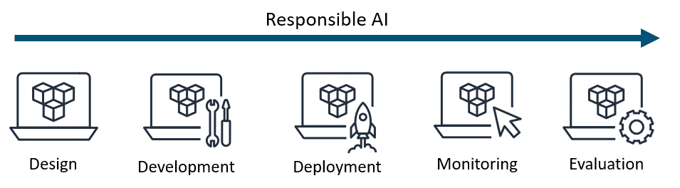
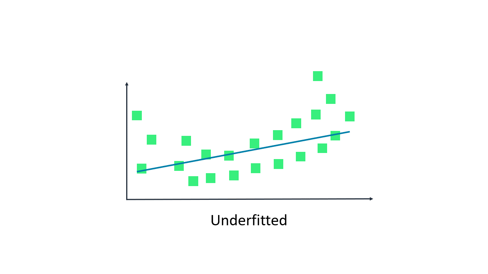
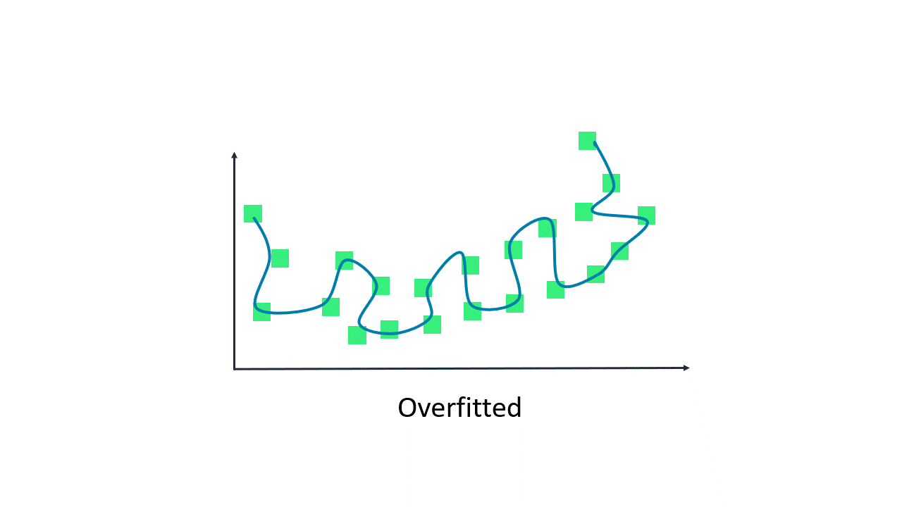

# Introduction

In this course, you will learn about responsible artificial intelligence (AI) practices. 
In the first section of this course, you will be introduced to what responsible AI is. You will learn how to define responsible AI, understand the challenges that responsible AI attempts to overcome, and explore the core dimensions of responsible AI.

Then in the next section of the course, you will dive into some topics for developing responsible AI systems. In this section of the course, you will learn about the services and tools that AWS offers to help you with responsible AI. You will also learn about responsible AI considerations for selecting a model and preparing data for your AI systems.

Finally, in the last section of the course, you learn about transparent and explainable models. You will learn what it means for a model to be transparent and explainable. You will also learn about tradeoffs to consider between safety and transparency for an AI model and the principles of human-centered design for explainable AI.

Each section will conclude with five knowledge check questions that will test what you have learned. 

# Responsible AI

**As you develop your AI system, whether it is a traditional or generative AI application, it is important to incorporate responsible AI.**

## What is responsible AI?
Responsible AI refers to practices and principles that ensure that AI systems are transparent and trustworthy while mitigating potential risks and negative outcomes. These responsible standards should be considered throughout the entire lifecycle of an AI application. This includes the initial design, development, deployment, monitoring, and evaluation phases

To operate AI responsibly, companies should proactively ensure the following about their system:
- It is fully transparent and accountable, with monitoring and oversight mechanisms in place.
- It is managed by a leadership team accountable for responsible AI strategies.
- It is developed by teams with expertise in responsible AI principles and practices.
- It is built following responsible AI guidelines.

**What type of AI requires responsible AI?**

Responsible AI is not exclusive to any one form of AI. It should be considered when you are building traditional or generative AI systems.

### TRADITIONAL AI

Traditional machine learning models perform tasks based on the data you provide. They can make predictions such as ranking, sentiment analysis, image classification, and more. However, each model can perform only one task. And to successfully do it, the model needs to be carefully trained on the data. As they train, they analyze the data and look for patterns. Then these models make a prediction based on these patterns. 

Some examples of traditional AI include recommendation engines, gaming, and voice assistance. 

### GENERATIVE AI

Generative artificial intelligence (generative AI) runs on foundation models (FMs). These models are pre-trained on massive amounts of general domain data that is beyond your own data. They can perform multiple tasks. Based on user input, usually in the form of text called a prompt, the model actually generates content. This content comes from learning patterns and relationships that empower the model to predict the desired outcome. 

Some examples of generative AI include chatbots, code generation, and text and image generation.

**Generative AI offers business value**

The potential of FMs is incredibly exciting. There are several FMs available, each with unique strengths and characteristics. 

New architectures are expected to arise in the future, and this diversity of FMs will set off a wave of innovation. This stands to spark the following business values that companies can benefit from:

- **Creativity:** Create new content and ideas, including conversations, stories, images, videos, and music.
- **Productivity:** Radically improve productivity across all lines of business, use cases, and industries.
- **Connectivity:** Connect and engage with customers and across organizations in new ways.

# Responsible AI Challenges in Traditional AI and Generative AI

## Biases in AI systems
**Accuracy of models**

The number one problem that developers face in AI applications is accuracy. Both traditional and generative AI applications are powered by models that are trained on datasets. These models can make predictions or generate content based only on the data they are trained on. If they are not trained properly, you will get inaccurate results. Therefore, it is important to address bias and variance in your model.

### BIAS

Bias is one of the biggest challenges a developer faces in AI systems. Bias in a model means that the model is missing important features of the datasets. This means that the data is too basic. Bias is measured by the difference between the expected predictions of the model and the true values we are trying to predict. If the difference is narrow, then the model has low bias. If the difference is wide, then the model has a high bias. 

When a model has a high bias, it is underfitted. Underfitted means that the model is not capturing enough difference in the features of the data, and therefore, the model performs poorly on the training data. 

### VARIANCE
Variance offers a different challenge for developers. Variance refers to the model's sensitivity to fluctuations or noise in the training data. The problem is that the model might consider noise in the data to be important in the output. When variance is high, the model becomes so familiar with the training data that it can make predictions with high accuracy. This is because it is capturing all the features of the data.

However, when you introduce new data to the model, the model's accuracy drops. This is because the new data can have different features that the model is not trained on. This introduces the problem of overfitting. Overfitting is when model performs well on the training data but does not perform well on the evaluation data. This is because the model is memorizing the data it has seen and is unable to generalize to unseen examples.

**Bias-variance trade-off**

Bias-variance tradeoff is when you optimize your model with the right balance between bias and variance. This means that you need to optimize your model so that it is not underfitted or overfitted. The goal is to achieve a trained model with the lowest bias and lowest variance tradeoff for a given data set. 

Review these examples of model that are underfitted, overfitted, and balanced.

In the underfitted example, the bias is high and the variance is low. Here the regression is a straight line. This shows us that the model is underfitting the data because it is not capturing all the features of the data.

In the overfitted example, bias is low and the variance is high. Here the regression curve perfectly fits the data. This means that it is capturing noise and is essentially memorizing the data. It won't perform well on new data.

In the balanced example, the bias is low and the regression is low. Here the regression is a curve. This is what you want. Its capturing enough features of the data, without capturing noise.

To help overcome bias and variance errors, you can use the following:

**Cross validation**

Cross-validation is a technique for evaluating ML models by training several ML models on subsets of the available input data and evaluating them on the complementary subset of the data. Cross-validation should be used to detect overfitting. 

**Increase data**

Add more data samples to increase the learning scope of the model.

**Regularization**

Use regularization. Regularization is a method that penalizes extreme weight values to help prevent linear models from overfitting training data examples. 

**Simpler models**

Use simpler model architectures to help with overfitting. If the model is underfitting, the model might be too simple.  

**Dimension reduction (Principal component analysis)**

Apply dimension reduction. Dimension reduction is an unsupervised machine learning algorithm that attempts to reduce the dimensionality (number of features) within a dataset while still retaining as much information as possible.

**Stop training early**

End training early so that the model does not memorize the data.

## Challenges of generative AI
Just as generative AI has its unique set of benefits, it also has a unique set of challenges. Some of these challenges include toxicity, hallucinations, intellectual property, and plagiarism, and cheating.

**Toxicity**

Toxicity is the possibility of generating content (whether it be text, images, or other modalities) that is offensive, disturbing, or otherwise inappropriate. This is a primary concern with generative AI. It is hard to even define and scope toxicity. The subjectivity involved in determining what constitutes toxic content is an additional challenge, and the boundary between restricting toxic content and censorship can be murky and dependent on context and culture. 

For example, should quotations that would be considered offensive out of context be suppressed if they are clearly labeled as quotations? What about opinions that might be offensive to some users but are clearly labeled as opinions? 

Technical challenges include offensive content that might be worded in a very subtle or indirect fashion, without the use of obviously inflammatory language.

**Hallucinations**

Hallucinations are assertions or claims that sound plausible but are verifiably incorrect. Considering the next-word distribution sampling employed by large language models (LLMs), it is perhaps not surprising that in more objective or factual use cases, LLMs are susceptible to hallucinations. 

For example, a common phenomenon with current LLMs is creating nonexistent scientific citations. Suppose that an LLMs is prompted with the request, “Tell me about some papers by" a particular author. The model is not actually searching for legitimate citations but generating ones from the distribution of words associated with that author. The result might include realistic titles and topics in the area of the author. However, these might not be real articles, and they might include plausible coauthors but not actual ones.

## Intellectual property

Protecting intellectual property was a problem with early LLMs. This was because the LLMs had a tendency to occasionally produce text or code passages that were verbatim of parts of their training data, resulting in privacy and other concerns. But even improvements in this regard have not prevented reproductions of training content that are more ambiguous and nuanced.

Consider this prompt for a generative image model, “Create a painting of a skateboarding cat in the style of Andy Warhol.” If the model is able to do so in a convincing yet still original manner because it was trained on actual Warhol images, objections to such mimicry might arise.

## Plagiarism and cheating

The creative capabilities of generative AI give rise to worries that it will be used to write college essays, writing samples for job applications, and other forms of cheating or illicit copying. Debates on this topic are happening at universities and many other institutions, and attitudes vary widely. 

Some are in favor of explicitly forbidding any use of generative AI in settings where content is being graded or evaluated, while others argue that educational practices must adapt to, and even embrace, the new technology. But the underlying challenge of verifying that a given piece of content was authored by a person is likely to present concerns in many contexts.

## Disruption of the nature of work

The proficiency with which generative AI is able to create compelling text and images, perform well on standardized tests, write entire articles on given topics, and successfully summarize or improve the grammar of provided articles has created some anxiety. There is a concern that some professions might be replaced or seriously disrupted by the technology. 

Although this might be premature, it does seem that generative AI will have a transformative effect on many aspects of work. It is possible that many tasks previously beyond automation could be delegated to machines.

# Core Dimensions of Responsible AI

## Core dimensions of responsible AI
The core dimensions of responsible AI include fairness, explainability, privacy and security, robustness, governance, transparency, safety, and controllability. No one dimension is a standalone goal for responsible AI. In fact, each topic should be considered as a required part for a complete implementation of responsible AI. 

You will find that there is considerable overlap between many of these topics. For example, you will find that when you implement transparency in your AI system, elements of explainability, fairness, and governance will be required. Next, you will explore how each of these topics is used in responsible AI.

#### Fairness

Fairness is crucial for developing responsible AI systems. With fairness, AI systems promote inclusion, prevent discrimination, uphold responsible values and legal norms, and build trust with society. 

You should consider fairness in your AI applications to create systems suitable and beneficial for all.

#### Explainability

Explainability refers to the ability of an AI model to clearly explain or provide justification for its internal mechanisms and decisions so that it is understandable to humans. 

Humans must understand how models are making decisions and address any issues of bias, trust, or fairness.

#### Privacy and security

Privacy and security in responsible AI refers to data that is protected from theft and exposure. More specifically, this means that at a privacy level, individuals control when and if their data can be used. At the security level, it verifies that no unauthorized systems or unauthorized users will have access to the individual’s data.

When this is properly implemented and deployed in an AI system, users can trust that their data is not going to be compromised and used without their authorization. 

#### Transparency

Transparency communicates information about an AI system so stakeholders can make informed choices about their use of the system. Some of this information includes development processes, system capabilities, and limitations.

It provides individuals, organizations, and stakeholders access to assess the fairness, robustness, and explainability of AI systems. They can identify and mitigate potential biases, reinforce responsible standards, and foster trust in the technology. 

#### Veracity and robustness

Veracity and robustness in AI refers to the mechanisms to ensure an AI system operates reliably, even with unexpected situations, uncertainty, and errors. 

The goal of veracity and robustness in responsible AI is to develop AI models that are resilient to changes in input parameters, data distributions, and external circumstances. 

This means that the AI model should retain reliability, accuracy, and safety in uncertain environments. 

#### Governance

Governance is a set of processes that are used to define, implement, and enforce responsible AI practices within an organization.

Governance addresses various responsible, legal, or societal problems that generative AI might invite. 

For example, governance policies can help to protect the rights of individuals to intellectual property. It can also be used to enforce compliance with laws and regulations. Governance is a vital component of responsible AI for an organization that seeks to incorporate responsible best practices.

#### Safety

Safety in responsible AI refers to the development of algorithms, models, and systems in such a way that they are responsible, safe, and beneficial for individuals and society as a whole. 

This means that AI systems should be carefully designed and tested to avoid causing unintended harm to humans or the environment. Things like bias, misuse, and uncontrolled impacts need to be proactively considered.

#### Controllability

Controllability in responsible AI refers to the ability to monitor and guide an AI system's behavior to align with human values and intent. It involves developing architectures that are controllable, so that any unintended issues can be managed and addressed.  

By ensuring controllability, responsible AI can help mitigate risks, promote fairness and transparency, and ensure that AI systems benefit society as a whole. 

## Business benefits of responsible AI
Responsible AI offers key business benefits in the development and deployment of AI systems.

#### Increased trust and reputation

Customers are more likely to interact with AI applications, if they believe the system is fair and safe. This enhances their reputation and brand value. 

#### Regulatory compliance

As AI regulations emerge, companies with robust ethical AI frameworks are better positioned to comply with guidelines on data privacy, fairness, accountability, and transparency.

#### Mitigating risks

Responsible AI practices help mitigate risks such as bias, privacy violations, security breaches, and unintended negative impacts on society. This reduces legal liabilities and financial costs.

#### Competitive advantage

Companies that prioritize responsible AI can differentiate themselves from competitors and gain a competitive edge, especially as consumer awareness of AI ethics grows.

#### Improved decision-making

AI systems built with fairness, accountability, and transparency in mind are more reliable and less likely to produce biased or flawed outputs, which leads to better data-driven decisions.

#### Improved products and business

Responsible AI encourages a diverse and inclusive approach to AI development. Because it draws on varied perspectives and experiences, it can drive more creative and innovative solutions.

# Knowledge Check

## Question 1

Responsible artificial intelligence (AI) should be incorporated in all phases of the development lifecycle of an AI system.

**Which choice best describes responsible AI?**
- Responsible AI refers the security and compliance that are shared responsibilities between AWS and the customer. 
- Responsible AI refers to the standards that uphold responsible practices and mitigate potential risks and negative outcomes of an AI application. 
- Responsible AI refers to the ability to create AI systems that add creativity, productivity, and connectivity to your business.
- Responsible AI refers to standards of upholding responsible practices that are exclusively needed for generative AI systems.

Responsible AI is not exclusive to generative AI. Though creativity, productivity, and connectivity are benefits of responsible AI, they don't define responsible AI. Responsible AI is the standard of upholding responsible practices and mitigating potential risks and negative outcomes of an AI application. 

## Question 2
A developer is training a model for a new artificial intelligence (AI) system. The developer wants to be sure that the model is not underfitting the data or overfitting the data.

**How should the model be trained on the data?**
- With low bias and high variance
- With low bias and low variance
- With high bias and high variance
- With high bias and low variance

To avoid underfitting and overfitting the data, the model should be trained with low bias and low variance. If either the bias or the variance is high, the model will not perform well.

## Question 3
A company is researching how it might benefit from using generative artificial intelligence (generative AI). At the same time, they are very concerned about the generative AI challenges that need to be addressed.

**Which options are challenges of responsible artificial intelligence (AI)? (Select TWO.)**
- Enterprise risk
- Toxicity
- Intellectual property
- Large language models (LLMs)
- Unsupervised learning

Toxicity and intellectual property are two challenges of responsible AI. Toxicity is explained as a foundation model output that is hateful, threatening, insulting, or demeaning to an individual or a group of individuals. There is a tendency of early LLMs to produce outputs that were verbatim regurgitation of parts of their training data, which resulted in privacy and copyright concerns around intellectual property. Implementing responsible AI best practices can help overcome these challenges.

## Question 4
A company is increasing their use of artificial intelligence (AI) and wants to implement processes to help ensure that they define, implement, and enforce compliance.

**Which core dimension of responsible AI should they consider? **
- Governance
- Veracity and robustness
- Privacy and security
- Fairness

AI governance provides the guiding processes and institutional mechanisms to help ensure responsibility, risk mitigation, and oversight for AI from research and development (R&D) to deployment. It encourages maximizing societal benefits while minimizing harm from AI. Governance is crucial for responsible adoption.

## Question 5
A government is using a machine learning (ML) model to identify people who qualify for government programs and services. Officials are concerned about the impact on human rights. They need a method to determine how the model performed its analysis.  

Which core dimension of responsible AI should they consider? 
Transparency
Veracity and robustness
Safety
Explainability

Explainability empowers users to verify system functionality, check for unwanted biases, increase useful human control, and place appropriate trust in AI systems. This dimension of AI promotes the responsible development and deployment of AI technology for the benefit of society. Without explainability, AI could lose public trust because of inscrutable failures.

# Amazon Services and Tools for Responsible AI

As the leader in cloud technologies, AWS offers services like Amazon SageMaker and Amazon Bedrock that have built-in tools to help you with responsible AI. These tools cover topics such as foundation model evaluation, safeguards for generative AI, bias detection, model prediction explanations, monitoring and human reviews, and governance improvement.

#### AMAZON SAGEMAKER

**Amazon SageMaker** is a fully managed ML service. With SageMaker, data scientists and developers can quickly and confidently build, train, and deploy ML models into a production-ready hosted environment. It provides a UI experience for running ML workflows that makes SageMaker ML tools available across multiple integrated development environments (IDEs).

With SageMaker, you can store and share your data without having to build and manage your own servers. This gives you or your organization more time to collaboratively build and develop your ML workflow and do it sooner. SageMaker provides managed ML algorithms to run efficiently against extremely large data in a distributed environment. With built-in support for bring-your-own-algorithms and frameworks, SageMaker offers flexible distributed training options that adjust to your specific workflows. Within a few steps, you can deploy a model into a secure and scalable environment from the SageMaker console.

#### AMAZON BEDROCK

**Amazon Bedrock** is a fully managed service that makes available high-performing FMs from leading AI startups and Amazon for your use through a unified API. You can choose from a wide range of FMs to find the model that is best suited for your use case. 

Amazon Bedrock also offers a broad set of capabilities to build generative AI applications with security, privacy, and responsible AI. 

With the serverless experience of Amazon Bedrock, you can privately customize FMs with your own data and securely integrate and deploy them into your applications by using AWS tools without having to manage any infrastructure.

# Reviewing Amazon service tools for responsible AI 

Next, you will look at Amazon service tools that can help you with different areas of responsible AI. These areas include FM evaluation, safeguards for generative AI, bias detection, model prediction explanation, monitoring and human reviews, and governance improvement.
### Foundation model evaluation
You should always evaluate a FM to determine if it will it is suited for your specific use case. To help you do this, Amazon offers model evaluation on Amazon Bedrock and Amazon SageMaker Clarify.

#### MODEL EVALUATION ON AMAZON BEDROCK

With **Model evaluation on Amazon Bedrock**, you can evaluate, compare, and select the best foundation model for your use case in just a few clicks. Amazon Bedrock offers a choice of automatic evaluation and human evaluation. 

Automatic evaluation offers predefined metrics such as accuracy, robustness, and toxicity. 
Human evaluation offers subjective or custom metrics such as friendliness, style, and alignment to brand voice. For human evaluation, you can use your in-house employees or an AWS-managed team as reviewers.

#### AMAZON SAGEMAKER CLARIFY

**SageMaker Clarify** supports FM evaluation. You can automatically evaluate FMs for your generative AI use case with metrics such as accuracy, robustness, and toxicity to support your responsible AI initiative. 

For criteria or nuanced content that requires sophisticated human judgment, you can choose to use your own workforce or use a managed workforce provided by AWS to review model responses.

### Safeguards for generative AI
With **Amazon Bedrock Guardrails**, you can implement safeguards for your generative AI applications based on your use cases and responsible AI policies. Guardrails helps control the interaction between users and FMs by filtering undesirable and harmful content, redacting personally identifiable information (PII), and enhancing content safety and privacy in generative AI applications. You can create multiple guardrails with different configurations tailored to specific use cases. Additionally, you can continuously monitor and analyze user inputs and FM responses that can violate customer-defined policies in the guardrails.

#### Consistent level of AI safety

Amazon Bedrock Guardrails evaluates user inputs and FM responses based on use case specific policies and provides an additional layer of safeguards regardless of the underlying FM. Amazon Bedrock Guardrails can be applied across FMs, including Anthropic Claude, Meta Llama 2, Cohere Command, AI21 Labs Jurassic, Amazon Titan Text, and fine-tuned models. Customers can create multiple guardrails, each configured with a different combination of controls, and use these guardrails across different applications and use cases. Amazon Bedrock Guardrails can also be integrated with Amazon Bedrock Agents to build generative AI applications aligned with your responsible AI policies.

#### Block undesirable topics

Organizations recognize the need to manage interactions within generative AI applications for a relevant and safe user experience. They want to further customize interactions to remain on topics relevant to their business and align with company policies. By using a short, natural language description, Amazon Bedrock Guardrails gives you the ability to define a set of topics to avoid within the context of your application. Amazon Bedrock Guardrails detects and blocks user inputs and FM responses that fall into the restricted topics. For example, a banking assistant can be designed to avoid topics related to investment advice.

#### Filter harmful content

Amazon Bedrock Guardrails provides content filters with configurable thresholds to filter harmful content across hate, insults, sexual, and violence categories. Most FMs already provide built-in protections to prevent the generation of harmful responses. In addition to these protections, Amazon Bedrock Guardrails gives you the ability to configure thresholds across the different categories to filter out harmful interactions. Amazon Bedrock Guardrails automatically evaluates both user queries and FM responses to detect and help prevent content that falls into restricted categories. For example, an ecommerce site can design its online assistant to avoid using inappropriate language such as hate speech or insults.

#### Redact PII to protect user privacy

Amazon Bedrock Guardrails helps you detect PII in user inputs and FM responses. Based on the use case, you can selectively reject inputs containing PII or redact PII in FM responses. For example, you can redact users’ personal information while generating summaries from customer and agent conversation transcripts in a call center.

### Bias detection
SageMaker Clarify helps identify potential bias in machine learning models and datasets without the need for extensive coding. You specify input features, such as gender or age, and SageMaker Clarify runs an analysis job to detect potential bias in those features. SageMaker Clarify then provides a visual report with a description of the metrics and measurements of potential bias so that you can identify steps to remediate the bias. 

You can use Amazon SageMaker Data Wrangler to balance your data in cases of any imbalances. SageMaker Data Wrangler offers three balancing operators: random undersampling, random oversampling, and Synthetic Minority Oversampling Technique (SMOTE) to rebalance data in your unbalanced datasets.

### Model prediction explanation
SageMaker Clarify is integrated with Amazon SageMaker Experiments to provide scores detailing which features contributed the most to your model prediction on a particular input for tabular, natural language processing (NLP), and computer vision models. For tabular datasets, SageMaker Clarify can also output an aggregated feature importance chart that provides insights into the overall prediction process of the model. These details can help determine if a particular model input has more influence than expected on overall model behavior.

> ℹ️
> SageMaker Experiments is a capability of SageMaker that you can use to create, manage, analyze, and compare your machine learning experiments.

### Monitoring and human reviews

#### AMAZON SAGEMAKER MODEL MONITOR
**Amazon SageMaker Model Monitor** monitors the quality of SageMaker machine learning models in production. You can set up continuous monitoring with a real-time endpoint (or a batch transform job that runs regularly), or on-schedule monitoring for asynchronous batch transform jobs. With SageMaker Model Monitor, you can set alerts that notify you when there are deviations in the model quality. With early and proactive detection of these deviations, you can take corrective actions. 

#### AMAZON A2I
**Amazon Augmented AI (Amazon A2I)** is a service that helps build the workflows required for human review of ML predictions. Amazon A2I brings human review to all developers and removes the undifferentiated heavy lifting associated with building human review systems or managing large numbers of human reviewers.

### Governance improvement
SageMaker provides purpose-built governance tools to help you implement AI responsibly. These tools give you tighter control and visibility over your AI models. You can capture and share model information and stay informed on model behavior, like bias, all in one place.

Governance tools include the following:
- **Amazon SageMaker Role Manager:** With SageMaker Role Manager, administrators can define minimum permissions in minutes. 
- **Amazon SageMaker Model Cards:** With SageMaker Model Cards, you can capture, retrieve, and share essential model information, such as intended uses, risk ratings, and training details, from conception to deployment. 
- **Amazon SageMaker Model Dashboard:** With SageMaker Model Dashboard, you can keep your team informed on model behavior in production, all in one place.

### Providing transparency
AWS AI Service Cards are a new resource to help you better understand AWS AI services. AI Service Cards are a form of responsible AI documentation that provides a single place to find information on the intended use cases and limitations, responsible AI design choices, and deployment and performance optimization best practices for AWS AI services.

They are part of a comprehensive development process to build AWS services in a responsible way that addresses the core dimensions of responsible AI.

### AWS AI model cards
Each AI Service Card contains four sections that cover the following:
- Basic concepts to help customers better understand the service or service features
- Intended use cases and limitations
- Responsible AI design considerations
- Guidance on deployment and performance optimization
The content of the AI Service Cards addresses a broad audience of customers, technologists, researchers, and other stakeholders. This content helps these audiences better understand key considerations in the responsible design and use of an AI service.

# Responsible Considerations to Select a Model

Selecting a model is one of the first and most critical steps to developing an AI system. Model selection has strategic implications for how the AI system will perform. Everything from user experience and go-to-market to hiring and profitability can be affected by selecting the right model for your use case. 

Remember that you can use **Model evaluation on Amazon Bedrock or SageMaker Clarify** to evaluate models for accuracy, robustness, toxicity, or nuanced content that requires human judgement.

## Define application use case narrowly

When selecting a model for your AI application, you must narrowly define your use case. This is important because you can tune your model for that specific use case.

#### Example: Defining application use case narrowly for traditional AI
In this example, you might have an AI application that uses face recognition. Face recognition is not a use case; it is a technology. The way your model applies that technology is a use case. 

  
Gallery retrieval

  
Celebrity recognition

  
Virtual proctoring

For example, a gallery retrieval application might be used to help find missing persons. In this case, you would need a model that can be tuned for favor recall or precision. Favor recall would bring up many results that could be beneficial to the use case of the AI application used in finding missing persons. 

However, if your AI application is being used for celebrity recognition or virtual proctoring, the model would only need to favor precision. This is because the favor recall tuning would provide too many results to be beneficial to the use case of the application. 

#### Example: Defining application use case narrowly for generative AI
In this example, you might have an AI application to assist customers in shopping on your online store. The use case might be to provide a product catalog or to persuade customers to buy products. An appropriate model would need to be selected based on the narrowly defined use case. 

		

| Features | Catalog a product | Persuade to buy |
|----------|-------------------|-----------------|
| **Target audience**    | Broad demographic     | Narrow demographic     |
| **Possible issues**    | Veracity     | Veracity, unwanted bias, toxicity, detail     |
| **Consequences**    | Brand damage, lost sales, and returns     | Representative harm, brand damage, lost sales, and returns     |
| **Tuning**   | Favors neutrality, clarity, and completeness     | Focuses on highest interest problem and benefit to group     |

In an AI application to catalog a product, you would want a broad demographic target audience so that it is available for all of your customers. 

In an AI application to persuade to buy, you would want a narrow target audience to capture a specific group of people. For example, you might want to target an audience that lives on the coast to buy accessories for docking boats.

## Choosing a model based on performance

Model performance varies across a number of factors, including the following: 

- Level of customization – The ability to change a model’s output with new data ranging from prompt-based approaches to full model retraining
- Model size – The amount of information the model has learned as defined by parameter count
- Inference options – From self-managed deployment to API calls
- Licensing agreements – Some agreements can restrict or prohibit commercial use
- Context windows – The amount of information that can fit in a single prompt
- Latency – The amount of time it takes for a model to generate an output

#### Consider a model based on performance with test datasets
A common mistake when choosing a model is to assume that the model, in and of itself, is either good or bad. This is not the case. Performance is a function of the model and a test dataset, not just the model. So, when you are assessing a model, you need to determine how well a model performs on a particular dataset. 

Model that performs differently on different datasets

---
For example, a model might perform well on test dataset A over a period of time. The model might perform even better on test dataset B. However, the model might progressively get worst on test dataset C.

This means that you need to consider two development trajectories: the development trajectory of the model and the development trajectory of the datasets. Remember the dataset is not necessarily constant. It is often evolving.

## Choosing a model based on sustainability concerns

Sustainability in the context of responsible AI refers to the ability of AI systems to be developed and deployed in a way that is socially, environmentally, and economically sustainable over the long term. 

### Responsible agency considerations for selecting a model
Responsible agency in responsible AI refers to an AI system's capacity to make good judgments and act in a socially responsible manner. The following are key aspects of moral agency for AI. 

#### Value alignment

Value alignment is being able to understand, evaluate, and make decisions based on moral principles rather than pure utility maximization. This requires value alignment between the AI system's goals and values and the responsible human values. 

#### Responsible reasoning skills

Responsible reasoning skills is being able to logically think through moral dilemmas and weigh various responsible considerations when making decisions. The AI needs logic and reasoning capabilities to apply responsible principles to novel situations. 

The AI system should have the capacity to engage in responsible reasoning and understand moral concepts, principles, and frameworks. It should be able to apply them in context to specific situations.

#### Appropriate level of autonomy

The AI system should have the appropriate level of autonomy, with clear boundaries and mechanisms for human oversight and intervention, particularly in high-stakes or sensitive domains.

#### Transparency and accountability

The AI system should be transparent about its decision-making process. It should allow external oversight and accountability to ensure its actions are responsibly justified.

Overall, responsible agency requires AI to have sophisticated intelligence on par with human-level cognition to properly apply ethical reasoning in the real world. This remains an immense challenge for current AI.

### Environmental considerations for selecting a model

When you are developing and deploying AI systems, use environmental considerations as you implement responsible AI.

The following are key environmental challenges and solutions to consider when choosing a model.

#### Energy consumption
| Challenge | Solution |
|-----------|----------|
| Training large AI models and running them at scale can consume significant amounts of energy and contribute to greenhouse gas emissions and environmental impact. | The solution is to optimize energy efficiency in AI systems, use renewable energy sources where possible, and consider the overall carbon footprint of AI operations. |

#### Resources utilization

| Challenge | Solution |
|-----------|----------|
| AI systems often require substantial computational resources, including specialized hardware, such as GPUs and TPUs, and data center infrastructure. The manufacturing and disposal of these resources can have environmental impacts. | Responsible AI should aim to maximize resource efficiency, promote hardware reusability and recyclability, and minimize electronic waste. |

#### Environmental impact assessment

| Challenge | Solution |
|-----------|----------|
| Before deploying AI systems, it is important to assess their potential environmental impacts, both direct (for example, energy consumption and resource usage) and indirect (for example, enabling or promoting environmentally harmful activities). | Environmental impact assessments should be conducted, and mitigation strategies should be implemented if necessary. |

### Economic considerations for selecting a model
Economic considerations in responsible AI include the potential benefits and costs of AI technologies and the impact on jobs and the economy. 

For example, AI can automate certain tasks and improve efficiency, but it can also lead to job displacement and inequality. Additionally, there are concerns about the concentration of power and data in the hands of a few companies, which could lead to monopolies and further inequality. 

# Responsible Preparation for Datasets
An essential requirement of responsible AI is to prepare your datasets responsibly. This means that you need to have balanced datasets to train your models. 

Remember that you can use **SageMaker Clarify** and **SageMaker Data Wrangler** to help balance your datasets. 

## Balancing datasets
Balanced datasets are important for creating responsible AI models that do not unfairly discriminate or exhibit unwanted biases. 

Balanced datasets should represent all groups of people or data topics. This means that the dataset should contain an adequate number of examples or instances of each group to ensure that the model is not biased towards any particular group or factor. The concept of balanced datasets is particularly important in applications like hiring, lending, or criminal justice, where fairness and equity are essential.

To achieve balanced datasets, the data collected needs to be inclusive and diverse, and the data also needs to be curated to optimize it for training.

### Inclusive and diverse data collection
Inclusiveness and diversity in data collection ensure that data collection processes are fair and unbiased. Data collection should accurately reflect the diverse perspectives and experiences required for the use case of the AI system. This includes a diverse range of sources, viewpoints, and demographics. By doing this, the AI system can work to ensure decisions are unbiased in their performance. 

For example, if an ML model is trained primarily on data from middle-aged individuals, it might be less accurate when making predictions involving younger and older people. Therefore, the datasets should be collected so that age groups are equally represented.

Example that shows bias towards middle-aged people

---

Inclusiveness and diversity in data collection is a primary concern for data that focuses on people. This is because alienating groups of people in the training data can lead to societal harms and legal repercussions. However, inclusiveness and diversity in data collection should be a primary focus regardless of the topic. For example, collection of data for people, scientific research, geography, weather, products, and other topics should be collected with a focus on the diverse range for each topic.

By promoting inclusiveness and diversity within AI, organizations can promote fairness, transparency, and accountability in their AI systems and contribute to the responsible development of AI technology.

### Data curation
The second part of balancing the datasets involves curation of the datasets. Curating datasets is the process of labeling, organizing, and preprocessing the data so that it can perform accurately on the model. The curation can help to ensure that the data is representative of the problem at hand and free of biases or other issues that can impact the accuracy of the AI model. Curation helps to ensure that AI models are trained and evaluated on high-quality, reliable data that is relevant to the task they are intended to perform. 

The main steps of curating data include data preprocessing, data augmentation, and regular auditing.

#### Data preprocessing

Preprocess the data to ensure it is accurate, complete, and unbiased. Techniques such as data cleaning, normalization, and feature selection can help to eliminate biases in the dataset.

#### Data augmentation

Use data augmentation techniques to generate new instances of underrepresented groups. This can help to balance the dataset and prevent biases towards more represented groups.

#### Regular auditing

Regularly audit the dataset to ensure it remains balanced and fair. Check for biases and take corrective actions if necessary.

### Balance your data for the intended use case
The use case for the AI system will determine how the data needs to be balanced. For example, if you are creating an AI system about cancer in children, you would collect the data and curate it to focus on children and not include datasets on adults. 

# Knowledge Check

## Question 1
A machine learning (ML) scientist is building an ML model for loan applications at a bank by using Amazon SageMaker. They want to mitigate bias in the data and increase visibility into model behavior.

**Which AWS service or feature helps to meet these needs?**

- Amazon Comprehend

- Amazon SageMaker JumpStart

- Amazon Augmented AI (Amazon A2I)

- Amazon SageMaker Clarify

SageMaker Clarify provides purpose-built tools to gain greater insights into ML models and data based on metrics such as accuracy, robustness, toxicity, and bias to improve model quality and support responsible AI initiatives.

## Question 2
A team is beginning to work with generative artificial intelligence (generative AI) and is concerned about implementing responsible AI. They want to use AWS AI tools and want to understand how to implement them responsibly.

**Which tool is available to help the team make those decisions? **

- Responsible Use of Machine Learning whitepaper
- AWS Marketplace
- AWS AI Service Cards
- AWS Machine Learning University

AI Service Cards are a form of documentation on responsible AI. They provide teams with a single place to find information on the intended use cases and limitations, responsible AI design choices, and deployment and performance optimization best practices for AWS AI services. 

## Question 3
Monitoring is important to maintain high-quality machine learning (ML) models and help ensure accurate predictions.

Which AWS services or features help with monitoring and human review? (Select TWO.)
- Amazon SageMaker JumpStart
- Amazon SageMaker Model Monitor
- Amazon Augmented AI (Amazon A2I)
- Amazon SageMaker Clarify
- Amazon Bedrock

Monitoring is important to maintain high-quality ML models and help ensure accurate predictions. SageMaker Model Monitor automatically detects and alerts users to inaccurate predictions from deployed models. With Amazon A2I, users can implement a human review of ML predictions when human oversight is needed.

## Question 4
A developer has been asked to build an artificial intelligence (AI) application that will be used to help a research team in their work. 

What should the developer ask the research team to do so that the best model can be selected for the AI application?
- Define the use case of the application broadly
- Define the use case of the application narrowly
- Define the governance policies for the application
- Define which teams will be monitoring the model

Defining a narrow use case for the application can help you to select the best model for the application. Governance policies and accountability for monitoring a model are important, but they don't fundamentally impact which model to select for the application.

## Question 5
A lending agency is using an artificial intelligence (AI) system so that customers can apply for a loan in Wyoming. However, the development team has tested the model and noticed that there is a bias against loan applicants that have lived in Wyoming for less than 10 years. The development team's research revealed that there is not a lot of data sample available for these groups of people.

What could the development team do to reduce the bias against applicants who have lived in Wyoming for less than 10 years?

- Use more inclusive data 
- Preprocess the data
- Augment the data 
- Conduct regular audits on the data

Data augmentation can be used to generate new instances of underrepresented groups. This can help to balance the dataset and prevent biases towards more represented groups.

Because there are not a lot of samples for the people who have lived in Wyoming for less than 10 years, using more inclusive data is not an option. All the data for this group that is available is already used. Preprocessing data and conducting regular audits won't help in this situation either. 

## Question 6
An organization is in the beginning stages of building an application that will use generative artificial intelligence (generative AI) technologies. The development team wants to use the best model for the application’s use case. But with the large selection of large language models (LLMs), the development team is not sure which model to select. Also, the application will be public facing, and the team is concerned about the potential of generating harmful content.

**Which AWS solutions should the team use to address these concerns? (Select TWO).**

- Amazon SageMaker Model Dashboard
- Model Evaluation on Amazon Bedrock
- Amazon Augmented AI (Amazon A2I)
- Amazon SageMaker Data Wrangler
- Amazon Bedrock Guardrails

With Model Evaluation on Amazon Bedrock, the team can evaluate, compare, and select the best foundation model for their use case. With Guardrails for Amazon Bedrock, the team can implement safeguards for their generative AI applications. It can help to filter out any harmful content.

The following are incorrect because they are not used to choose a model or filter out harmful content that generative AI might generate:
SageMaker Data Wrangler can be used to balance their data in cases of any imbalances.
Amazon A2I can be used to build the workflows required for human review of ML predictions.
SageMaker Model Dashboard can be used as a central place to keep the team informed on model behavior in production.

# Transparent and Explainable Models

**To promote trust and accountability in an AI system, there should be transparency and explainability in the model.**

---

## Models need to be transparent and explainable 

### Transparency and explainability

AI systems are now commonplace in many fields that impact business and society. Some of these fields include healthcare, security, and financial institutions. There must be trust and accountability in these AI systems. Therefore, including transparent and explainable models is fundamental for developing these AI systems.
Transparency answers the question **HOW**, and explainability answers the question **WHY**. Both aspects are needed to build responsible AI systems.

#### Transparency

Transparency helps to understand **HOW** a model makes decisions.

This helps to provide accountability and builds trust in the AI system. Transparency also makes auditing a system easier. 

#### Explainability

Explainability helps to understand **WHY** the model made the decision that it made. It gives insight into the limitations of a model. 

This helps developers with debugging and troubleshooting the model. It also allows users to make informed decisions on how to use the model. 

### Transparent and explainable models compared to black box models
Models that lack transparency and explainability are often referred to as black box models. These models use complex algorithms and numerous layers of neural networks to make predictions, but they do not provide insight into their internal workings.

Transparent and explainable models have several advantages over black box models.

#### Increased trust

Transparent and explainable models can increase trust in the models and help users understand why the models are making certain predictions. This can be particularly important in high-stakes applications, such as healthcare, financial services, and transportation, where it is crucial to understand the reasoning behind the models' decisions. 

#### Easier to debug and optimize for improvements

Transparent and explainable models can be easier to debug and improve than black box models. By providing insight into the models' internal workings, developers can identify issues and make targeted improvements to optimize the models' performance. 

In contrast, black box models can be more difficult to debug and improve because the internal workings of these models are not transparent. Developers might struggle to identify issues and make targeted improvements. This can lead to a longer development cycle and less optimal models. 

#### Better understanding of the data and the model's decision-making process

In terms of performance, transparent and explainable models might not always outperform black box models. 

However, they can provide a more comprehensive understanding of the data and the model's decision-making process. This can be particularly important in applications where explainability is a key consideration, such as in healthcare, where patients need to understand why a particular treatment was recommended.

### Solutions for transparent and explainable models
There is no standard solution for creating transparent and explainable models. Depending on the use case of the model, you might use different techniques. 

Here are some potential solutions for increasing transparency and explainability in AI systems to help ensure responsible AI development.

#### Explainability frameworks

There are several explainability frameworks available, such as SHapley Value Added (SHAP), Layout-Independent Matrix Factorization (LIME), and Counterfactual Explanations, that can help summarize and interpret the decisions made by AI systems. These frameworks can provide insights into the factors that influenced a particular decision and help assess the fairness and consistency of the AI system.

#### Transparent documentation

Maintain clear and comprehensive documentation of the AI system's architecture, data sources, training processes, and underlying assumptions, which can be made available to relevant stakeholders and auditors.

This can include user guides, technical documentation, and visualizations that help users understand the underlying algorithms and their inputs and outputs.

#### Monitoring and auditing

AI systems should be monitored and audited to ensure that they are functioning as intended and not exhibiting bias or discriminatory behavior. This can include regular testing and oversight by humans and automated tools to identify unusual patterns or decisions.

#### Human oversight and involvement

Incorporate human oversight and involvement in critical decision-making processes where humans can review and validate the AI system's outputs and decisions, especially in high-stakes situations.

#### Counterfactual explanations

Provide counterfactual explanations that show how the output would change if certain input features were different to help users understand the model's behavior and reasoning.

#### User interface explanations

Design user interfaces that provide clear and understandable explanations of the AI system's outputs, rationale, and limitations to end-users, so they can make informed decisions.

### Risks of transparent and explainable models
Just as transparent and explainable models provide many advantages, they also come with some risks. Some of those risks include the following: 
- Increasing the complexity of the development and maintenance of the model can increase the costs.

- Creating vulnerabilities of the model, data, and algorithms can be exploited by bad actors.

- Presenting unrealistic expectations that the model is perfectly transparent and explainable. In some situations, this may not be achievable or even intended.

- Providing too much information that can create privacy and security concerns. It could also lead to compromising the competitive edge of the model.

## AWS tools for transparent and explainability
### AWS tools for transparency
To help with transparency, Amazon offers AWS AI Service Cards and Amazon SageMaker Model Cards. The difference between them is that with AI Service Cards, Amazon provides transparent documentation on Amazon services that help you build your AI services. With SageMaker Model Cards, you can catalog and provide documentation on models that you create or develop yourself. 

To review more information about AI Service Cards and SageMaker Model Cards, choose each of the following cards.

#### AWS AI Service Cards
**AI Service Cards** are a resource to increase transparency and help customers better understand AWS AI services, including how to use them in a responsible way. AI service cards are a form of responsible AI documentation that provides customers with a single place to find information on the intended use cases and limitations, responsible AI design choices, and the deployment and operation best practices for our AI services.

#### Amazon SageMaker Model Cards
Use **SageMaker Model Cards** to document critical details about your ML models in a single place for streamlined governance and reporting.

Catalog details include information such as the intended use and risk rating of a model, training details and metrics, evaluation results and observations, and additional callouts such as considerations, recommendations, and custom information. 

### AWS tools for explainability
#### SageMaker Clarify

SageMaker Clarify is integrated with SageMaker Experiments to provide scores detailing which features contributed the most to your model prediction on a particular input for tabular, NLP, and computer vision models. For tabular datasets, SageMaker Clarify can also output an aggregated feature importance chart which provides insights into the overall prediction process of the model. These details can help determine if a particular model input has more influence than expected on overall model behavior.

#### SageMaker Autopilot

Amazon SageMaker Autopilot uses tools provided by SageMaker Clarify to help provide insights into how ML models make predictions. These tools can help ML engineers, product managers, and other internal stakeholders understand model characteristics. To trust and interpret decisions made on model predictions, both consumers and regulators rely on transparency in machine learning.

The SageMaker Autopilot explanatory functionality determines the contribution of individual features or inputs to the model's output and provides insights into the relevance of different features. You can use it to understand why a model made a prediction after training or use it to provide per-instance explanation during inference. 

## Model Trade-Offs

### Interpretability trade-offs
Interpretability is a feature of model transparency. Interpretability is the degree to which a human can understand the cause of a decision. This might sound a lot like explainability, but there is a distinction difference. 

#### Interpretability

Interpretability is the access into a system so that a human can interpret the model’s output based on the weights and features. For example, if a business wants high model transparency and wants to understand exactly why and how the model is generating predictions, they need to observe the inner mechanics of the AI/ML method.

#### Explainability

Explainability is how to take an ML model and explain the behavior in human terms. With complex models (for example, black boxes), you cannot fully understand how and why the inner mechanics impact the prediction. However, through model agnostic methods (for example, partial dependence plots, SHAP dependence plots, or surrogate models) you can discover meaning between input data attributions and model outputs. With that understanding, you can explain the nature and behavior of the AI/ML model.

Diagram that shows how a model's interpretability can affect performance.

---

If a business wants high model transparency and wants to understand exactly why and how the model is generating predictions, then they need a model that offers interpretability. However, high interpretability typically comes at the cost of performance, as seen in the diagram. 

If a company wants to achieve high performance but still wants to have a general understanding of the model behavior, model explainability starts to play a larger role.

When starting a new AI/ML project, you need to consider whether interpretability is required. Model explainability can be used in any AI/ML use case, but if detailed transparency is required, then your AI/ML method selection becomes limited.

## Safety and transparency trade-offs
### Model safety
Model safety is the ability of an AI system to avoid causing harm in its interactions with the world. This includes avoiding social harm, such as bias in decision-making algorithms, and avoiding privacy and security vulnerability exposures. Model safety is important for ensuring that AI systems are used in ways that benefit society and do not cause harm to individuals or groups. 

### Model safety and model transparency trade-offs
With model safety focusing on protecting information, and model transparency focusing on exposing information, you can understand that there is a delicate balance needed between them. 

#### Accuracy

Complex models like large neural networks tend to be more accurate but less interpretable than simpler linear models, which are more transparent.

#### Privacy

Privacy-preserving techniques like differential privacy can improve safety but make models harder to inspect. This can make models less transparent.

#### Safety

Constraining or filtering model outputs for safety can reduce transparency into the original model reasoning. 

#### Security

Highly secured air-gapped train models (models that are trained on networks that are private and do not have access to external data) might be less open to external auditing. 

## Model controllability

### Model control
A controllable model is one where you can influence the model's predictions and behavior by changing aspects of the training data. Higher controllability provides more transparency into the model and allows correcting undesired biases and outputs. 

Model controllability is measured by how much control you have over the model by changing the input data. Models that are more controllable are easier to steer towards desired behaviors. This is important for fairness because you want to be able to understand and control bias in the model. Controllability of a model is also important for transparency and debugging in a model. 
Controllability depends on the model architecture. Linear models tend to be more controllable than complex neural models. You can test for controllability by evaluating if manipulating the data, such as adding or removing examples, causes expected changes in the model's outputs and predictions. Controllability can be improved through data augmentation techniques and by adding constraints to the model training process. 

# Principles of Human-Centered Design for Explainable AI

Human-centered design (HCD) is an approach to creating products and services that are intuitive, easy to use, and meet the needs of the people who will be using them. When applied to explainable AI, HCD helps ensure that the explanations and interfaces provided are clear, understandable, and useful to the people they are intended to serve. This includes being accurate and fair.

The following are key principles of human-centered design for explainable AI: 
- Design for amplified decision-making.
- Design for unbiased decision-making.
- Design for human and AI learning.

## Design for amplified decision-making 
The principle of design for amplified decision-making supports decision-makers in high-stakes situations. This principle seeks to maximize the benefits of using technology while minimizing potential risks and errors, especially risks and errors that can occur when humans make decisions under stress or in high-pressure environments. This can lead to better outcomes for individuals, organizations, and society as a whole.

### Key aspects of designing for amplified decision-making
By designing for amplified decision-making, you can help to mitigate sensitive errors. Some key aspects of design for amplified decision-making include designing for clarity, simplicity, usability, reflexivity, and accountability. 

#### Clarity

Designing for clarity ensures that information is presented in a way that is easy to understand and interpret without introducing biases or misunderstandings.

#### Simplicity

Designing for simplicity minimizes the amount of information that needs to be processed by the user while still providing all the necessary information to make a decision.

#### Usability

Designing for usability means designing technology that is easy to use and navigate regardless of the user's level of expertise or technical skills.

#### Reflexivity

Designing for reflexivity means designing technology that prompts users to reflect on their decision-making process and encourages them to take responsibility for their choices.

#### Accountability

Designing for accountability attaches consequences to the decisions made using amplified technology so the users are held responsible for their actions.

## Design for unbiased decision-making
The design for unbiased decision-making principle and practices aim to ensure that the design of decision-making processes, systems, and tools is free from biases that can influence the outcomes. This can have significant impacts on decision-making outcomes and help promote fairness and efficient use of resources. 

Design for unbiased decision-making involves the following steps:
- Identify and assess potential biases.
- Design decision-making processes and tools that are transparent and fair.
- Train decision-makers to recognize and mitigate biases.

### Key aspects of designing for unbiased decision-making
By designing for unbiased decision-making, you can create more effective decision-making processes. Some of the key aspects to incorporate for designing for unbiased decision-making include transparency, fairness, and training.

#### Transparency

Decision-making processes and tools should be designed in a way that is clear and accessible to all stakeholders. These processes should provide easy scrutiny and identification of potential biases. This can involve using data visualization techniques to make complex information more accessible and intuitive and providing clear explanations of the decision-making process and its implications. 

#### Fairness

Decision-making processes and tools should be designed to minimize unfairness and discrimination. They should help to ensure that all stakeholders have an equal opportunity to participate and influence the outcomes. This can involve designing decision-making processes that are inclusive of diverse perspectives and experiences. It also involves avoiding the use of biased criteria or metrics that might perpetuate stereotypes or biases. 

#### Training

Decision-makers, including policymakers, judges, and business leaders, need to be trained to recognize and mitigate biases. This can involve providing training to help decision-makers develop strategies for managing and overcoming biases.

## Design for human and AI learning

Design for human and AI learning is a process that aims to create learning environments and tools that are beneficial and effective for both humans and AI. It encompasses a range of strategies and approaches that take into account the unique strengths and limitations of each learner and the goals and purposes of the learning experience.

### Key aspects of designing for human and AI learning
By designing for human and AI learning, you can create more effective AI systems. Some of the key aspects to incorporate for designing for human and AI learning include cognitive apprenticeship, personalization, and user-centered design. 

#### Cognitive apprenticeship

Cognitive apprenticeship refers to the process in which humans learn new skills and knowledge by observing and interacting with more skilled and knowledgeable individuals, such as teachers or mentors. In AI learning, this involves creating learning environments where AI systems learn from human instructors and experts and gain experience and expertise through simulated or real-world scenarios. 

#### Personalization

Personalization refers to the process of tailor-making learning experiences and tools to meet the specific needs and preferences of individual learners. By using data analytics and ML algorithms, developers can create personalized learning recommendations and algorithms that adapt to the unique learning style and needs of each learner. 

#### User-centered design

User-centered design involves designing learning environments and tools that are intuitive and accessible to a wide range of learners, including those with disabilities or language barriers. By prioritizing user experience and usability, designers can ensure that learning environments are effective and engaging for all users.

## Reinforcement learning from human feedback

Reinforcement learning from human feedback (RLHF) is an ML technique that uses human feedback to optimize ML models to self-learn more efficiently. Reinforcement learning (RL) techniques train software to make decisions that maximize rewards, which makes their outcomes more accurate. RLHF incorporates human feedback in the rewards function, so the ML model can perform tasks aligned with human goals, wants, and needs. RLHF is used in both traditional AI and generative AI applications. 
### Benefits of RLHF
Some of the benefits of RLHF include the following:
- Enhances AI performance
- Supplies complex training parameters
- Increases user satisfaction

### Amazon SageMaker Ground Truth

SageMaker Ground Truth offers the most comprehensive set of human-in-the-loop capabilities for incorporating human feedback across the ML lifecycle to improve model accuracy and relevancy. SageMaker Ground Truth includes a data annotator for RLHF capabilities. You can give direct feedback and guidance on output that a model has generated by ranking, classifying, or doing both for its responses for RL outcomes. The data, referred to as comparison and ranking data, is effectively a reward model or reward function that is then used to train the model. You can use comparison and ranking data to customize an existing model for your use case or to fine-tune a model that you build from scratch.

# Knowledge Check

## Question 1
A developer is considering the pros and cons of developing an AI system with a transparent and explainable model compared to using a black box model.

**What are the benefits that might convince the developer to use a transparent and explainable model? (Select TWO.)**
- They are cheaper to develop and maintain.
- They are easier to debug and optimize for improvements.
- They are less complex to develop.
- They are opaque and keep model information secure. 
- They can help to build trust.

The insight that transparent and explainable models offer makes them easier to debug and optimize for improvements. It also helps to build trust with users.

Some risks to consider with transparent and explainable models is that they can be more complex and expensive to develop. They are also more susceptible to security breaches. 

## Question 2
A developer is in the planning stage of a healthcare AI system. The system needs to be developed with a model that offers transparency and explainability.

**Which AWS solution should the developer consider to make the AWS service explainable? **

- AWS AI Service Cards
- AWS HealthScribe
- Amazon SageMaker Autopilot 
- Amazon SageMaker Data Wrangler

The developer can use SageMaker Autopilot to provide explainable insights into how ML models make predictions.

AWS AI Service Cards provide transparency for AWS services. SageMaker Data Wrangler is used to balance data in cases of any imbalances. AWS HealthScribe is a HIPAA-eligible service to build clinical applications that automatically generate clinical notes by analyzing patient-clinician conversations. 

## Question 3
A developer is planning on building and training a model for a loan application AI system. To satisfy the need for transparency, the developer needs to catalog details such as the intended use and risk rating of the model, training details and metrics, and custom information.

**Which AWS solution should the developer consider to make the AWS service to provide transparency for this model? **

- AWS AI Service Cards
- Amazon SageMaker Clarify
- Amazon SageMaker Role Manager
- Amazon SageMaker Model Cards

The developer can use SageMaker Model Cards to provide transparency to models that they build and train. They can use it to document and catalog information for the sake of transparency.

AWS AI Service Cards are transparent documentation that AWS provides concerning the AI tools that they offer to customers to use. They are not customizable. 

Amazon Sage Maker Clarify can be used to evaluate models and provide explainability for models. However, it cannot be used to document information about models that the developer will train. Amazon SageMaker Role Manager is a tool that administrators use to provide permissions. 

## Question 4
A developer is building an AI application. A specific requirement is that the model must be interpretable.

**Which statement best describes interpretability in a model?**

- A model that you can influence the predictions and behavior by changing aspects of the training data
- A model that avoids causing harm in its interactions with the world
- A model that provides transparency into a system so a human can explain the model’s output based on - the weights and features
- A model that uses model agnostic methods to explain the behavior of the model in human terms

A model that provides transparency into a system so a human can explain the model’s output based on the weights and features is an example of interpretability in a model.

A model that uses model agnostic methods to explain the behavior of the model in human terms is an example of explainability in a model.

A model that avoids causing harm in its interactions with the world is an example of safety in a model.

A model that you can influence the predictions and behavior by changing aspects of the training data is an example of controllability in a model. 

## Question 5
An organization is concerned about decision-makers making errors in high-stakes situations because of stressful or high-pressure environments. They want to design their AI system to help mitigate errors in these situations with technology. 

**Which design principle should the organization implement to help mitigate potential errors because of stressful or high-pressure environments?**

- Design for environmental decision-making 
- Design for amplified decision-making
- Design for unbiased decision-making
- Design for human and AI learning

Design for amplified decision-making is a design principle that supports decision-makers in making decisions carefully in high-pressure environments by using technology.

The design for unbiased decision-making principle focuses on reducing bias. 

The design for human and AI learning focuses on creating better AI systems. 