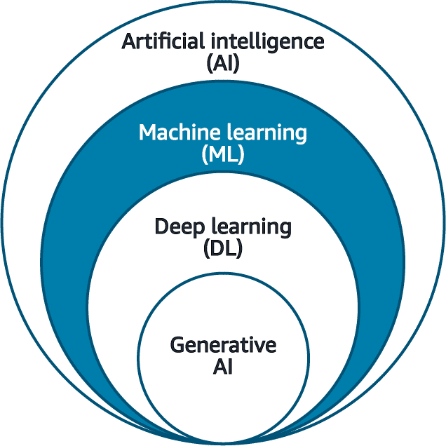
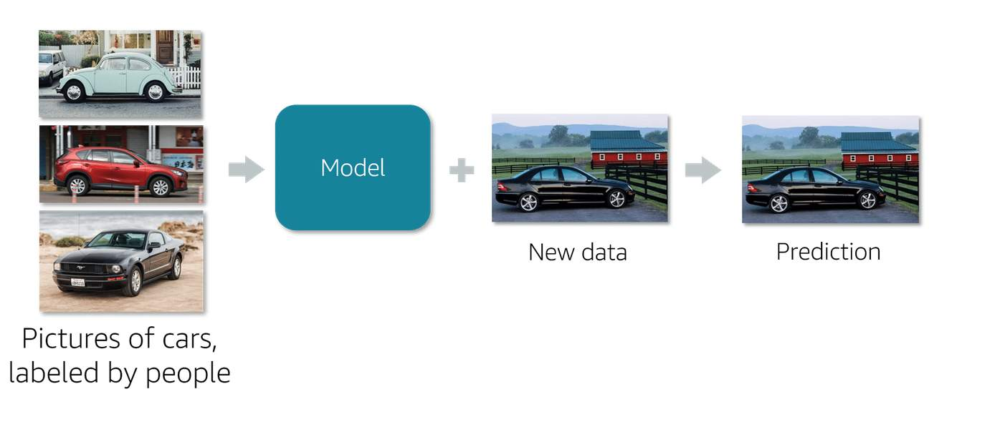
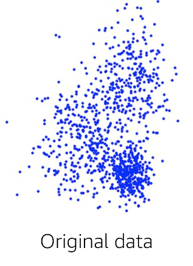
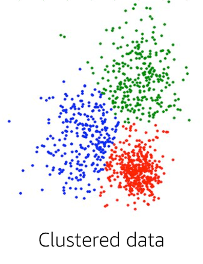
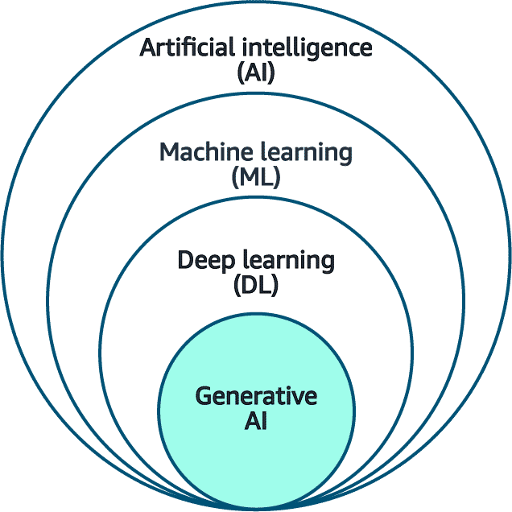

# Introduction

In this course, you will explore real-world use cases in artificial intelligence (AI), machine learning (ML), and generative artificial intelligence (generative AI) across a range of industries. These areas include healthcare, finance, marketing, entertainment, and more. You will also learn about AI, ML, and generative AI capabilities and limitations, model selection techniques, and key business metrics.

Artificial Intelligence (AI). Let’s dive into real-world use cases and applications. 
Many industries use AI such as manufacturing, healthcare, education, retail, life science, transportation, media and entertainment, and more. AI transformed these industries by boosting employee productivity, fostering creativity, improving business operations, and enhancing customer experiences. Text summarization, code generation, image, video, and text generation, music creation, content localization, chatbots, virtual assistance, anomaly detection, maintenance assistance, and contact center analytics are ways AI transforms how businesses operate and make decisions. This course will uncover AI’s endless possibilities and transformative power to shape the world.

## Learning objectives
- Identify examples of real-world AI applications.
- Recognize use cases and solutions where AI can address business needs.
- Determine when AI and ML solutions are not appropriate.
- Identify use cases that use ML techniques such as supervised, unsupervised, and reinforcement learning.
- Identify capabilities of generative AI.
- Identify challenges of generative AI.
- Identify factors to consider when selecting generative AI models.
- Determine business metrics for generative AI applications.

# Artificial Intelligence
Review the definitions of AI, ML, deep learning (DL), and generative AI before exploring the use cases and applications associated with these terms.

### AI

AI is a broad field that encompasses the development of intelligent systems capable of performing tasks that typically require human intelligence, such as perception, reasoning, learning, problem-solving, and decision-making. AI serves as an umbrella term for various techniques and approaches, including machine learning, deep learning, and generative AI. 

### ML
ML is subset of AI for understanding and building methods that make it possible for machines to learn. These methods use data to improve computer performance on a set of tasks.

### DL
Deep learning uses the concept of neurons and synapses similar to how our brain is wired.

### Generative AI

Generative AI is a subset of deep learning because it can adapt models built using deep learning, but without retraining or fine tuning. 

Generative AI is capable of generating new data based on the patterns and structures learned from training data.
It can create new content, including conversations, stories, images, videos, music, and code.

Now that you understand the relationship between AI, ML, DL, and generative AI, let's explore real-world uses cases and applications associated with these terms.

# Examples of Real-World Use Cases

Many industries are using the power of AI to enhance creativity, elevate customer experience, and streamline business operations. Here are a few real-world examples of AI use cases and applications across various sectors. As technology continues to advance, we can expect this list to expand, which will drive innovation and transform society. 

## Media and entertainment

AI contributes to media and entertainment in the following ways:

**Content generation:** AI can create scripts, dialogues, or even complete stories for films, TV shows, and games.
**Virtual reality:** AI can create immersive and interactive virtual environments for games or simulations.
**New generation:** AI can generate articles or summaries based on raw data or events.

## Retail
AI contributes to retail in the following ways:

**Product review summaries:** AI can generate review summaries for products so consumers can quickly find pertinent information.
**Pricing optimization:** AI can model different pricing scenarios to determine optimal pricing strategies that maximize profits.
**Virtual try-ons:** AI can generate virtual models of customers for virtual try-ons, which can improve the online shopping experience.
**Store layout optimization:** AI can generate the most efficient store layouts to improve the customer shopping experience and boost sales.

## Healthcare

AI contributes to healthcare in the following ways:

**AWS HealthScribe:** This AWS service empowers healthcare software vendors to build clinical applications that automatically generate clinical notes by analyzing patient-clinician conversations.
**Personalize medicine:** By generating treatment plans based on a patient's specific genetic makeup, lifestyle, and disease progression, AI can contribute to more effective, personalized care.
**Improve medical imaging:** AI can enhance, reconstruct, or even generate medical images, like X-rays, MRIs, or CT scans, which can aid in better diagnosis.

## Life sciences
AI contributes to life sciences in the following ways:

**Drug discovery:** AI can generate new potential molecular structures for drugs and accelerate the process of drug discovery and reducing costs.
**Protein folding prediction:** AI can predict the 3D structures of proteins based on their amino acid sequence, which is crucial for understanding diseases and developing new therapies.
**Synthetic biology:** AI can generate designs for synthetic biological systems, such as engineered organisms or biological circuits.

## Financial services

AI contributes to financial services in the following ways:

**Fraud detection mechanisms:** AI can help create synthetic datasets to improve AI and ML systems by simulating various money-laundering patterns.
**Portfolio management:** AI can simulate various market scenarios and help in the creation and management of robust investment portfolios.
**Debt collection:** AI can generate the most effective communication and negotiation strategies for debt collection to increase the rate of successful collections.

## Manufacturing
AI contributes to manufacturing in the following ways:

**Predictive maintenance:** By analyzing historical production data, AI can predict maintenance schedules that will provide the most efficient machine outputs and reduce downtimes.
**Process optimization:** AI can generate the most efficient production processes by modeling different scenarios and optimizing for variables such as cost, time, resource usage, and so forth.
**Product design:** AI can be used to create new product designs based on set parameters and constraints. It can generate multiple design options and optimize for factors like cost, materials, performance, and so forth.
**Material science:** AI can help generate new material compositions with desired properties.

Next, you will review examples of applications used to create AI solutions.

# Examples of AI Applications

AI applications and other AWS services automate processes across various industries. Some of the applications include computer vision, natural language processing (NLP), intelligent document processing (IDP), and fraud detection. These applications are used in various industries, from healthcare to finance to retail. These AI applications aim to enhance customer experiences, boost employee productivity, and improve business operations.

## Computer vision
Computer vision is a field of artificial intelligence that allows computers to interpret and understand digital images and videos. Deep learning has revolutionized computer vision by providing powerful techniques for tasks such as image classification, object detection, and image segmentation.

Computer vision is used by but not limited to the following industries.

### AUTONOMOUS DRIVING
Auto manufacturers can use computer vision technology to make self-driving cars safer and more reliable.
**Business value:** Enhance customer experience

### HEALTHCARE OR MEDICAL IMAGING
Using computer vision in healthcare can improve the accuracy and speed of medical diagnoses, which leads to better treatment outcomes and increased life expectancy for patients.

**Business value:** Improve business operations

### PUBLIC SAFETY AND HOME SECURITY
Computer vision image and facial recognition can swiftly identify unlawful entries or persons of interest, which fosters safer communities and works as a crime deterrent. 

**Business value:** Enhance customer experience

## Natural language processing
NLP is a branch of artificial intelligence that deals with the interaction between computers and human languages. Deep learning has made significant strides in NLP. It can perform tasks such as text classification, sentiment analysis, machine translation, and language generation.

NLP is used by but not limited to the following industries.

### INSURANCE
Insurance companies can use NLP to extract policy numbers, expiration dates, and other personal information.

**Business value:** Sensitive data redaction

### TELECOMMUNICATION
Telecommunication companies use NLP to analyze customer text messages and suggest personalized recommendations. 

**Business value:** Customer engagement

### EDUCATION
In the education industry, students use Q&A chatbots to address questions.

**Business value:** Enhance student experience and engagement

# Intelligent document processing
IDP is an application that extracts and classifies information from unstructured data, generates summaries, and provides actionable insights.

IDP is used by but (not) limited to the following industries.

### FINANCIAL SERVICES OR LENDING
Financial services use IDP to extract important information from mortgage applications to accelerate customer response time. It also helps with the underwriting process by identifying incomplete loan packages, tax forms, pay stubs, and other missing data.

**Business value:** Improve business operations, automation

### LEGAL
IDP, along with other applications such as optical character recognition (OCR) and NLP, helps eliminate the manual effort of processing documents such as contractual documents, agreements, court filings, and legal dockets.

**Business value:** Improve business operations

### HEALTHCARE
Using IDP in healthcare can help expedite business quickly and accurately by processing various document types, such as claims and doctor’s notes. 

**Business value:** Improve business operations

## Fraud detection
Fraud detection refers to the process of identifying and preventing fraudulent activities or unauthorized behavior with a system, process, or transaction.

Fraud detection is used by but not limited to the following industries.

### FINANCIAL SERVICES
Financial services use fraud detection for identity verification, payment fraud detection, transaction surveillance, and anti-money laundering (AML) sanctions.

**Business value:** Improve business operations

### RETAIL
Fraud detection systems in the retail industry protect businesses from financial losses, safeguard customer accounts and data, and maintain trust and confidence in online transactions. 

**Business value:** Improve business operations

### TELECOMMUNICATION
The telecommunication industry uses fraud detection to identify any fraudulent activities in any of the following areas:
- Telecom
  - Roaming, premium rate service, and subscription fraud
- Online 
  - New account fraud, claims processing fraud, and promotion abuse
- Retail
  - Credit card and online retail fraud
**Business value:** Improve business operations

You have learned how AI contributes to various industries and the different applications used to create solutions. In the next section, you will learn about ML.

# Machine Learning

Remember, ML is a subset of AI that focuses on developing algorithms and statistical models so that computer systems can learn from data and make predictions or decisions without being explicitly programmed. ML models learn patterns and relationships from data rather than relying on hard-coded rules for instructions. These models are trained on large datasets, and their accuracy and performance improve over time as they process more data. 

In this section, you will learn about when ML is an appropriate solution and the techniques used for specific use cases. 

## When AI and ML are appropriate solutions
To determine the appropriate AI solution, you must understand when to use AI to resolve a business problem. AI is a good choice for the following use cases:

- Coding the rules is challenging: Many human tasks cannot be solved properly using simple, rule-based solutions. Take spam filtering for instance. Determining whether an incoming email is legitimate or spam is a complex task that cannot always be effectively tackled through a set of predefined rules. There are many variables at play.  When rules rely on too many factors, have overlaps, or need to be finely tuned, it becomes difficult for humans to code them accurately. ML can be used to effectively solve this kind of problem.

- Scale of the project is challenging: In the spam filtering example, a human might be able to look at a few hundred emails and decide if they are spam or not. However, scaling this task to scan through millions of emails would be tedious and inefficient. ML solutions are appropriate for large-scale problems like this.

## Alternative approach to AI and ML
Notice in the previous section that AI can solve many problems. However, there might be situations where alternative approaches would be more suitable. Consider all approaches and select the most appropriate one based on the task’s specific requirements and constraints. 

For example, you do not need ML if you can determine a target value using simple rules, computations, or predetermined steps. You can program the steps without needing any data-driven learning. 

You have learned when AI and ML are appropriate and when an alternative solution is appropriate. Next, you will learn about ML techniques for selecting a model.

# Machine Learning Techniques and Use Cases
When choosing an ML solution, it’s not just about the technology, but also about understanding the appropriate ML techniques for specific use cases. ML learning techniques represent the backbone of modern AI and empower systems to learn from data and make intelligent decisions without explicit programming. These techniques include supervised learning, unsupervised learning, and reinforcement learning, which each serve a distinct purpose. 

**To learn the definition of these techniques, choose each of the markers.**

## Supervised learning

In supervised learning, the algorithms are trained on labeled data. The goal is to learn a mapping function that can predict the output for new, unseen input data.

## Unsupervised learning

Unsupervised learning refers to algorithms that learn from unlabeled data. The goal is to discover inherent patterns, structures, or relationships within the input data. 

## Reinforcement learning

In reinforcement learning, the machine is given only a performance score as guidance and semi-supervised learning, where only a portion of training data is labeled. Feedback is provided in the form of rewards or penalties for its actions and the machine learns from this feedback to improve it decision-making over time.

## Supervised learning use cases
Supervised learning is a popular type of ML because it’s widely applicable. It’s called supervised learning because there needs to be a supervisor. The supervisor is labeled training data. Like any student, a supervised algorithm needs to learn by example. Essentially, this type of algorithm uses training data to help determine the patterns and relationships between the inputs and outputs. For example, pictures of cars labeled by people as cars are provided to the model. Then, when the model receives a new picture of a car that is not labeled, the model can predict that it is a car.

The model learns by identifying patterns in data that's already labeled.

**Types of supervised ML**

Supervised learning has two subcategories—classification and regression. 

### CLASSIFICATION
Classification is a supervised learning technique used to assign labels or categories to new, unseen data instances based on a trained model. The model is trained on a labeled dataset, where each instance is already assigned to a known class or category. The goal of classification is to learn patterns from the training data and use them to predict the class or category for new unlabeled data instances.

**Use cases include the following:**
- Fraud detection
- Image classification
- Customer retention
- Diagnostics

REGRESSION
Regression is a supervised learning technique used for predicting continuous or numerical values based on one or more input variable. It is used to model the relationship between a dependent variable (the value to be predicted) and one or more independent variables (the features or inputs used for prediction).

**Use cases include the following:**
- Advertising popularity prediction
- Weather forecasting
- Market forecasting
- Estimating life expectancy
- Population growth prediction

## Unsupervised learning use cases

Recall that in supervised learning, the data includes labels so that the model can learn the patterns and relationships. In unsupervised learning, the model is trained on unlabeled data. The algorithm tries to discover hidden patterns or structures within the data without any prior information or guidance.

In this type of learning, the machine has to uncover and create the labels itself. These models use the data they’re presented with to detect emerging properties of the entire dataset and then construct patterns.

In unsupervised learning, labels are not provided—you don't know all the variables and patterns.

Types of unsupervised ML

Unsupervised learning encompasses various techniques and algorithms. Two main subcategories of unsupervised learning are clustering and dimensionality reduction. 

### CLUSTERING

A common subcategory of unsupervised learning is clustering. This kind of algorithm groups data into different clusters based on similar features or distances between the data point to better understand the attributes of a specific cluster.

For example, by analyzing customer purchasing habits, an unsupervised algorithm can identify a company as being large or small.

**Use cases include the following: **
- Customer segmentation
- Targeted marketing
- Recommended systems

### DIMENSIONALITY REDUCTION
Dimensionality reduction is an unsupervised learning technique used to reduce the number of features or dimensions in a dataset while preserving the most important information or patterns.

**Use cases include the following:**
- Big data visualization
- Meaningful compression
- Structure discovery
- Feature elicitation

## Reinforcement learning use case
Another kind of algorithm that has gained popularity recently is reinforcement learning. Unlike the first two algorithms, this one continuously improves its model by mining feedback from previous iterations. In reinforcement learning, an agent continuously learns through trial and error as it interacts in an environment. Reinforcement learning is broadly useful when the reward of a desired outcome is known, but the path to achieving it isn’t—and that path requires a lot of trial and error to discover.

The agent is the virtual car, and the environment is a virtual racetrack.

For example, in the AWS DeepRacer simulator, the agent is the virtual car, and the environment is a virtual racetrack. The actions are throttle and steering inputs to the car. The goal is completing the racetrack as quickly as possible and without deviating from the track.

The car needs to learn the desired driving behavior to reach the goal of completing the track. To learn this, rewards are used to incentivize the model to learn the desired driving behavior.

In summary, as you can see in the following graphic, machine learning techniques encompass diverse methods, including supervised learning, unsupervised learning, and reinforcement learning. Supervised learning has two subcategories: classification and regression. Similarly, unsupervised learning has two subcategories: clustering and dimensionality reductions. To use the full potential of ML, you should understand the principles and applications of these techniques.

**Next, you will test your knowledge with a set of knowledge check questions.**

# Generative AI
Generative AI is a subset of deep learning. It can adapt models that are built using deep learning without needing to retrain or fine-tune them. Generative AI is capable of generating new data based on the patterns and structures learned from training data. Generative AI can create new content, including conversations, stories, images, videos, music, and code. 

In this section, you will learn about the capabilities and challenges of AI, the factors to consider when selecting a generative AI model, and the business metrics for generative AI applications. 

# Capabilities of Generative AI

If you are considering implementing AI within your organization, it is important to understand the capabilities of generative AI. Generative AI can automate tedious tasks such as data entry and analyze data to identify patterns and trends, which can assist organizations in making more informed decisions. Additionally, it can automate complex tasks, freeing up time for users to focus on more creative work. Review additional capabilities of generative AI below.

## Adaptability
Generative AI models can adapt to various tasks and domains by learning from data and generating content tailored to specific contexts or requirements. Because generative AI is flexible, it can be used for a wide range of applications across different industries.

## Responsiveness
Generative AI models can generate content in real-time, which results in rapid response times and dynamic interactions. This is particularly useful for chatbots, virtual assistants, and other interactive applications that require immediate responses.

## Simplicity
Generative AI can simplify complex tasks by automating content creation processes. For example, AI language models can generate human-like text, which reduces the time and effort required for content generation.

## Creativity and exploration
Generative AI models can generate novel ideas, designs, or solutions by combining and recombining elements in unique ways. This can foster creativity and exploration of new possibilities.

## Data efficiency
Some generative AI models can learn from relatively small amounts of data and generate new samples consistent with the training data. This can be useful when data is scarce or difficult to obtain.

## Personalization
Generative AI can create personalized content tailored to individual preferences or characteristics, which enhances user experiences and engagement.

## Scalability
When trained, generative AI models can generate large amounts of content quickly. This makes the models suitable for tasks that require producing content at scale.

This is a non-exhaustive list of generative AI capabilities. Overall, generative AI capabilities are diverse and evolving. They offer endless possibilities for innovation, creativity, and problem-solving across industries and applications.

# Challenges of Generative AI

While AI offers many capabilities, some challenges include regulatory violations, social risks, privacy concerns, toxicity, hallucination, and interpretability. These challenges are important to take into account because a model has the potential to make decisions that are unethical or socially irresponsible. Review the list below:

## Regulatory violations
**Risk**
Generative AI models trained on sensitive data might inadvertently generate an output that violates regulations, such as exposing personally identifiable information (PII).

**Mitigation**
To minimize the risk of privacy violations, implement strict data anonymization and privacy-preserving techniques during model training. To ensure compliance with privacy regulations, conduct thorough audits and assessment of the data used to train the model.

## Social risks
**Risk**
The possibility of unwanted content that might reflect negatively on your organization is a social risk.

**Mitigation**
Test and evaluate all models before deploying them in production.

## Data security and privacy concerns
**Risk**
The information shared with your model can include personal information and can potentially violate privacy laws.

**Mitigation**
To protect sensitive data, implement cybersecurity measures, such as encryption and firewalls.

## Toxicity
**Risk**
Generative AI models can generate content that is inflammatory, offensive, or inappropriate.

**Mitigation**
- Curate the training data by identifying these phrases in advance and removing them from the training data. This prevents them from being generated as output.
- Use guardrail models. These models will detect and filter out unwanted content.

## Hallucinations
**Risk**
The model generates inaccurate responses that are not consistent with the training data. These are called hallucinations.

**Mitigation**
Teach users that everything must be checked. Foundation models (FM) can’t be trusted to verify their own stories are based in reality and on facts. Hallucinations could be further mitigated by checking that content is verified with independent sources. Also, generated content can be marked as unverified to alert the user that verification will be necessary.

## Interpretability
**Risk**
Users might misinterpret the model’s output, which could lead to incorrect conclusions or decisions.

**Mitigation**
Use specific domain knowledge for model development and performance by providing key information for data model inputs. 

## Nondeterminism
**Risk**
The model might generate different outputs for the same input, which can cause problems in applications where reliability is key.  

**Mitigation**
Perform tests on the model to identify any sources of nondeterminism. Run the model multiple times and compare the output to ensure consistency.

These challenges address issues related to data quality and bias. By proactively addressing them, customers can experience the full potential of generative AI, while verifying its responsible use across various domains.

**You have learned about the capabilities and challenges of generative AI. In the next lesson, you will learn about factors to consider when selecting a generative AI model.**

# Factors to Consider When Selecting a Generative AI Model

When selecting a generative AI model, there are several important factors to consider. First, it's essential to define the specific task or application you want the model to perform, such as text generation, image creation, or code generation. Models are optimized for different tasks, so choosing the right one is crucial for achieving the desired results.

Some of the key factors to consider when selecting an appropriate generative AI model include the following: 
- Model types
- Performance requirements
- Capabilities
- Constraints
- Compliance

## Models
There are many model types. The following list is a non-exhaustive list of model options. It shows the model names, the tasks those models can do, and some sample use cases of how the model has been used to solve business problems. Each model has its own capabilities and challenges.

### AI21 labs
**Jurassic-2 Models**

#### Tasks

- Text generation
- Summarization
- Paraphrasing
- Chat
- Information extraction

#### Use Cases

- **Financial services** – summarize lengthy documents
- **Retail** – generate product descriptions

### Amazon
**Amazon Titan**

#### Tasks

- Text summarization
- Classification
- Open-ended Q&A
- Information extraction
- Embeddings
- Search

#### Use Cases

- **Advertising** – create studio quality images
- **Customer service** – generate real-time abstract summaries

### Anthropic
**Claude**

#### Tasks

- Content generation
- Text translation
- Question answering
- Text summarization
- Code explanation and generation

#### Use Cases

- **Developer** – code generation and debugging
- **Legal** – parse legal documents and answer questions

### Stability AI
**Stable Diffusion**

#### Tasks

- Generate photo realistic images from text input
- Improve quality of generated images

#### Use Cases

- **Gaming and metaverse** – create characters, scenes, and worlds
- **Advertising and marketing** – create ad campaigns and marketing assets

### Cohere
**Command**

#### Tasks

- Text generation
- Information extraction
- Question and answering
- Summarization

#### Use Cases

- **Customer service** – support chatbots
- **Retail** – provide product descriptions
- **Healthcare** – summarize key ideas from long text

### Meta
**Llama**

#### Tasks

- Question answering
- Chat
- Summarization
- Paraphrasing
- Sentiment analysis
- Text generation

#### Use Cases

- **Customer service support** – chatbots

## Performance requirements
Performance requirements are another factor to consider when selecting a generative AI model. These requirements include accuracy, reliability of the output, and others. Assess the overall performance of the model to evaluate its suitability for a particular task. You should also test the model against different datasets to ensure reliability. Finally, monitor its performance over time to ensure it remains consistent. 

## Constraints
Consider the constraints of a model such as the following: 

- Computational resources (for example, available GPU power, CPU power, or memory)
- Data availability (for example, size and quality of training data)
- Deployment requirement (for example, on premises or cloud)
Some models might have higher resource demands or require specific hardware configurations, which could impact their use case.

## Capabilities
Another factor to consider is the model's capabilities. Generative AI encompasses a wide range of capabilities. It can perform different tasks with varying degrees of output quality and levels of control or customization. For instance, some models might be better at generating text, whereas others might excel at generating images or performing multimodal tasks such as text-to-image generation. Therefore, it is important to understand the specific capabilities required for your application before selecting a generative AI model.

## Compliance

Compliance is another factor. Generative AI models can pose moral concerns, including biases, privacy issues, and potential misuse. When evaluating a particular model, consider its compliance and moral implications, particularly in sensitive domains like healthcare, finance, and legal applications. One should consider factors such as fairness, transparency or traceability, accountability, hallucination, and toxicity. Additionally, the model should adhere to relevant regulation guidelines.

## Cost
Another key factor is cost. Generative AI models can vary in terms of cost. Consider the trade-off between the size and the speed of the model. Larger models are usually more precise, but they are expensive and offer few deployment options. Conversely, smaller models are cheaper and faster, and they offer more deployment alternatives.

By using generative AI for content creation, you can reduce labor costs and increase efficiency, especially for repetitive tasks that require significant human effort.

Remember to evaluate all expenses related to deployment, maintenance, hardware, software, and other associated costs.

By considering these factors, you can select a generative AI model that best fits your specific needs.

Now that you understand the factors to consider when selecting a model, let's discuss some key business metrics associated with AI models.

# Business Metrics for Generative AI

Deploying AI applications has become increasingly prevalent. Organizations have unprecedented opportunities for innovation, efficiency, and growth. However, the success of the AI initiative hinges not only on the sophistication of the underlying algorithms but also on their tangible impact on key business objectives. By quantifying the performance, effectiveness, and return on investment (ROI) of AI applications through relevant business metrics, organizations can gain valuable insights into the value delivered. They can also identify areas of improvement and make informed decisions to optimize resource allocation and strategy.

## Business metrics for generative AI
The business metrics you use to measure the success of your model can vary depending on the use case. 

### User satisfaction
User satisfaction gathers user feedback to assess their satisfaction with the AI-generated content or recommendations.

**Use case:** Measuring and improving user satisfaction for an e-commerce website 

An ecommerce company wants to monitor and enhance the overall user satisfaction with its website to increased customer loyalty, repeat purchases, and positive word-of-mouth.

### Average revenue per user
Average revenue per user (ARPU) calculates the average revenue generated per user or customer attributed to the generative AI application.

**Use case:** Analyzing and optimizing revenue generation per user 

The marketing and product teams at an ecommerce company want to understand how effectively they are monetizing their user base and identify opportunities for improvement.

### Average revenue per user
Average revenue per user (ARPU) calculates the average revenue generated per user or customer attributed to the generative AI application.

**Use case:** Analyzing and optimizing revenue generation per user 

The marketing and product teams at an ecommerce company want to understand how effectively they are monetizing their user base and identify opportunities for improvement.

### Conversion rate
Conversion rate monitors the conversion rate to generate content or recommend desired outcomes, such as purchases, sign-ups, or engagement metrics.

**Use case:** Optimizing an ecommerce website for higher conversion rates 

A marketing manager for an online clothing store is responsible for analyzing and improving the website's performance in terms of converting visitors into paying customers. To do this, they closely monitor the conversion rate metric, which measures the percentage of website visitors who complete a desired action, such as making a purchase.

### Efficiency
The efficiency metric evaluates the generative AI model's efficiency in resource utilization, computation time, and scalability.

**Use case:** Improving production line efficiency 

Example Corp Manufacturing Company operates a production line for assembling electronic devices. The company aims to optimize the efficiency of its production line to reduce costs and increase productivity.

### Summary
You've reviewed the commonly used business metrics for generative AI in this section. However, the business metrics an organization uses depend on the use case or business problem that the AI application solves.

By monitoring these business metrics, organizations can effectively evaluate generative AI applications' performance, effectiveness, and ROI. They can use generative AI to guide strategic decision-making and optimization efforts and maximize business value.

# Knowledge Check

## Question 1
What are some of the capabilities of generative artificial intelligence (generative AI) systems in business applications? (Select THREE.)
- Personalization
- Scalability
- Conversion rate
- Simplicity
- Accuracy
- Cross-domain performance

The correct answers are personalization, scalability, simplicity, and responsiveness.
- Personalization: Generative AI can create personalized content tailored to individual preferences or characteristics, which enhances user experiences and engagement.
- Scalability: When trained, generative AI models can generate large amounts of content quickly, which makes them suitable for tasks that require producing content at scale.
- Simplicity: Generative AI can simplify complex tasks by automating content creation processes. For example, AI language models can generate human-like text, which reduces the time and effort required for content generation.

Conversion rate, accuracy, and cross-domain performance are not capabilities of generative AI.

## Question 2
A product manager works for a company that uses a generative AI application for content creation. They have noticed that the model often produces different outputs each time it runs with the same input data. What is the challenge this company is encountering?
- Nondeterminism
- Toxicity
- Social risks
- Hallucinations

This company is facing nondeterminism when the model produces different outputs each time it runs with the same input data.

## Question 3
A data engineer is analyzing the performance of a generative AI system used for customer support in a software company. Which business metric would be most appropriate for assessing the system’s effectiveness?
- Cross-domain performance
- Customer satisfaction
- Conversion rate
- Average revenue per user (ARPU)

Customer satisfaction is a critical metric for evaluating the effectiveness of a customer support system because it directly measures how well the system meets customer needs and expectations.

# Course Summary

This course provided a comprehensive understanding of AI's various applications and use cases in different industries. Participants gained the knowledge and insights to identify opportunities of integrating Artificial Intelligence (AI) into their organizations and contribute to advancing AI-driven solutions.

## Learning Objectives Completed

- Identify examples of real-world AI applications.

- Recognize use cases and solutions where AI can address business needs.

- Determine when AI and ML solutions are not appropriate.

- Identify use cases that use ML techniques such as supervised, unsupervised, and reinforcement learning.

- Identify capabilities of generative AI.

- Identify challenges of generative AI.

- Identify factors to consider when selecting generative AI models.

- Determine business metrics for generative AI applications.